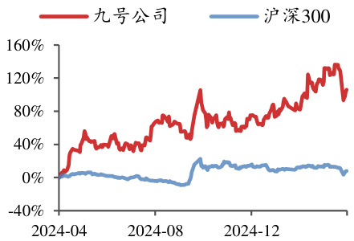

# 九号公司（689009.SH） 2024 年两轮车&割草机器人持续超预期增长，全年现2025 年 04 月 13 日金分红超预期  

投资评级：买入（维持）  

<html><body><table><tr><td>日期</td><td>2025/4/11</td></tr><tr><td>当前股价(元)</td><td>56.90</td></tr><tr><td>一年最高最低(元)</td><td>68.32/27.60</td></tr><tr><td>总市值(亿元)</td><td>40.81</td></tr><tr><td>流通市值(亿元)</td><td>31.28</td></tr><tr><td>总股本(亿股)</td><td>0.72</td></tr><tr><td>流通股本(亿股)</td><td>0.55</td></tr><tr><td>近3个月换手率(%)</td><td>1,068.23</td></tr></table></body></html>  

  
股价走势图  
数据来源：聚源  

# 相关研究报告  

《2024Q4 业绩处预告中枢偏上，2025年开年两轮车&割草机器人或延续亮眼表现 — 公司信息更新报告》-2025.2.28  

《AI 机器人+消费（2）：深度融合DeepSeek+底层机器人&AI 技术积累有望赋能各业务线增长—公司信息更新报告》-2025.2.17  

《2024Q4 业绩阶段受股份支付费用和非经等扰动，长期高业绩成长性不变—公司信息更新报告》-2025.1.27公司信息更新报告吕明（分析师）lvming@kysec.cn证书编号：S0790520030002周嘉乐（分析师）zhoujiale@kysec.cn证书编号：S0790522030002林文隆（分析师）linwenlong@kysec.cn证书编号：S0790524070004  

 2024 年现金分红超预期，看好长期收入增长及盈利提升，维持“买入”评级2024 年实现营收142 亿元（同比 $+39\%$ ，下同），归母净利润 10.8 亿元（ $(+81\%)$ ），扣非归母净利润 10.6 亿元（+157%）。2024Q4 营收 32.9 亿元（+22%），归母净利润1.14 亿元（-48%），扣非归母净利润 1.25 亿元（+92%），剔除股份支付费用以及非经影响预计实际经营利润翻三倍以上增长，全年现金分红 8 亿超预期。2025 年年初以来两轮车&割草机器人渠道拓展持续推进，我们上调2025-2026 年并新增 2027 年盈利预测，预计 2025-2027 年归母净利润 16.89/23.92/32.69 亿元（2025-2026 原值分别为 15.98/22.97 亿元），对应 EPS 为 23.54/33.35/45.57 元，当前股价对应PE 为 24.2/17.1/12.5 倍。长期视角，两轮车关注渠道升级+拓宽用户群扩大市场份额、规模效应下预计盈利能力仍有提升空间，同时继续看好高成长赛道割草机器人持续增长以及潜力赛道E-Bike 贡献增量，维持“买入”评级。  

 2024Q4 零售滑板车&割草机器人超预期表现，两轮车全年销量符合预期2024Q4 收入拆分：（1）两轮车营收 12.4 亿元（+23%），销量 46 万台（+44%），均价2679 元（-14%）。全年销量符合预期，Q4 均价同比下滑主系经销商补贴冲减收入所致。（2）零售滑板车营收7.6 亿元（+34%），销量36 万台（+18%），均价 2075 元（+13%）。全年营收增速 17%，超预期表现或系欧洲行业景气较高。（3）全地形车营收 2.1 亿元（-5%），销量 0.58 万台（+7%），均价 36045 元（-11%）。（4）割草机器人营收 2.67 亿元（+178%），全年营收 8.6 亿元（+284%），机器人板块销量超 16 万台，预计割草机器人销量超此前预期。（5）TOB 渠道营收2.8 亿元（-41%）。展望2025 年，两轮车/割草机器人有望在渠道扩张以及新品驱动下维持较高增长，关注两轮车女性新品/M 系列迭代新品以及割草机X3 表现。  

# 同口径下规模效应驱动毛利率持续提升&销售费用率持续下降  

毛利端，2024 年毛利率 28.2%（+3.1pct），其中两轮车/机器人/全地形车/滑板车&平衡车毛利率同比分别+2.1/+2.1/-0.65/+7.95pct，滑板车毛利率提升或系高毛利渠道占比提升+补贴适当减少所致。同口径下2024Q4 毛利率为31.4%（+3.8pct），规模效应下毛利率持续提升。费用端，同口径下2024Q4 公司期间费用率25.62%（+1.4pct），其中销售/管理/研发/财务同比分别-1.8/+0.8/+3.0/-0.7pct，销售费用规模效应明显，研发费用较大幅度增加或系奖金增加所致。综合影响下 2024Q4公司净利率为 3.5%（-4.7pct），扣非归母净利率 3.8%（+1.4pct）。  

$\bullet$ 风险提示：渠道拓展不及预期；新品销售不及预期；行业竞争加剧等。  

财务摘要和估值指标  

<html><body><table><tr><td>指标</td><td>2023A</td><td>2024A</td><td>2025E</td><td>2026E</td><td>2027E</td></tr><tr><td>营业收入(百万元)</td><td>10,222</td><td>14,196</td><td>20,221</td><td>26,773</td><td>34,498</td></tr><tr><td>YOY(%)</td><td>1.0</td><td>38.9</td><td>42.4</td><td>32.4</td><td>28.9</td></tr><tr><td>归母净利润(百万元)</td><td>598</td><td>1,084</td><td>1,689</td><td>2,392</td><td>3,269</td></tr><tr><td>YOY(%)</td><td>32.5</td><td>81.3</td><td>55.8</td><td>41.6</td><td>36.7</td></tr><tr><td>毛利率(%)</td><td>25.2</td><td>28.2</td><td>29.3</td><td>30.4</td><td>30.9</td></tr><tr><td>净利率(%)</td><td>5.9</td><td>7.6</td><td>8.4</td><td>8.9</td><td>9.5</td></tr><tr><td>ROE(%)</td><td>10.8</td><td>17.4</td><td>21.3</td><td>23.2</td><td>24.1</td></tr><tr><td>EPS(摊薄/元)</td><td>8.34</td><td>15.11</td><td>23.54</td><td>33.35</td><td>45.57</td></tr><tr><td>P/E(倍)</td><td>68.3</td><td>37.6</td><td>24.2</td><td>17.1</td><td>12.5</td></tr><tr><td>P/B(倍)</td><td>7.5</td><td>6.6</td><td>5.2</td><td>4.0</td><td>3.0</td></tr></table></body></html>

数据来源：聚源、开源证券研究所  

附：财务预测摘要   

<html><body><table><tr><td>资产负债表(百万元)</td><td>2023A</td><td>2024A</td><td>2025E</td><td>2026E</td><td>2027E</td></tr><tr><td>流动资产</td><td>7706</td><td>12401</td><td>14809</td><td>21078</td><td>25726</td></tr><tr><td>现金</td><td>4974</td><td>7473</td><td>9190</td><td>14830</td><td>18722</td></tr><tr><td>应收票据及应收账款</td><td>995</td><td>1096</td><td>2544</td><td>2171</td><td>3572</td></tr><tr><td>其他应收款</td><td>58</td><td>106</td><td>135</td><td>180</td><td>229</td></tr><tr><td>预付账款</td><td>123</td><td>102</td><td>325</td><td>194</td><td>445</td></tr><tr><td>存货</td><td>1108</td><td>1839</td><td>1020</td><td>2086</td><td>1093</td></tr><tr><td>其他流动资产</td><td>448</td><td>1784</td><td>1594</td><td>1617</td><td>1665</td></tr><tr><td>非流动资产</td><td>3143</td><td>3277</td><td>3800</td><td>4367</td><td>4979</td></tr><tr><td>长期投资</td><td>0</td><td>0</td><td>0</td><td>0</td><td>0</td></tr><tr><td>固定资产</td><td>1071</td><td>1184</td><td>1664</td><td>2147</td><td>2712</td></tr><tr><td>无形资产</td><td>847</td><td>894</td><td>928</td><td>968</td><td>1026</td></tr><tr><td>其他非流动资产</td><td>1225</td><td>1199</td><td>1208</td><td>1252</td><td>1241</td></tr><tr><td>资产总计</td><td>10850</td><td>15678</td><td>18609</td><td>25445</td><td>30705</td></tr><tr><td>流动负债</td><td>5147</td><td>9128</td><td>10467</td><td>14901</td><td>16872</td></tr><tr><td>短期借款</td><td>0</td><td>0</td><td>0</td><td>0</td><td>0</td></tr><tr><td>应付票据及应付账款</td><td>3669</td><td>6187</td><td>8435</td><td>12158</td><td>14031</td></tr><tr><td>其他流动负债</td><td>1478</td><td>2941</td><td>2032</td><td>2742</td><td>2841</td></tr><tr><td>非流动负债</td><td>169</td><td>316</td><td>223</td><td>236</td><td>258</td></tr><tr><td>长期借款</td><td>0</td><td>0</td><td>0</td><td>0</td><td>0</td></tr><tr><td>其他非流动负债</td><td>169</td><td>316</td><td>223</td><td>236</td><td>258</td></tr><tr><td>负债合计</td><td>5316</td><td>9443</td><td>10690</td><td>15137</td><td>17130</td></tr><tr><td>少数股东权益</td><td>77</td><td>78</td><td>75</td><td>71</td><td>69</td></tr><tr><td>股本</td><td>0</td><td>0</td><td>0</td><td>0</td><td>0</td></tr><tr><td>资本公积</td><td>7866</td><td>7572</td><td>7572</td><td>7572</td><td>7572</td></tr><tr><td>留存收益</td><td>-2018</td><td>-934</td><td>751</td><td>3140</td><td>6406</td></tr><tr><td>归属母公司股东权益</td><td>5457</td><td>6156</td><td>7845</td><td>10237</td><td>13506</td></tr><tr><td>负债和股东权益</td><td>10850</td><td>15678</td><td>18609</td><td>25445</td><td>30705</td></tr></table></body></html>  

<html><body><table><tr><td>现金流量表(百万元)</td><td>2023A</td><td>2024A</td><td>2025E</td><td>2026E</td><td>2027E</td></tr><tr><td>经营活动现金流</td><td>2319</td><td>3354</td><td>2498</td><td>6370</td><td>4714</td></tr><tr><td>净利润</td><td>596</td><td>1085</td><td>1685</td><td>2389</td><td>3266</td></tr><tr><td>折旧摊销</td><td>197</td><td>208</td><td>203</td><td>256</td><td>318</td></tr><tr><td>财务费用</td><td>-136</td><td>-109</td><td>-80</td><td>-80</td><td>-80</td></tr><tr><td>投资损失</td><td>42</td><td>-20</td><td>-21</td><td>-21</td><td>-21</td></tr><tr><td>营运资金变动</td><td>1577</td><td>2749</td><td>699</td><td>3795</td><td>1206</td></tr><tr><td>其他经营现金流</td><td>43</td><td>-560</td><td>12</td><td>32</td><td>24</td></tr><tr><td>投资活动现金流</td><td>-454</td><td>-2462</td><td>-747</td><td>-812</td><td>-919</td></tr><tr><td>资本支出</td><td>827</td><td>546</td><td>775</td><td>768</td><td>948</td></tr><tr><td>长期投资</td><td>339</td><td>-1947</td><td>0</td><td>0</td><td>0</td></tr><tr><td>其他投资现金流</td><td>33</td><td>31</td><td>28</td><td>-43</td><td>29</td></tr><tr><td>筹资活动现金流</td><td>-147</td><td>-513</td><td>-34</td><td>81</td><td>97</td></tr><tr><td>短期借款</td><td>0</td><td>0</td><td>0</td><td>0</td><td>0</td></tr><tr><td>长期借款</td><td>-23</td><td>0</td><td>0</td><td>0</td><td>0</td></tr><tr><td>普通股增加</td><td>0</td><td>-0</td><td>0</td><td>0</td><td>0</td></tr><tr><td>资本公积增加</td><td>164</td><td>-294</td><td>0</td><td>0</td><td>0</td></tr><tr><td>其他筹资现金流</td><td>-288</td><td>-219</td><td>-34</td><td>81</td><td>97</td></tr><tr><td>现金净增加额</td><td>1741</td><td>393</td><td>1717</td><td>5640</td><td>3892</td></tr></table></body></html>

数据来源：聚源、开源证券研究所  

<html><body><table><tr><td>利润表(百万元)</td><td>2023A</td><td>2024A</td><td>2025E</td><td>2026E</td><td>2027E</td></tr><tr><td>营业收入</td><td>10222</td><td>14196</td><td>20221</td><td>26773</td><td>34498</td></tr><tr><td>营业成本</td><td>7649</td><td>10188</td><td>14298</td><td>18639</td><td>23845</td></tr><tr><td>营业税金及附加</td><td>57</td><td>72</td><td>102</td><td>135</td><td>174</td></tr><tr><td>营业费用</td><td>847</td><td>1101</td><td>1547</td><td>2088</td><td>2684</td></tr><tr><td>管理费用</td><td>676</td><td>837</td><td>1163</td><td>1513</td><td>1915</td></tr><tr><td>研发费用</td><td>616</td><td>826</td><td>1163</td><td>1606</td><td>2035</td></tr><tr><td>财务费用</td><td>-136</td><td>-109</td><td>-80</td><td>-80</td><td>-80</td></tr><tr><td>资产减值损失</td><td>-104</td><td>-27</td><td>-62</td><td>-62</td><td>-62</td></tr><tr><td>其他收益</td><td>45</td><td>82</td><td>90</td><td>100</td><td>110</td></tr><tr><td>公允价值变动收益</td><td>148</td><td>-15</td><td>-15</td><td>-15</td><td>-15</td></tr><tr><td>投资净收益</td><td>-42</td><td>20</td><td>21</td><td>21</td><td>21</td></tr><tr><td>资产处置收益</td><td>4</td><td>-2</td><td>0</td><td>0</td><td>0</td></tr><tr><td>营业利润</td><td>564</td><td>1329</td><td>2053</td><td>2906</td><td>3969</td></tr><tr><td>营业外收入</td><td>102</td><td>63</td><td>60</td><td>60</td><td>60</td></tr><tr><td>营业外支出</td><td>25</td><td>73</td><td>70</td><td>70</td><td>70</td></tr><tr><td>利润总额</td><td>641</td><td>1319</td><td>2043</td><td>2896</td><td>3959</td></tr><tr><td>所得税</td><td>45</td><td>234</td><td>357</td><td>507</td><td>693</td></tr><tr><td>净利润</td><td>596</td><td>1085</td><td>1685</td><td>2389</td><td>3266</td></tr><tr><td>少数股东损益</td><td>-2</td><td>1</td><td>-4</td><td>-3</td><td>-3</td></tr><tr><td>归属母公司净利润</td><td>598</td><td>1084</td><td>1689</td><td>2392</td><td>3269</td></tr><tr><td>EBITDA</td><td>689</td><td>1303</td><td>2008</td><td>2801</td><td>3785</td></tr><tr><td>EPS(元)</td><td>8.34</td><td>15.11</td><td>23.54</td><td>33.35</td><td>45.57</td></tr></table></body></html>  

<html><body><table><tr><td>主要财务比率</td><td>2023A</td><td>2024A</td><td>2025E</td><td>2026E</td><td>2027E</td></tr><tr><td>成长能力</td><td></td><td></td><td></td><td></td><td></td></tr><tr><td>营业收入(%)</td><td>1.0</td><td>38.9</td><td>42.4</td><td>32.4</td><td>28.9</td></tr><tr><td>营业利润(%)</td><td>-0.3</td><td>135.7</td><td>54.5</td><td>41.5</td><td>36.6</td></tr><tr><td>归属于母公司净利润%)</td><td>32.5</td><td>81.3</td><td>55.8</td><td>41.6</td><td>36.7</td></tr><tr><td>获利能力</td><td></td><td></td><td></td><td></td><td></td></tr><tr><td>毛利率(%)</td><td>25.2</td><td>28.2</td><td>29.3</td><td>30.4</td><td>30.9</td></tr><tr><td>净利率(%)</td><td>5.9</td><td>7.6</td><td>8.4</td><td>8.9</td><td>9.5</td></tr><tr><td>ROE(%)</td><td>10.8</td><td>17.4</td><td>21.3</td><td>23.2</td><td>24.1</td></tr><tr><td>ROIC(%)</td><td>8.2</td><td>14.3</td><td>18.8</td><td>20.4</td><td>21.1</td></tr><tr><td>偿债能力</td><td></td><td></td><td></td><td></td><td></td></tr><tr><td>资产负债率(%)</td><td>49.0</td><td>60.2</td><td>57.4</td><td>59.5</td><td>55.8</td></tr><tr><td>净负债比率(%)</td><td>-87.6</td><td>-117.6</td><td>-115.2</td><td>-143.1</td><td>-137.4</td></tr><tr><td>流动比率</td><td>1.5</td><td>1.4</td><td>1.4</td><td>1.4</td><td>1.5</td></tr><tr><td>速动比率</td><td>1.2</td><td>1.1</td><td>1.3</td><td>1.2</td><td>1.4</td></tr><tr><td>营运能力</td><td></td><td></td><td></td><td></td><td></td></tr><tr><td>总资产周转率</td><td>1.0</td><td>1.1</td><td>1.2</td><td>1.2</td><td>1.2</td></tr><tr><td>应收账款周转率</td><td>9.5</td><td>13.8</td><td>11.3</td><td>11.5</td><td>12.2</td></tr><tr><td>应付账款周转率</td><td>4.4</td><td>4.9</td><td>4.4</td><td>4.6</td><td>4.6</td></tr><tr><td>每股指标 (元)</td><td></td><td></td><td></td><td></td><td></td></tr><tr><td>每股收益(最新摊薄)</td><td>8.34</td><td>15.11</td><td>23.54</td><td>33.35</td><td>45.57</td></tr><tr><td>每股经营现金流(最新摊薄)</td><td>32.34</td><td>46.75</td><td>34.82</td><td>88.81</td><td>65.72</td></tr><tr><td>每股净资产(最新摊薄)</td><td>76.07</td><td>85.83</td><td>109.37</td><td>142.72</td><td>188.29</td></tr><tr><td>估值比率</td><td></td><td></td><td></td><td></td><td></td></tr><tr><td>P/E</td><td>68.3</td><td>37.6</td><td>24.2</td><td>17.1</td><td>12.5</td></tr><tr><td>P/B</td><td>7.5</td><td>6.6</td><td>5.2</td><td>4.0</td><td>3.0</td></tr><tr><td>EV/EBITDA</td><td>-7.3</td><td>-6.5</td><td>-5.1</td><td>-5.7</td><td>-5.2</td></tr></table></body></html>  

# 特别声明  

《证券期货投资者适当性管理办法》、《证券经营机构投资者适当性管理实施指引（试行）》已于2017年7月1日起正式实施。根据上述规定，开源证券评定此研报的风险等级为R4（中高风险），因此通过公共平台推送的研报其适用的投资者类别仅限定为专业投资者及风险承受能力为C4、C5的普通投资者。若您并非专业投资者及风险承受能力为C4、C5的普通投资者，请取消阅读，请勿收藏、接收或使用本研报中的任何信息。因此受限于访问权限的设置，若给您造成不便，烦请见谅！感谢您给予的理解与配合。  

# 分析师承诺  

负责准备本报告以及撰写本报告的所有研究分析师或工作人员在此保证，本研究报告中关于任何发行商或证券所发表的观点均如实反映分析人员的个人观点。负责准备本报告的分析师获取报酬的评判因素包括研究的质量和准确性、客户的反馈、竞争性因素以及开源证券股份有限公司的整体收益。所有研究分析师或工作人员保证他们报酬的任何一部分不曾与，不与，也将不会与本报告中具体的推荐意见或观点有直接或间接的联系。  

股票投资评级说明  

<html><body><table><tr><td></td><td>评级</td><td>说明</td></tr><tr><td rowspan="4">证券评级</td><td>买入 (Buy)</td><td>预计相对强于市场表现20%以上；</td></tr><tr><td>增持(outperform)</td><td>预计相对强于市场表现5%～20%;</td></tr><tr><td>中性 (Neutral)</td><td>预计相对市场表现在一5%～十5%之间波动;</td></tr><tr><td>减持(underperform)</td><td>预计相对弱于市场表现5%以下。</td></tr><tr><td rowspan="3">行业评级</td><td>看好（overweight)</td><td>预计行业超越整体市场表现；</td></tr><tr><td>中性 (Neutral)</td><td>预计行业与整体市场表现基本持平；</td></tr><tr><td>看淡(underperform)</td><td>预计行业弱于整体市场表现。</td></tr><tr><td colspan="4">备注：评级标准为以报告日后的6~12个月内，证券相对于市场基准指数的涨跌幅表现，其中A股基准指数为沪 深300指数、港股基准指数为恒生指数、新三板基准指数为三板成指（针对协议转让标的）或三板做市指数（针 对做市转让标的）、美股基准指数为标普500或纳斯达克综合指数。我们在此提醒您，不同证券研究机构采用不同 的评级术语及评级标准。我们采用的是相对评级体系，表示投资的相对比重建议；投资者买入或者卖出证券的决 定取决于个人的实际情况，比如当前的持仓结构以及其他需要考虑的因素。投资者应阅读整篇报告，以获取比较 完整的观点与信息，不应仅仅依靠投资评级来推断结论。</td></tr></table></body></html>  

# 分析、估值方法的局限性说明  

本报告所包含的分析基于各种假设，不同假设可能导致分析结果出现重大不同。本报告采用的各种估值方法及模型均有其局限性，估值结果不保证所涉及证券能够在该价格交易。  

# 法律声明  

开源证券股份有限公司是经中国证监会批准设立的证券经营机构，已具备证券投资咨询业务资格。  

本报告仅供开源证券股份有限公司（以下简称“本公司”）的机构或个人客户（以下简称“客户”）使用。本公司不会因接收人收到本报告而视其为客户。本报告是发送给开源证券客户的，属于商业秘密材料，只有开源证券客户才能参考或使用，如接收人并非开源证券客户，请及时退回并删除。  

本报告是基于本公司认为可靠的已公开信息，但本公司不保证该等信息的准确性或完整性。本报告所载的资料、工具、意见及推测只提供给客户作参考之用，并非作为或被视为出售或购买证券或其他金融工具的邀请或向人做出邀请。本报告所载的资料、意见及推测仅反映本公司于发布本报告当日的判断，本报告所指的证券或投资标的的价格、价值及投资收入可能会波动。在不同时期，本公司可发出与本报告所载资料、意见及推测不一致的报告。客户应当考虑到本公司可能存在可能影响本报告客观性的利益冲突，不应视本报告为做出投资决策的唯一因素。本报告中所指的投资及服务可能不适合个别客户，不构成客户私人咨询建议。本公司未确保本报告充分考虑到个别客户特殊的投资目标、财务状况或需要。本公司建议客户应考虑本报告的任何意见或建议是否符合其特定状况，以及（若有必要）咨询独立投资顾问。在任何情况下，本报告中的信息或所表述的意见并不构成对任何人的投资建议。在任何情况下，本公司不对任何人因使用本报告中的任何内容所引致的任何损失负任何责任。若本报告的接收人非本公司的客户，应在基于本报告做出任何投资决定或就本报告要求任何解释前咨询独立投资顾问。  

本报告可能附带其它网站的地址或超级链接，对于可能涉及的开源证券网站以外的地址或超级链接，开源证券不对其内容负责。本报告提供这些地址或超级链接的目的纯粹是为了客户使用方便，链接网站的内容不构成本报告的任何部分，客户需自行承担浏览这些网站的费用或风险。  

开源证券在法律允许的情况下可参与、投资或持有本报告涉及的证券或进行证券交易，或向本报告涉及的公司提供或争取提供包括投资银行业务在内的服务或业务支持。开源证券可能与本报告涉及的公司之间存在业务关系，并无需事先或在获得业务关系后通知客户。  

本报告的版权归本公司所有。本公司对本报告保留一切权利。除非另有书面显示，否则本报告中的所有材料的版权均属本公司。未经本公司事先书面授权，本报告的任何部分均不得以任何方式制作任何形式的拷贝、复印件或复制品，或再次分发给任何其他人，或以任何侵犯本公司版权的其他方式使用。所有本报告中使用的商标、服务标记及标记均为本公司的商标、服务标记及标记。  

# 开源证券研究所  

上海 深圳  
地址：上海市浦东新区世纪大道1788号陆家嘴金控广场1号 地址：深圳市福田区金田路2030号卓越世纪中心1号  
楼3层 楼45层  
邮编：200120 邮编：518000  
邮箱：research@kysec.cn 邮箱：research@kysec.cn  
北京 西安  
地址：北京市西城区西直门外大街18号金贸大厦C2座9层 地址：西安市高新区锦业路1号都市之门B座5层  
邮编：100044 邮编：710065  
邮箱：research@kysec.cn 邮箱：research@kysec.cn  