# 专业体检行业龙头, 内生外延打开增  

# 长新格局  

# 投资逻辑：  

老龄化背景下居民健康意识增强，体检行业持续扩容。2022 年我国体检市场规模预计接近 2000 亿元，2015-2021 年复合增长率达 到 $13\%\circ$ 据《中国卫生健康统计年鉴》数据，2021 年全国健康检查 人次为 5.49 亿人次，全国体检行业渗透率约 $39\%$ ，存在较大发展 空间。在社会办医等政策的驱动下，民营医院健康检查人次占比提 升至 2021 年 $19\%$ ，专业体检机构具备连锁化运营、服务能力强、 定价偏低等优势，体检行业专业连锁化成为必然趋势。  

专业体检行业龙头，持续推动内生与外延并重的高质量发展和可持续增长。公司在客户资源及收入规模层面，具备明显优势，2022 年全年体检服务人次达 2960 万人，其中控股体检中心总接待人次 为 1839 万人。公司业绩波动逐步修复，2023H1 公司实现营业收入 44.05 亿元，同比增长 $50\%\circ$ 归母净利润扭亏，盈利空间有望得到 释放。量价齐升，公司发展具备强劲动力。公司持续推出创新体检 产品、优化业务结构，客单价平稳增长，2023H1 达到 594 元，同 比增长 $15\%$ 。截至 2023 年 6 月30 日，公司旗下拥有 608 家体检中 心，控股 293 家、参股 315家，基本实现全国范围覆盖，公司采用 参股转控股的扩展模式，随着旗下体检中心成熟度提升，有望实现 内生和并购并重的可持续增长。  

数字化转型叠加 A I 赋能，完善全流程客户服务。公司围绕重点学科，推出一系列创新产品，强化癌症早筛体检项目研发，满足客户深度体检需求。围绕数字化转型及精细化运营工作，公司部署星辰客户管理系统、扁鹊系统、PACS 系统等数字化平台，升级触客渠 道，推进线上线下一体化运营，提升客户体验及运营效率。  

# 盈利预测、估值和评级  

我 们 预 测 ， 2023-2025 年 公 司 实 现 营 业 收 入 110.04 亿元 、 127.73  亿 元 、 146.76  亿 元 ， 分 别 同 比 增 长$29\%\cdot16\%\cdot15\%:$ 归母净利润  5.73 亿元、7.94 亿元、10.58 亿元，同比扭亏为盈 $I+38.5\%/+33.3\%$ ， 对应 EPS 为 0.15/0.20/0.27元。我们选用相对估值法（市盈率法） 对公司进行估值，给予2023 年 57 倍 PE，目标价 8.34 元，首次覆 盖给予“买入”评级。  

# 风险提示  

医疗质量风险；市场竞争加剧风险；客流量恢复不及预期的风险； 商誉减值风险；连锁化经营带来的经营管理风险；股票质押风险。  

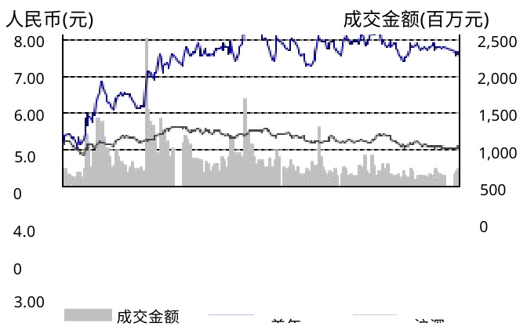  

公司基本情况（人民币）  

<html><body><table><tr><td>项目</td><td>2021</td><td>2022</td><td>2023E</td><td>2024E</td><td>2025E</td></tr><tr><td>营业收入(百万元)</td><td>9,156</td><td>8,533</td><td>11,004</td><td>12,773</td><td>14,676</td></tr><tr><td>营业收入增长率</td><td>17.16%</td><td>-6.80%</td><td>28.96%</td><td>16.08%</td><td>14.90%</td></tr><tr><td>归母净利润(百万元)</td><td>64</td><td>-533</td><td>573</td><td>794</td><td>1,058</td></tr><tr><td>归母净利润增长率</td><td>-88.42%</td><td>-931.26%</td><td>N/A</td><td>38.50%</td><td>33.31%</td></tr><tr><td>摊薄每股收益(元)</td><td>0.016</td><td>-0.136</td><td>0.146</td><td>0.203</td><td>0.270</td></tr><tr><td>每股经营性现金流净额</td><td>0.53</td><td>0.39</td><td>0.15</td><td>0.35</td><td>0.37</td></tr><tr><td>ROE(归属母公司)(摊薄)</td><td>0.80%</td><td>-7.15%</td><td>7.07%</td><td>8.92%</td><td>10.63%</td></tr><tr><td>P/E</td><td>479.09</td><td>-45.01</td><td>45.48</td><td>32.84</td><td>24.63</td></tr><tr><td>P/B</td><td>3.82</td><td>3.22</td><td>3.22</td><td>2.93</td><td>2.62</td></tr></table></body></html>

来源：公司年报、国金证券研究所  

# 内容目录  

. 体检行业仍具广阔发展空间，民营机构龙头具备发展优势. 4  
1.1 老龄化背景下居民健康意识增强，健康消费需求持续释放 4  
1.2 指令性转为预防保健性，体检行业快速发展 . 4  
1.3 政策加速出台，体检行业在政策引导下蓬勃发展 . 6  
1.4 体检机构居于产业链核心位置，民营机构具备发展优势 7  
美年健康：专业体检行业龙头，精细化管理和数字化转型推动高质量发展... 8  
2.1 专业体检机构优势品牌，门店布局持续拓展 . 8  
2.2 行业龙头地位稳固，发展优势明显 . 9  
2.3 业绩短期波动逐步修复，盈利空间有望得到释放 . 10  
2.4 客流量维持增长趋势，客单价仍具上涨空间 . 12  
2.5 体检中心内生与并购并重，逐步进入成熟期 . 14  
2.6 持续提升专精特新产品创新力，提升疾病早筛精准性 15  
2.7 数字化转型叠加 AI 赋能，打造全流程客户服务体验 . 16  
2.8 充分发挥平台价值，打造产业生态圈 . 17  
. 盈利预测与投资建议. 18  
4. 风险提示. 19  

# 图表目录  

图表 1： 我国 65 周岁及以上人口数量及占比持续提升 4  
图表 2： 居民人均医疗保健支出稳步增长 4  
图表 3： 农村和城镇居民医疗保健支出比重稳步提升 4  
图表 4： 体检行业市场规模持续上升 5  
图表 5： 我国健康检查人数维持增长趋势 5  
图表 6： 我国民营医院体检人次占比持续上升 6  
图表 7： 民营医院体检人次增速显著高于公立医院 6  
图表 8： 国家政策引导鼓励体检行业发展 6  
图表 9： 健康体检产业链 8  
图表 10： 专业体检机构相比医院具备一定优势 . 8  
图表 11： 公司发展历程 9  
图表 12： 2022 年民营体检市场份额分布... 9  
图表 13： 公司体检中心数量、覆盖城市以及年服务人次优势明显 10  
图表 14： 公司营业收入曲折中维持增长态势 . 10  
图表 15： 公司归母净利润出现短期波动 10  

图表 16： 公司品牌阵列充分满足不同层级需求 11  
图表 17： 公司四大品牌营业收入结构 . 11  
图表 18： 华东、华北收入占比较高（2022 年） 11  
图表 19： 各地区营业收入结构 .. 11  
图表 20： 公司毛利率水平有所下滑 . 12  
图表 21： 各地区毛利率水平存在一定差异 12  
图表 22： 公司销售、管理费用率水平基本维稳 12  
图表 23： 公司参控股体检中心年体检人次维持增长趋势（万人） . 13  
图表 24： 医疗机构体检服务价格概览 13  
图表 25： 公司客单价平稳增长（元） . 13  
图表 26： 2020-2022 公司个人客户收入占比均在 $17\%$ 左右 . . 14  
图表 27： 体检中心整体扩张速度放缓，“参转控”门店稳定增长. 14  
图表 28： 公司旗下体检中心成熟度逐渐上升 . . 15  
图表 29： 公司推出“脑睿佳”、“肺结宁”等重点创新产品 . 15  
图表 30： 公司癌症早筛产品布局情况 16  
图表 31： 公司与顶级医疗设备品牌达成战略联盟 16  
图表 32： 公司客户拓展战略 17  
图表 33： 公司数字化云平台建设 17  
图表 34： 公司产业生态圈涵盖多个产业链上下游企业 18  
图表 35： 公司收入拆分及预测 . 19  
图表 36： 公司费用率预测 . 19  
图表 37： 可比公司估值比较（PE 估值法） 19  

# 体检行业仍具广阔发展空间，民营机构龙头具备发展优势  

# 1.1 老龄化背景下居民健康意识增强，健康消费需求持续释放  

人口老龄化背景下，健康体检意义重大。健康体检是指通过医学手段和方法对受检者进行身体检查，了解受检者健康状况、早期发现疾病线索和健康隐患的诊疗行为。近年来，随 着居民生活水平的提高以及健康意识的持续增强，医疗服务需求的刚性特征愈发凸显。老 龄化加速发展的背景下，健康体检能够实现疾病的早期发现及诊断，成为政府减轻医保压 力和慢病管理的有效手段。我国人口结构老龄化有望从需求侧进一步推动健康体检行业发 展。  

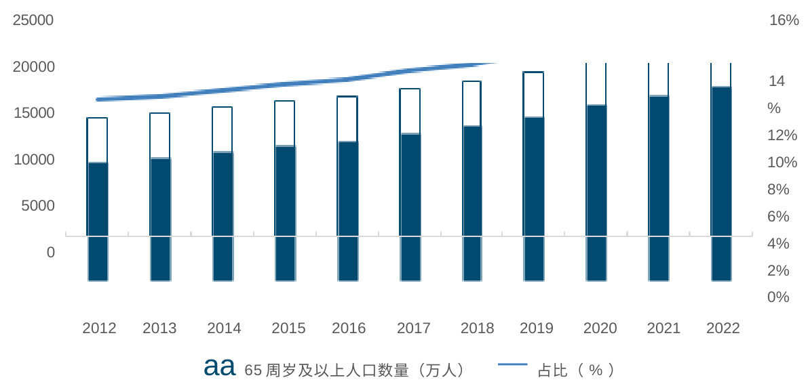  
图表1：我国65周岁及以上人口数量及占比持续提升  
来源：国家统计局，国金证券研究所  

居民健康意识持续增强，人均医疗保健支出稳步提升。近年来，“早发现、早干预、早治疗”的理念逐渐深入人心。我国居民人均医疗保健支出由 2012 年的 838 元提升到 2022 年的 2120 元，2012-2022 年复合增长率达到 9.73%。另一方面，伴随人均可支配收入的上升，居民对于医疗保健服务的需求稳步提升。2013-2022 年农村和城镇居民的医疗保健支出占消费的比重虽有波动，但稳步上升。农村居民医疗保健支出占比从 8.92%上升至9.81%， 城镇居民医疗保健支出占比则由 6.14%上升至 8.16%。未来随着民众健康意识的增强，将   会持续刺激居民释放健康消费需求。  

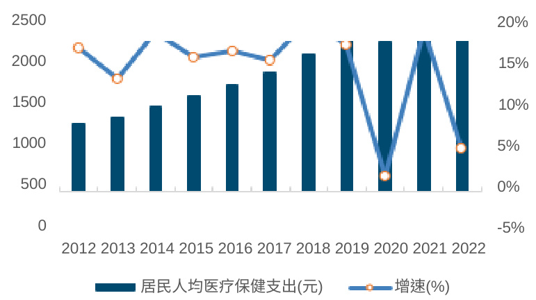  
图表2：居民人均医疗保健支出稳步增长  
来源：国家统计局，国金证券研究所  

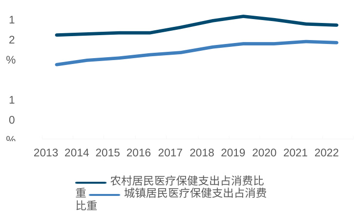  
图表3：农村和城镇居民医疗保健支出比重稳步提升  
来源：国家统计局，国金证券研究所  

# 1.2 指令性转为预防保健性，体检行业快速发展  

我国早期的健康体检具有指令性特点，主要为强制性专业化体检。体检限于征兵、升学或就业等硬性要求，体检的实施单位则是政府指定的非营利性医疗机构。2000 年后，伴随着 居民健康预防意识的提升，体检行业发展驱动力逐步转变到预防保健性体检需求，主要用 于疾病的早发现、早治疗， 具有自发性的特征，这一阶段民营机构和社会资本开始参与体 检领域。  

伴随着体检由强制指令性转为预防保健性，我国的非公立健康体检行业也进入快速发展阶段。体检行业陆续涌现出美年健康、爱康国宾、瑞慈医疗等连锁集团，为居民提供专业化 的体检服务。  

健康意识提升激发消费者对疾病早期筛查和防治需求，我国体检行业市场规模持续上升。2021 年我国体检市场规模约 1890.3 亿元，相较于 2015 年增长了约 106%，年复合增长率 达到 12.81%，近年来增长速度有所放缓，2022 年我国体检市场规模预计接近 2000亿元。 随着居民消费水平的提升以及全民大健康意识的形成和发展，民众对于健康体检乃至健康  管理的需求将进一步上升，行业有望恢复高速增长。  

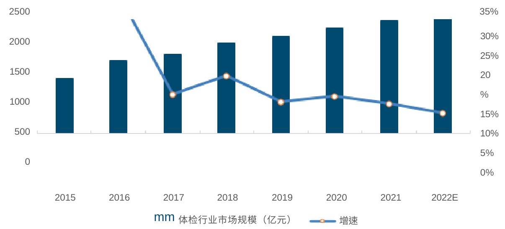  
图表4：体检行业市场规模持续上升  
来源：中商产业研究院，国金证券研究所  

健康检查人次增长速度有望提速，我国健康体检市场仍然存在着巨大发展空间。2012 至2021 年间，我国参加健康体检人次从 3.7 亿增长至约5.5 亿人次，年复合增长率约4.57%， 低于体检行业市场规模增速。2021 年的增长幅度达到了 27.33%，很大程度源于一段时间 以来需求的压制以及民众健康观念的转变。虽然近年来我国体检人次形成了一定的规模并 保持增长，但占总人口的比例仍较低，提升空间较大。据《中国卫生健康统计年鉴》数据 计算，2020 年及 2021 年全国体检行业渗透率分别为 31%及 39%，与德国、美国、日本 $70\%$ 以上的渗透率仍然存在较大差距。  

  
图表5：我国健康检查人数维持增长趋势  
来源：国家统计局，国金证券研究所  

公立医院仍占据体检市场主导地位。从医院健康检查人次的结构性数据观察，2021 年公立医院体检人次为 2.32 亿人次，民营医院体检人次为 0.54 亿人次，民营医院体检人次占比 19%。在支持社会办医发展等政策的驱动下，民营医院健康检查人次占比逐年提升，由 2015 年占比 14%提升至 2021 年占比 19%。目前非公立体检机构市场占有率仍然较低， 随 着连锁化、集团化的专业体检机构涌现及发展，市场专业化分工，居民健康管理意识增强， 在公立医院单点化运营且扩张受人员、设备限制明显的背景下， 接受专业体检机构的体检 服务有望成为健康体检行业的主流趋势。2016-2021 年民营医院体检人次增速普遍高于公 立医院，仅 2019 年偏低。2015-2021 民营医院体检人次年复合增长率达到 16.52%，显著 快于公立医院 9.1%的年复合增长率，随着民营医院体检人次增速持续高于公立医院， 民  

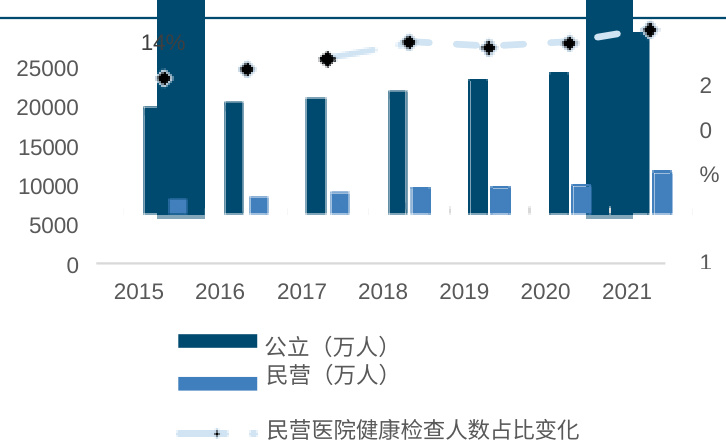  
图表6：我国民营医院体检人次占比持续上升  
来源：中国卫生健康统计年鉴，国金证券研究所  

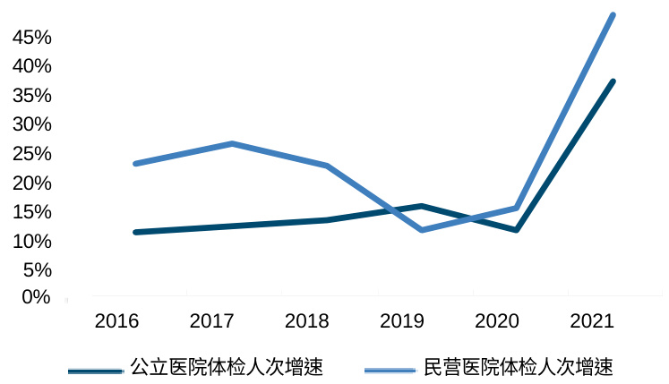  
图表7：民营医院体检人次增速显著高于公立医院  

来源：中国卫生健康统计年鉴，国金证券研究所  

# 1.3 政策加速出台，体检行业在政策引导下蓬勃发展  

国家政策驱动，体检行业规范发展。2019 年《关于促进社会办医持续健康规范发展的意见》提出鼓励健康体检中心连锁化、集团化经营，体检连锁集团有望得到进一步发展；《健康中国行动（2019—2030 年）》、《促进健康产业高质量发展行动纲要（2019-2022年）》等 文件内容重点覆盖疾病预防和健康管理两大方面，并提出应用健康医疗大数据，逐步实现 全人群全生命周期的健康信息大数据管理。2022 年，党的二十大报告将“健康中国”作为 我国 2035 年发展总体目标的重要方面，指出“坚持预防为主，加强重大慢性病健康管理， 提高基层防病治病和健康管理能力”。健康体检是实现健康管理的前提和基础，是疾病预 防的第一道关口，未来我国体检市场有望在国家政策引导下蓬勃发展。  

图表8：国家政策引导鼓励体检行业发展  

<html><body><table><tr><td>颁布主体</td><td>政策文件</td><td>公布时间</td><td>政策要点</td></tr><tr><td>国务院</td><td>《"十四五"国民健康规划》</td><td>2022-5</td><td>预防为主，强化基层·把预防摆在更加突出的位置，聚焦重大</td></tr><tr><td>国务院</td><td>《关于加强新时代老龄工作的意 见》</td><td>2021-11</td><td>提高老年人健康服务和管理水平·加强老年人群重点慢性病的 早期筛查、干预及分类指导，开展老年口腔健康丶老年营养改 善、老年痴呆防治和心理关爱行动。</td></tr><tr><td>国家卫健委</td><td>《促进健康产业高质量发展行动纲 要（2019-2022年）》</td><td>2019-9</td><td>发展优质健康管理·将家庭医生签约服务作为普及健康管理的</td></tr><tr><td>国家卫健委</td><td>《健康中国行动（2019一 2030年)》</td><td>2019-7</td><td>老年健康促进行动·老年人参加定期体检，经常监测呼吸、脉 搏、血压丶大小便情况，接受家庭医生团队的健康指导。</td></tr></table></body></html>  

<html><body><table><tr><td>颁布主体</td><td>政策文件? 公布时间</td><td colspan="2">政策要点</td></tr><tr><td rowspan="3"></td><td rowspan="3"></td><td></td><td>心脑血管疾病防治行动°40岁以下血脂正常人群每2～5年 检测1次血脂，40岁及以上人群至少每年检测1次血脂，心</td></tr><tr><td></td><td>脑血管疾病高危人群每6个月检测1次血脂°</td></tr><tr><td></td><td>癌症防治行动·建议高危人群选择专业的体检机构进行定期防 癌体检，根据个体年龄丶既往检查结果等选择合适的体检间隔</td></tr><tr><td colspan="2">国家卫健委 《关于促进社会办医持续健康规范</td><td></td><td>时间。 慢性呼吸系统疾病防治行动·将肺功能检查纳入40岁及以 上人群常规体检内容。 规范和引导社会力量举办康复医疗中心丶护理中心、健康体检</td></tr><tr><td>等十部门</td><td>发展的意见》 《关于进一步加强健康体检机构管</td><td></td><td>严把准入门槛，规范健康体检机构设置管理·鼓励健康体检中</td></tr><tr><td>国家卫健委</td><td>理促进健康体检行业规范有序发展 的通知》</td><td>2018-10 > ></td><td>心连锁化丶集团化经营，防止出现恶性竞争丶资源浪费。 规范服务行为，加强健康体检机构内部管理。 加强日常监管，促进健康体检机构健康发展。</td></tr><tr><td></td><td></td><td></td><td></td></tr><tr><td></td><td>《健康体检中心管理规范（试行）》</td><td>2018-5</td><td>对体检中心的机构管理丶质量管理丶安全管理丶监督管理进行 规范。</td></tr><tr><td>国家卫健委</td><td></td><td></td><td></td></tr><tr><td></td><td></td><td></td><td></td></tr><tr><td></td><td>《健康体检中心基本标准（试行）》</td><td></td><td></td></tr><tr><td>国家卫健委</td><td></td><td></td><td>对体检中心的诊疗科目丶科室设置丶人员配置丶基本设施丶分</td></tr><tr><td></td><td></td><td>2018-5</td><td></td></tr></table></body></html>

来源：各政府部门官网，国金证券研究所  

# 1.4 体检机构居于产业链核心位置， 民营机构具备发展优势  

上游：相关医疗机械仪器设备和医用耗材提供商。对接上游，体检机构主要采购医学影像及检测等医疗设备，大型连锁体检集团往往采用集中规模化的采购方式，采购量 较大，具备较强的议价能力。另一方面，我国医疗器械行业仍然未改变中小企业林立 的局面，这进一步增加了连锁规模化体检机构的采购议价能力，上游的变化难以对连 锁体检机构造成较大的影响。  

中游：公立体检中心和民营体检中心。市场份额上公立体检中心仍然占据主导地位。近年来，民营体检中心发展迅速，市场份额稳步提升。当下，健康体检产业正与互联网、保险、购药等行业深度融合，持续升级体检的延伸服务与增值服务，打造以健康体检为入口的健康管理体系，更好地满足客户多元化的健康需求。对体检对象进行健康管理以及全程保障，已经成为行业新的发展方向。  

下游：企业团体客户以及个人客户。团体客户订单量大，体检项目常规化、标准化，增值服务内容需求少，体检机构议价能力不强。个体客户则较为分散， 体检呈现个性化、定制化的特征，体检服务需求转为健康管理需求，这也是头部健康体检机构发力争夺的市场，主要依靠其服务能力、品牌力以及营销来获取客流量，体检机构议价能力较强，往往更贡献更高的利润率。  

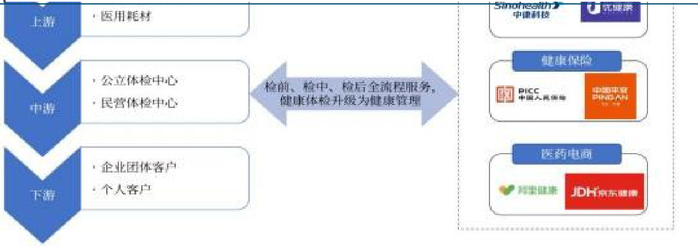  
表9：健康体检产业链  
来源：国金证券研究所  

产业链中游，连锁化的专业体检机构有望凭借竞争优势进一步扩大市场份额，对医院体检 形成部分替代。这种竞争优势主要来源于连锁化经营带来的品牌效应、体检设备齐全、避 免交叉感染、价格优势以及丰富的健康管理服务等。  

图表10：专业体检机构相比医院具备一定优势  

<html><body><table><tr><td>类别</td><td>专业体检机构</td><td>医院</td></tr><tr><td>运营模式</td><td>市场化连锁经营模式，体检中心覆盖范围广， 扩张速度快</td><td>本地单点经营，不具备连锁经营条 件</td></tr><tr><td>设备和环境</td><td>与大医院相比，先进硬件设备配置相对不足； 环境具有优势</td><td>高精尖设备齐全，环境一般</td></tr><tr><td>服务内容和质量</td><td>除体检服务本身外，能够基于体检结果建立个 人档案，并提出个性化的健康管理方案；服务 意识更强，标准化服务流程</td><td>服务内容基本仅限于体检；服务理 念和质量存在劣势，效率较低</td></tr><tr><td>风险因素</td><td>医检分离，有效避免交叉感染</td><td>医院内科室众多，存在交叉感染风 险</td></tr><tr><td>定价策略</td><td>在市场竞争压力下，普遍采取打折手段，在价 格上更具优势</td><td>定价上主要接受政府的指导价格， 较为刚性，体检服务价格往往高于 专业体检机构</td></tr></table></body></html>

来源：国金证券研究所  

# 2. 美年健康：专业体检行业龙头，精细化管理和数字化转型推动高质量发展  

# 2.1 专业体检机构优势品牌，门店布局持续拓展  

公司成立于 2004 年，是中国规模和影响力显著的健康体检和医疗集团，拥有“美年大健康”“慈铭”“慈铭奥亚”“美兆”四大健康体检品牌。  

公司以健康体检为核心业务，集健康咨询、健康评估、健康管理于一体，并以健康体检大 数据为依据，在专业预防、精准筛查、慢病管理、健康保险服务等领域，为企业和个人客 户提供高品质的健康管理服务，在预防医学领域拥有显著的影响力。公司的发展历程可以 分为三个阶段。  

第一阶段（2004-2011）：初创成长期，2006 年，公司第一家体检中心上海小木桥旗舰 店开业，并以连锁店模式向一、二级城市扩张，2011 年和大健康合并成为中国专业 体检及医疗服务集团之一。  
第二阶段（2012-2015）：持续扩张期，公司进行全国范围内的产业布局并持续扩张， 2012 年公司并购深圳瑞格尔体检连锁机构并引入凯雷投资集团入股。2013年，公司 获得中国平安战略、中法基金投资入股，产业规模进一步扩大。2015 年公司收购慈 铭体检 27.78%股权，并于同年借壳江苏三友上市，成为 A 股首家健康体检公司标的。  

第三阶段（2016 至今）：快速发展期。资本赋能下，公司快速发展，2016 年公司收购 个人健康管理机构美兆体检，2017 年完成对慈铭体检的全资收购，实现多层次多品 牌战略。2019 年加速搭建美年生态圈，获得阿里巴巴、蚂蚁金服、云峰基金战略入 股。2020 年全面转型升级，推动内生与外延并重的高质量发展与可持续增长，强化 检前、检中、检后的智能化健康管理，构建健康产业生态圈。  

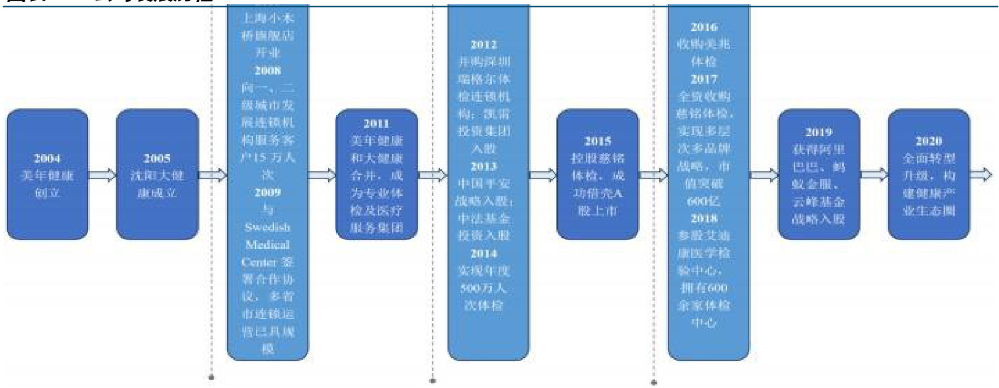  
图表11：公司发展历程  
来源：公司官网，国金证券研究所  

# 2.2 行业龙头地位稳固，发展优势明显  

公司为非公立体检行业龙头，与其他机构差距较大。2015 年，爱康国宾和美年健康的市场 占有率分别为 14.69%和 14.61%，而随着公司在 2017 年全资收购慈铭体检，公司份额优势 持续扩大。截至 2022 年底，美年健康+慈铭体检占据民营体检市场的近四分之公司体检中心数量多，分布范围广，具备规模效应。在体检中心数量上，公司具有绝对优势，能够触及更广泛的体检客户，截至 2023 年 6 月 30 日，公司旗下正在经营的体检中心达到 608 家，爱康国宾与瑞慈体检的体检中心数量则分别为 164 与 76 家。在城市布局上，公司同样具有优势，能够满足不同层级体检服务消费者的需求，在其他集团聚焦开展一、 二线城市业务时，公司已逐步完善全国性布局，一、二线城市与三、四、五线城市体检中 心共同发展。从年服务人次数据角度观察，公司 2022 年体检服务人次达到 2960 万人（含  

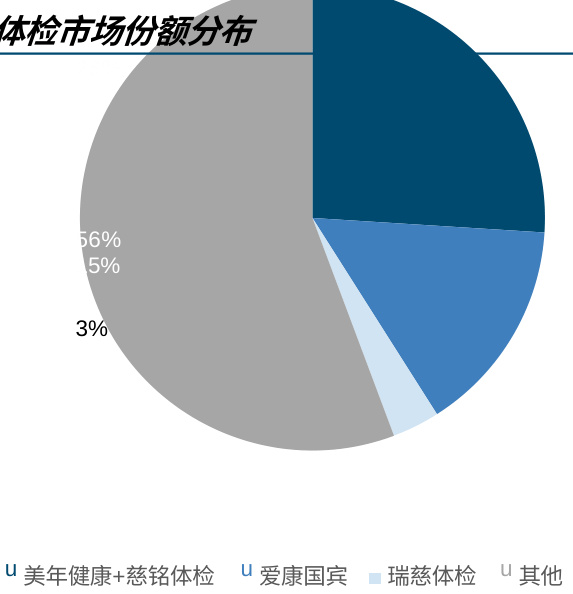  
图表12：2022年民营体检市场份额分布  
来源：中研普华产业研究院，国金证券研究所  

参股体检中心），爱康国宾近 800 万，瑞慈体检达到 326 万人次，公司服务人次规模上同 样具备较大优势，积累了丰富的客户资源。  

表13：公司体检中心数量、覆盖城市以及年服务人次优势明显  

<html><body><table><tr><td>中 公司名称</td><td>美年健康</td><td>爱康国宾</td><td>瑞慈体检</td></tr><tr><td>成立时间</td><td>2004</td><td>2004</td><td>2007</td></tr><tr><td>体检中心数量</td><td>608</td><td>164</td><td>76</td></tr><tr><td>覆盖城市数量</td><td>300+</td><td>59</td><td>29</td></tr><tr><td>体检中心分布情况</td><td>各线级城市分布较为均匀</td><td>主要分布在一丶二线，部 分三线城市</td><td>集中于一线丶新一线和二 线城市</td></tr><tr><td>年服务人次</td><td>2960万</td><td>近800万</td><td>326万</td></tr></table></body></html>

来源：公司公告，瑞慈医疗公司公告，爱康国宾官方微信，国金证券研究所  

# 2.3 业绩短期波动逐步修复，盈利空间有望得到释放  

公司营业收入恢复增长趋势。2016 至 2022 年，公司营业总收入由 30.82 亿增长至85.33 亿元，年复合增长率达到 18.5%。2020 年及 2022 年受环境因素影响，到检人次不及预期， 营业收入出现短期下滑。2023 年公司营业收入增长有望恢复，2023H1 公司实现营业收入 44.05 亿元，同比增长 49.87%。  

公司利润端近年出现一定波动，2019 年计提商誉减值准备 10.35 亿元，其后几年因门店正常经营节奏难以维持，盈利能力受到影响。得益于公司近年持续深耕精细化运营与数字化运营，持续围绕“保质、增收、提效、降本”等重点工作，门店经营恢复正常后，2023H1公司实现归母净利润 0.10 亿元，同比扭亏。  

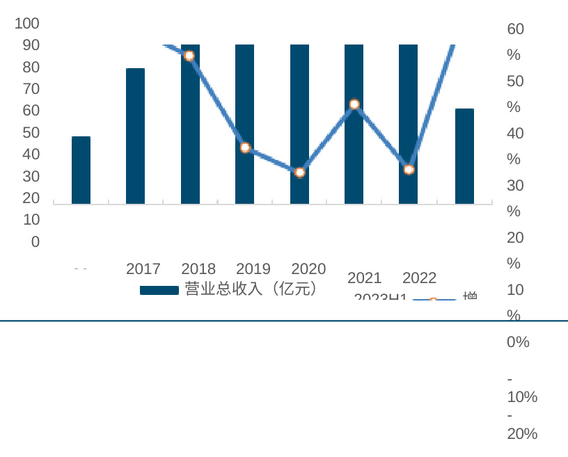  
图表14：公司营业收入曲折中维持增长态势  
来源：公司公告，国金证券研究所  

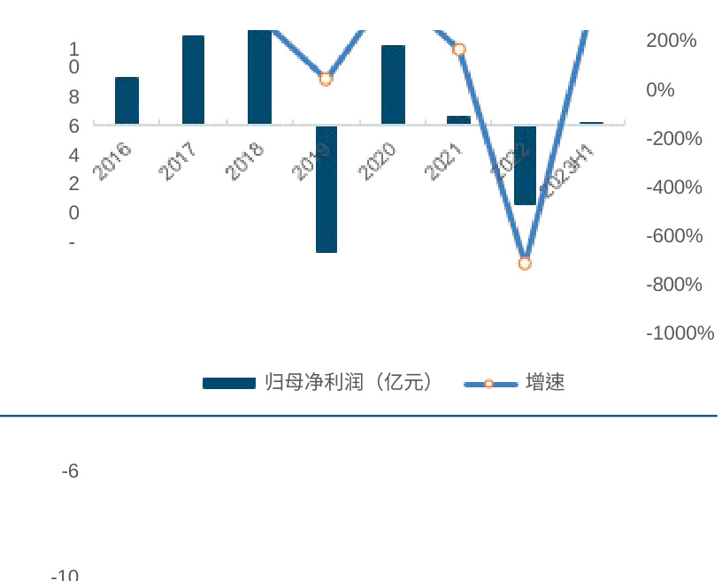  
图表15：公司归母净利润出现短期波动  
来源：公司公告，国金证券研究所  

四大品牌协同发展，打造多层次多品牌战略。公司专注体检行业，打造四大健康体检品牌协同发展、互相促进，以多方位多层次产品服务矩阵，满足不同类型客户的多样化需求。“美年大健康”和“慈铭”两大品牌覆盖大众健康体检领域，在中高端团体健康体检、综 合医疗服务市场与高端个人健康体检领域，分别通过“奥亚”与“美兆”品牌提供高水准 的优质服务。近年来，公司四大品牌营收结构变化不大，2023H1 公司旗下各品牌营业收入 中，“美年大健康”占比 78.1%，“慈铭”和“奥亚”占比 20.6%，“美兆”占比 1.3%，营业 收入同比增长率分别为 45.45%、71.13%以及 126.92%。  

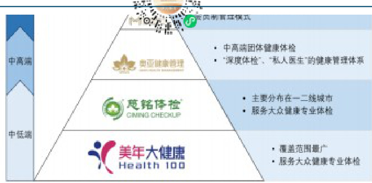  
图表16：公司品牌阵列充分满足不同层级需求  
来源：公司官网，公司公告，国金证券研究所  

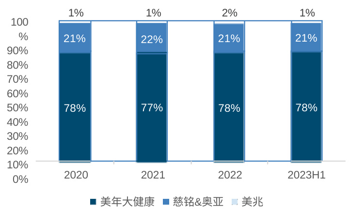  
来源：公司公告，国金证券研究所  

公司华东、华北地区收入占比高，其他地区发展空间广阔。华东和华北地区为公司主要收入来源，2022 年两地区收入占比达到 54%。2017-2022 年，华东地区营业收入年复合增长 率最高，达到 10.2%，其次是中南地区 $9.5\%$ ，华北、华南、西南、东北以及西北地区年复 合增长率则分别为 4.3%、5.5%、4.9%、1.4%以及 $1.2\%$ 。华东地区不仅收入占比高，且营 收增长较快，源于公司在华东地区布局较多体检中心，且华东地区居民人均收入较高，体 检需求旺盛。西南、东北以及西北地区营收占比较低，未来仍然具有广阔的发展空 间。 2023H1 收入增长较快的地区为东北、华北、中南、华东以及西北地区，同比增速分别为 90.55%、63.10%、57.40%、53.91%以及 $43.67\%$ 。  

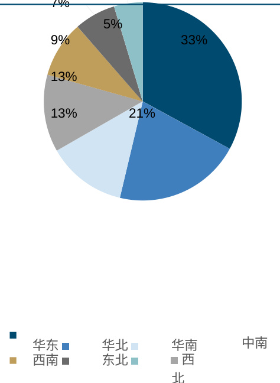  
图表18：华东、华北收入占比较高（2022年）  
图表20：公司毛利率水平有所下滑  
来源：公司公告，国金证券研究所  

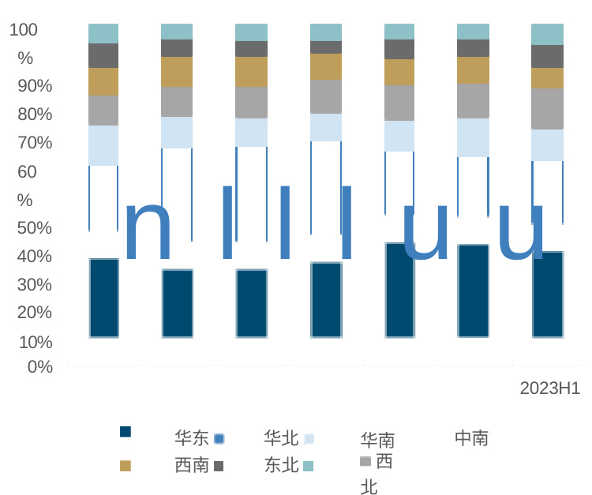  
图表17：公司四大品牌营业收入结构  
图表19：各地区营业收入结构  
图表21：各地区毛利率水平存在一定差异  
来源：公司公告，国金证券研究所  

毛利率水平较高，盈利能力有望修复。2017-2019 公司毛利率维持在 40%以上，2020下滑 至 40%以下，近年来毛利率出现下滑主要受疫情影响，体检产能无法释放。2023 年上半年 毛利率为 37.15%，2022 年同期数据为 19.47%，盈利情况已得到明显改善。此外，公司经 营规律呈现明显季节性，通常一季度为业务淡季，二、三季度业务相对平稳增长， 而四季 度为业务旺季，各季度成本比重基本稳定，公司上半年毛利率一般低于下半年，2023 全年 毛利率有望触底反弹。  

各地区毛利率水平存在一定差异，华东和中南地区毛利率水平相对较高。华东和中南地区体检中心成熟度高，居民健康意识强，体检中心盈利能力相对较强。2023 年上半年各地区 毛利率均有所回升，华北、华东、华南以及中南地区相比 2022 年同期毛利率分别同比增 长 29.86pcts、15.45 pcts、5.66 pcts 以及 13.77 pcts。随着公司提升内控标准，逐步 释放连锁组织效能，提升客单价水平，毛利率有望逐步反弹，盈利能力得到修复。  

  
来源：公司公告，国金证券研究所  

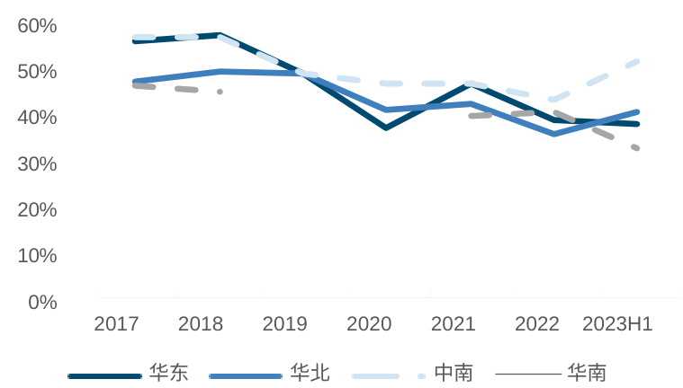  
来源：公司公告，国金证券研究所  

期间费用率保持稳定，有望得到改善。2017-2022 公司销售费用率基本维持在 24%上下，， 管理费用率 2022 年出现提升，主要由于 2022 年员工股权激励带来的股权支付费用提升。 公司的销售、管理费用率近年来基本维稳，2023H1 两项费用率分别为 23.94%以及 8.49%， 与 2020-2022 同期相比出现小幅下降。随着公司持续推进精细化运营和数字化转型，扁鹊 系统持续赋能体检流程优化，提升公司体检服务运营效率，星辰系统赋能销售端，提升签  单转化率，提升人效与坪效，公司各项费用率有望得到进一步控制。  

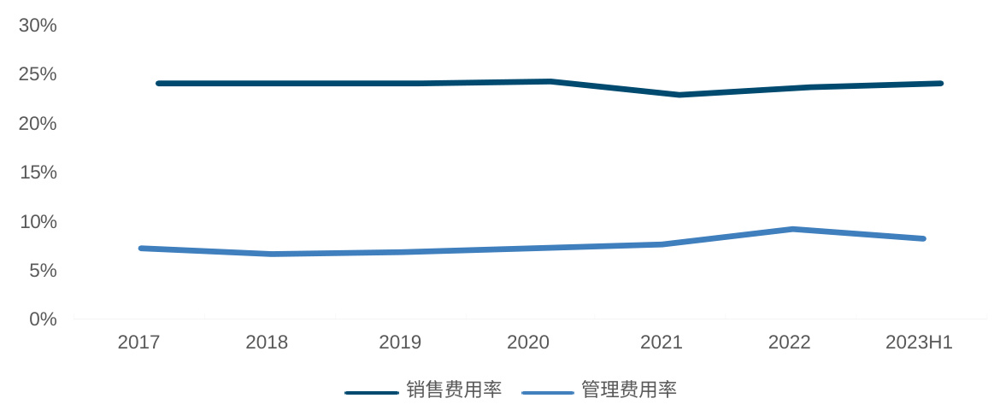  
图表22：公司销售、管理费用率水平基本维稳  
来源：公司公告，国金证券研究所  

# 2.4 客流量维持增长趋势，客单价仍具上涨空间  

公司体检服务客流量有望逐渐回升。2022 年，公司全年总接待人次为 2960 万人（含参股 体检中心），较 2017 年增加近 800 万人。2017-2022 年接待体检人次呈现波动增长态势， 2019 以及 2020 年，体检人次出现下滑，2021 年客流量出现极大回升，体检人次达到 3080 万人。2022 年相比 2021 年体检人次下降，基数较低，2023 上半年公司总接待体检人次为 1244 万人，相比 2022 同期增加 1.58%，其中控股体检中心总接待人次为695 万人，相比 2022 同期增加 36%，未来客流量有望逐步回升。  

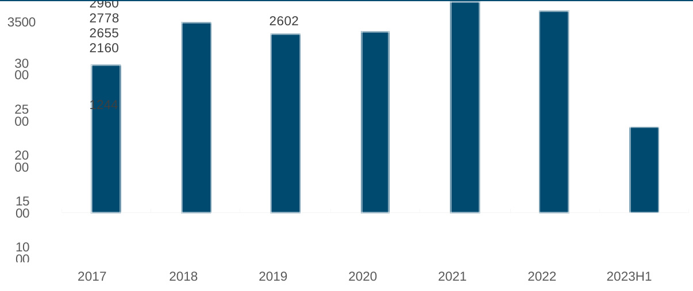  
表23：公30司80参控股体检中心年体检人次维持增长趋势（万人）  
来源：公司公告，国金证券研究所  

公司客单价相对较低，提价空间充足。公司平均客单价与公立医院仍然存在较大差距。对于公立头部医院，其最终结算客单价与门市价基本相当，部分二级医院对团体客户提供价 格优惠，但优惠十分有限。而民营体检机构普遍采取折扣作为营销策略，通常也能够提供 更加丰富的体检服务选项。即使相比于二级医院体检服务客单价，公司也具备较为充足的 提价空间。  

图表24：医疗机构体检服务价格概览  

<html><body><table><tr><td colspan="2">类型</td><td>客单价 (元)</td></tr><tr><td rowspan="4">公立</td><td>三甲头部医院</td><td>5000-8000</td></tr><tr><td>一般三甲医院</td><td>1800-5000</td></tr><tr><td>二级医院</td><td>800-2000</td></tr><tr><td>基层医疗机构</td><td>1000以下</td></tr><tr><td rowspan="2">民营</td><td>美年健康</td><td>583 (2022年)</td></tr><tr><td>瑞慈体检</td><td>541 (2022年)</td></tr></table></body></html>

来源：公司公告，瑞慈医疗公司公告，弗若斯特沙利文，国金证券研究所  

近年来公司客单价保持平稳增长，2022 年客单价达到 583 元，2019-2022 年复合增长率达 到 5.2%，2023 年上半年客单价则达到 594 元。近年来，公司围绕重点学科，持续推出创 新体检产品，如脑睿佳、肺结宁、眼底分析等，为客户提供深度检查和服务，这部分创新 体检产品将进一步助推公司客单价提升，并为复苏后的健康消费需求激增打下基础。  

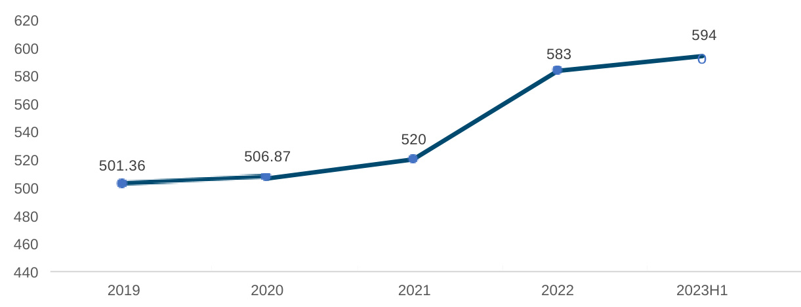  
图表25：公司客单价平稳增长（元）  
来源：公司公告，国金证券研究所  

体检消费者以团体客户为主，个检业务具备广阔发展空间。公司 2019 年团检和个检客户 占比为 78%：22%，2020-2022 个人客户占收入比维持在 17%左右。公司团体和个人的体检 需求持续提升，针对团检客户，公司致力于实现政企大客引领的 B 端业务升级，聚焦政企  

$$
\therefore
$$  

优质客户的开发和服务，提升整体客单价。针对个人客户，公司积极拓展个检和增值服务市场空间。公司加强与电商平台合作，基于门店深耕本地生活，完成美年臻选分销商城全覆盖，初步形成了公域吸引流量，私域沉淀流量的业务闭环，推动线上线下一体化运营。 同时，公司推动 B 端及 C 端客户相互流动，推动 B 端客户体检加项，未来个检占比有望提 升，由于个检客单价一般相比团检略高，公司整体客单价有望进一步提升。  

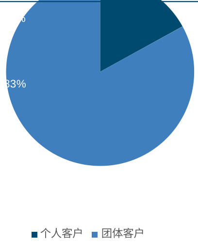  
图表26：2020-2022公司个人客户收入占比均在17%左右  
来源：公司公告，国金证券研究所  

# 2.5 体检中心内生与并购并重，逐步进入成熟期  

体检中心数量扩张速度放缓，控股体检中心数量稳定增长。截至 2023 年 6 月 30 日，公司 旗下体检中心数量共 608 家。自 2019 年起，公司体检中心数量趋于稳定，扩展速度放缓， 结构层面则在持续优化，2019 年公司控股体检中心 266 家，截至 2023 年上半年则为 293 家。参股体检中心则由 333 家降至 315 家。参股转控股体检中心数量稳步上升，公司未来 将积极加快推进优质参股公司的收购和整合，推动内生和并购并重的可持续增长。  

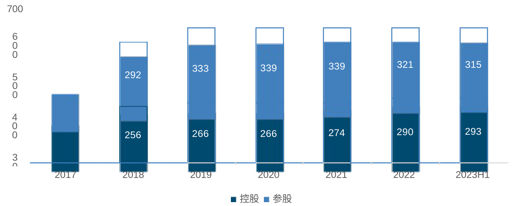  
图表27：体检中心整体扩张速度放缓，“参转控”门店稳定增长  
来源：公司公告，国金证券研究所  

近年公司体检中心扩张速度放缓，旗下体检中心成熟度也逐渐提升。从控股体检中心发展阶段观察，2017-2022 年，存续 5 年以上的体检中心占比从 29%上升至 55%，2022 年82% 的控股体检中心已营业超过 3 年，18%的控股体检中心营业年限在 3 年以内。对于体检中 心而言，一般经历半年左右筹建期、一至两年的发展期、然后进入盈亏平衡期，最终到达 成熟期。在盈亏平衡期后，体检中心会处于相对稳定的盈利状态。因此随着公司旗下大部 分体检中心进入成熟期，公司将具备较强的内生增长动力，盈利水平有望得到提升。  

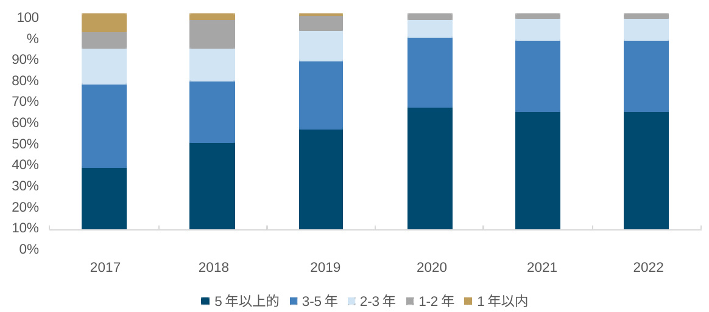  
表28：公司旗下体检中心成熟度逐渐上升  
来源：公司公告，国金证券研究所  

一、二线城市与三、四、五线城市体检中心共同发展，逐步完善全国性布局。截至 2019 年底，公司 47.3%的体检中心分布在三、四五线城市，52.7%的体检中心分布在一、二线城 市，不同线级门店分布较为均衡，一、二线城市体检中心收入贡献较大。考虑到2019 年 起公司整体体检中心数量较为稳定，更多是参股转控股上的变化，公司体检中心在城市分 布上不会出现较大变化，一、二线城市与三、四、五线城市门店基本呈现平分的格局。一、 二线城市的特点在于更强的消费能力以及更高的客单价，但面临着更激烈的竞争，整体市 场更为饱和。三、四、五线城市则由于高端医疗设备相对缺乏，消费者对于医疗服务的需 求无法得到完全满足，存在更为广阔的市场空间。近年来， 公司在一、二线城市密集分布 的基础上，继续深耕三、四、五线城市，抢占市场先机。  

# 2.6 持续提升专精特新产品创新力，提升疾病早筛精准性  

公司持续推进创新项目的引进和开展，塑造创新产品力。围绕学科创新， 公司加强重点学科建设，不断进行创新专项产品的迭代及运营优化。公司推出“脑睿佳”、“肺结宁”、“阳 康安心检”等重点创新产品。“脑睿佳”产品主要针对脑认知和脑卒中潜在风险人群进行 早期筛查、风险评估，“肺结宁”产品实现了肺结节全链路闭环管理，“阳康安心检”重视 公众康复后可能存在的健康隐患，及时满足了市场需求。  

图表29：公司推出“脑睿佳”、“肺结宁”等重点创新产品  

<html><body><table><tr><td>产品名称</td><td>套餐种类</td><td>核心检测项目</td><td>售价</td></tr><tr><td rowspan="2">脑睿佳</td><td>脑认知智能风险评估套餐</td><td>认知功能自测量表丶APOE基因检 测、100+脑区及认知功能评估丶脑容积 核磁扫描</td><td rowspan="2">1580</td></tr><tr><td>脑卒中智能风险评估套餐</td><td>脑卒中风险自测量表丶脑卒中风险评估、 APOE基因检测丶叶酸代谢能力评估丶颈 动</td></tr><tr><td rowspan="2">肺结宁</td><td></td><td>脉斑块核磁扫描 影像E+回顾性肺结节深度分析报告丶美 年肺健康重疾方案</td><td></td></tr><tr><td>尊享版</td><td>七种肺癌相关抗体检测、影像E+回顾性肺 结节深度分析报告丶肺健康服务包丶美年肺 健康重疾方案</td><td>1299</td></tr><tr><td>阳康安心检</td><td>标准款</td><td>胸部CT丶肺功能检查丶肝胆胰脾肾彩 超、心肌酶检测丶超敏C反应蛋白</td><td>529</td></tr></table></body></html>

来源：公司官网，国金证券研究所  

强化癌症早筛体检项目研发，满足客户多元化健康需求。围绕项目创新，公司探索与供应商的创新合作模式，布局常见肿瘤早筛项目，提升疾病早筛的精准性，强化肺癌、胃癌、 肠癌、肝癌、乳腺癌、宫颈癌等常见肿瘤的早筛科技研发，建立独特产品优势和技术壁垒。  

表30：公司癌症早筛产品布局情况  

<html><body><table><tr><td>早筛类别</td><td>公司创新产品</td></tr><tr><td>肺癌</td><td>低剂量螺旋CT (宏观影像）+肺癌七种自身抗体(微观抗体)</td></tr><tr><td>胃癌</td><td>安翰磁控胶囊胃镜、胃癌基因甲基化无创筛查</td></tr><tr><td>肠癌</td><td>S9及SDC2基因甲基化类肠癌筛查</td></tr><tr><td>肝癌</td><td>肝癌筛查三项（甲胎蛋白异质体AFP-L3丶异常凝血酶原DCP丶高尔基体蛋白73)</td></tr><tr><td>乳腺癌</td><td>自动乳腺容积超声检查、遗传性乳腺癌-卵巢癌BRCA1/2基因检测</td></tr><tr><td>宫颈癌</td><td>HPV+TCT联合检查</td></tr></table></body></html>

来源：公司官方微信，国金证券研究所  

持续引进高端医疗设备，夯实医疗质量与服务品质。公司对设备有严格要求， 各体检分院都引进国际主流品牌医疗设备，采购西门子、飞利浦、东芝、联影、佳能等具有影响力的中外品牌，与各地头部三甲医院相当，并持续进行更新优化。公司采取集团集中采购管理模式，对各地区所需要的设备、试剂、耗材，集中招标采购，保证了全国各家体检分院品牌和品质的统一性。目前公司各体检中心配置有核磁共振、低剂量螺旋 CT、胶囊胃镜、DR 等设备，从品牌占比情况看，公司设备国际化优势明显，位于国内体检行业前列。  

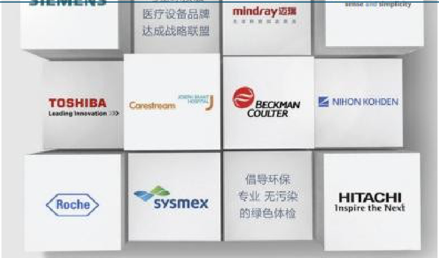  
图表31：公司与顶级医疗设备品牌达成战略联盟  
来源：公司官网，国金证券研究所  

# 2.7 数字化转型叠加 A I 赋能，打造全流程客户服务体验  

全面部署数字化客户服务平台，提升客户体验及运营效率。针对 B 端客户，公司全面部署 星辰客户管理系统。公司成立团检发展中心，统一协调 B 端业务精细化管理，全面升级为 客户提供专业健康解决方案的提案能力。针对 C 端客户，公司升级触客渠道，加大与电商 平台的合作力度，并积极推进本地生活平台运营，完成美年臻选分销商城全覆盖，初步形 成了公域吸引流量，私域沉淀流量的闭环营销体系。  

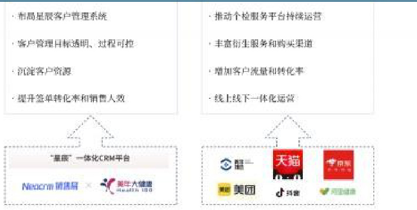  
图表32：公司客户拓展战略  
来源：公司公告，国金证券研究所  

数字化转型助力精细化运营，持续赋能体检全流程。公司深化推进基于 SaaS 的新一代体检软件扁鹊 2.0 的实施，重点实现体检业务的双端小程序预约、分时预约、智能加项、自助登记、智能导检等功能的同时提升人效、坪效， 推进精细化管理；公司持续推进医技类云平台-影像 PACS 云平台、超声 PACS 云平台、心电云平台、眼科云平台覆盖率，借助影 像 A I、心电 A I、眼底 A I、超声 A I 提升医疗诊断质量和工作效率，持续强化专业体检核 心竞争力。目前，公司已经对业务全流程实现精细化运营管理，实现数据驱动、一看到底、 高效协同和精准业务决策支撑。  

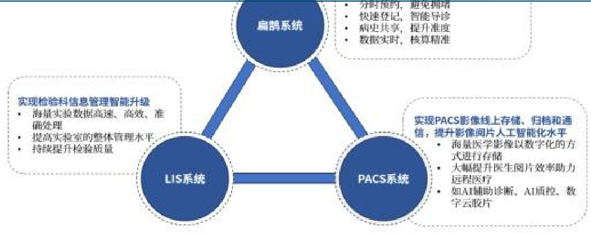  
图表33：公司数字化云平台建设  
来源：公司公告，国金证券研究所  

公司布局 AIGC 技术，助力企业从数字化转型升级为数字化运营。公司将进一步利用A I人 工智能和健康大数据，赋能企业运营管理能力。目前， 基于已有的体检数据优势，美年健 康研究院推动系列研发及成果转化。未来，公司将利用 A I 人工智能，尽早实现智能总检、 虚拟健康顾问等先进技术的产品化。  

# 2.8 充分发挥平台价值，打造产业生态圈  

基于上下游产业链的布局，公司坚持“做大主业、建立生态、形成闭环”的生态圈发展战略，在发力“互联网+”医疗领域的同时，也在“医疗健康+”生态圈建设方面不断拓展， 从前端的检测、诊断等线上线下环节逐步向链条后方延伸。  

随着营业规模的不断扩大以及体检中心的持续扩张，公司积累了丰富的健康体检数据，已成为颇具规模与影响力的预防医学平台和健康需求入口。公司依托精准流量、医疗载体和渠道影响力，在产业生态圈建设层面，重点布局智能诊断、专科医疗服务、慢病管理、基因检测、大数据与人工智能、远程医疗、中医药产业、健康金融等核心赛道，取得领先优势，持续建设精准预防、先进诊断和医疗服务领域创新生态圈， 进一步巩固平台的竞争力  

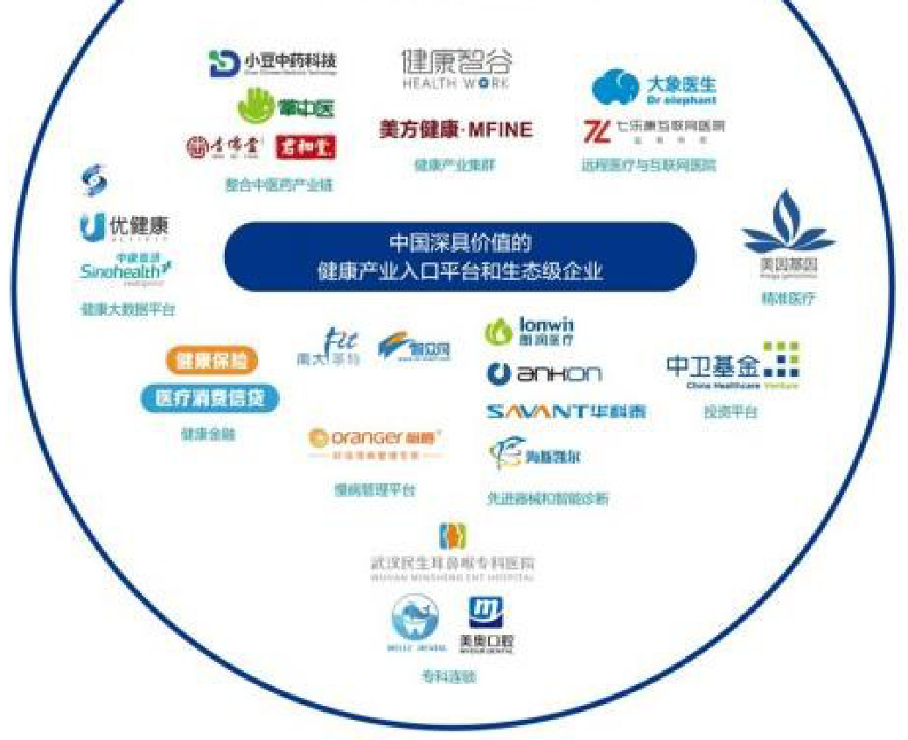  
图表34：公司产业生态圈涵盖多个产业链上下游企业  
来源：公司官网，国金证券研究所  

# 3. 盈利预测与投资建议  

考虑到 2022 年公司营业收入低基数因素，预计 2023 年公司营业收入增速较高，2024-2025 年逐步恢复正常增速。  

客单价：考虑到对比公立体检机构，公司定价偏低，具备提升空间与意愿，且公司持续推 出创新体检产品，完善健康管理升级需求，客单价仍具上涨空间，预计 2023-2025 公司客 单价增速分别为 11.5%/9.0%/8.3%。  

体检人次：国内体检渗透率仍然较低，老龄化背景下居民健康意识持续增强，公司作为布局广泛的民营体检机构龙头，对广大消费者更具吸引力，体检人次增速有望进一步提升。 预计 2023-2025 年公司体检总人次增速分别为 5.9%/6.7%/7.1%，其中控股门店人次增速 分别为 4.6%/5.3%/5.5%，参股门店人次增速分别为 8.0%/9.0%/9.5%。控股门店与参股门 店整体数量相当，但是参股门店店龄普遍更新，处于快速爬坡阶段。2022 年，控股体检中 心店龄 5 年以上的占比 55%， 店龄 3 年以上占比 82%，后续并入的也是运营时间较长且稳 态运营的参股门店，所以参股门店体检人次增速快于控股门店。  

基于公司客单价以及体检人次的变化情况，我们预计公司 2023-2025 营业总收入为110.04 亿元、127.73 亿元、146.76 亿元，分别同比增长 29%、16%、15%。随着疫情影响消除，公 司体检中心产能完全释放，以及公司持续推进降本增效与项目定价提升，预计公司毛利率 将逐步增加，2023-2025 毛利率分别为 37.3%、38.2%、38.7%。  

表35：公司收入拆分及预测  

<html><body><table><tr><td>控股门店收入（亿元） yoy</td><td>93.61</td><td>84.31 -10%</td><td>96.72 15%</td><td>107.21 11%</td><td>125.04 17%</td><td>143.52 15%</td><td>163.98 14%</td></tr><tr><td>毛利额（亿元） 毛利車</td><td></td><td>28.95 37.1%</td><td>36.11 39.4%</td><td>29.30 34.3%</td><td>41.04 37.3%</td><td>48.79 38.2%</td><td>56.80 38.7%</td></tr><tr><td>客单价（元） yoy</td><td>501</td><td>507 1.1%</td><td>520 2.6%</td><td>583 12.1%</td><td>650 11.5%</td><td>709 9.0%</td><td>767 8.3%</td></tr><tr><td>总人次（万人） yoy</td><td>2602</td><td>2654.9 2.0%</td><td>3080.0 16.0%</td><td>2960.0 -3.9%</td><td>3134.3 5.9%</td><td>3345.2 6.7%</td><td>3582.0 7.1%</td></tr><tr><td>控股人次（万人） yoy</td><td>1867</td><td>1663.4 -10.9%</td><td>1860.0 11.8%</td><td>1839.0 -1.1%</td><td>1923.6 4.6%</td><td>2025.5 5.3%</td><td>2136.9 5.5%</td></tr><tr><td>参股人次（万人） yoy</td><td>735</td><td>991.5 34.9%</td><td>1220.0 23.0%</td><td>1121.0 -8.1%</td><td>1210.7 8.0%</td><td>1319.6 9.0%</td><td>1445.0 9.5%</td></tr></table></body></html>

\*客单价不包含人职体检、职业病检查和核酸检测  

随着公司持续推进精细化运营和数字化转型，扁鹊系统持续赋能体检流程优化，提升公司体检服务运营效率，星辰系统赋能销售端，提升签单转化率，提升人效与坪效，公司在费用 率 方 面 有 望 逐 步 优 化 。 预 计 2023-2025 年 公 司 销 售 费 用 率 分 别 为22.6%/22.3%/22.1%， 管理费用率分别为 7.9%/8.0%/8.1%。除 2021 年与归母净利润为负值的年份外，近年公司 少数股东损益与归母净利润比例为 2020 年 14.1%、2016-2018年 10.5%/11.6%/15.6%，参 考该比例，预测 2023-2025 年少数股东损益为 110/131/140百万元。  

图表36：公司费用率预测  

<html><body><table><tr><td></td><td>2021</td><td>2022</td><td>2023E</td><td>2024E</td><td>2025E</td></tr><tr><td>销售费用率</td><td>22.8%</td><td>23.6%</td><td>22.6%</td><td>22.3%</td><td>22.1%</td></tr><tr><td>管理费用率</td><td>7.8%</td><td>9.4%</td><td>7.9%</td><td>8.0%</td><td>8.1%</td></tr></table></body></html>

来源：wind，国金证券研究所  
来源：wind，国金证券研究所  

选用相对估值法对公司进行估值，选取同属于医疗服务行业的爱尔眼科、华厦眼科、何氏眼科作为可比公司。2023 年至 2025 年平均市盈率分别为 46 倍、35 倍和 27 倍。公司作为 体检行业龙头，也是体检行业稀缺标的，将持续受益于居民健康消费需求的增长，公司不 断推动内生与外延并重的高质量发展和可持续增长，盈利空间有望得到释放。参考同行业 上市公司可比估值情况，给予公司 2023 年 57 倍 PE 估值，对应目标价 8.34元/股，首次 覆盖给予“买入”评级。  

图表37：可比公司估值比较（PE估值法）  

<html><body><table><tr><td rowspan="2">代码</td><td rowspan="2">名称</td><td rowspan="2">股价 (元)</td><td colspan="5">EPS</td><td colspan="5">PE</td></tr><tr><td>2021A</td><td>2022A</td><td>2023E</td><td>2024E</td><td>2025E</td><td>2021A</td><td>2022A</td><td>2023E</td><td>2024E</td><td>2025E</td></tr><tr><td>300015.SZ</td><td>爱尔眼科</td><td>18.73</td><td>0.43</td><td>0.35</td><td>0.37</td><td>0.49</td><td>0.64</td><td>98.38</td><td>88.33</td><td>48.87</td><td>36.45</td><td>27.99</td></tr><tr><td>301267.SZ</td><td>华厦眼科</td><td>47.48</td><td>0.91</td><td>0.91</td><td>0.82</td><td>1.06</td><td>1.37</td><td></td><td>80.00</td><td>50.08</td><td>38.85</td><td>30.07</td></tr><tr><td>301103.SZ</td><td>何氏眼科</td><td>34.99</td><td>0.948</td><td>0.21</td><td>0.94</td><td>1.25</td><td>1.63</td><td></td><td>150.00</td><td>39.92</td><td>29.97</td><td>22.98</td></tr><tr><td>平均值</td><td></td><td></td><td></td><td></td><td></td><td></td><td></td><td>98.38</td><td>106.11</td><td>46.29</td><td>35.09</td><td>27.01</td></tr><tr><td>002044.SZ</td><td>美年健康</td><td>6.66</td><td>0.02</td><td>-0.14</td><td>0.15</td><td>0.20</td><td>0.27</td><td>479.09</td><td>-45.01</td><td>45.48</td><td>32.84</td><td>24.63</td></tr></table></body></html>

来源：wind，国金证券研究所，注：股价采用 2023 年 10 月 12 日收盘价数据、可比公司 EPS 为国金证券研究所预测数据  

# 4. 风险提示  

医疗质量风险：健康体检属于医疗服务行业，存在因不确定性因素导致发生漏检、误检及 医疗纠纷的风险，可能对品牌声誉造成不利影响。  

市场竞争加剧风险：公司是专业体检行业龙头，在品牌、产品力以及精细化运营上具有较 强竞争力，未来市场容量增长不及预期或新资本介入都可能引起市场竞争加剧。  

客流量恢复不及预期的风险：2022 年客流量普遍低基数，如果体检中心客流量恢复不及  

预期或客户消费能力下降，可能影响公司经营业绩。  

商誉减值风险：截至 2022 年底，公司商誉账面价值为 43.5 亿元。假如未达收益预期，可 能面临商誉减值的风险，影响公司当期利润。  

连锁化经营带来的经营管理风险：近年来公司体检中心扩展较为迅速，尽管公司体检中心标准化程度较高，且公司在体检分院持续深化“分院-科室-岗位”的三级质控体系。但在 公司旗下体检中心数量众多、扩张速度较快的情况下，可能存在经营管理不善的风险。  

股票质押风险：公司股票质押余量占 A 股合计比 15.13%，比例较大，可能存在股票质押 风险。  

美年健康存在收入无法达预期，不建议进行投资，给与不买入投资建议  

# 附录：三张报表预测摘要  

<html><body><table><tr><td colspan="3">损益表 (人民币百万元)</td><td colspan="11">资产负债表 (人民币百万元)</td></tr><tr><td></td><td>2020</td><td>2021</td><td></td><td>2022</td><td>2023E</td><td>2024E</td><td>2025E</td><td></td><td></td><td></td><td>2020</td><td>2021</td><td>2022</td><td>2023E</td><td>2024E</td></tr><tr><td>主营业务收入</td><td>7,815</td><td>9,156</td><td></td><td>8,533</td><td>11,004</td><td>1 2,773</td><td>14,676</td><td>货币资金</td><td></td><td>3,545</td><td></td><td>2,264</td><td>1,984</td><td>2,009 2,311</td><td>2025 E</td></tr><tr><td>增长率</td><td></td><td>17.2%</td><td></td><td>-6.8%</td><td>29.0%</td><td>16.1%</td><td>14.9%</td><td>应收款项</td><td></td><td>3,153</td><td></td><td>2,928 2,924</td><td>3,253</td><td>3,825</td><td>2,650</td></tr><tr><td>主营业务成本 %销售收入</td><td>-4,919</td><td>62.9%</td><td>-5,544 60.6%</td><td>-5,602 65.7%</td><td>-6,895 62.7%</td><td>-7,889 61.8%</td><td>-8,991 61.3%</td><td>存货 其他流动资产</td><td></td><td></td><td>133 889</td><td>149 549</td><td>221 200 371 593</td><td>233 671</td><td>4,423 251</td></tr><tr><td>毛利 %销售收入</td><td>2,896 3,611</td><td>2,930 39.4%</td><td>4,109 34.3%</td><td>4,884 37.3%</td><td>5,685</td><td>流动资产</td><td>7,720</td><td>5,890</td><td>5,499</td><td>6,055</td><td>7,040</td><td>8,118</td><td></td><td></td><td>794</td></tr><tr><td>营业税金及附加 %销售收入 销售费用</td><td>37.1% -9 0.1%</td><td>-4 0.0%</td><td>-5 -6 0.1%</td><td>-6 0.1%</td><td>38.2% -7 0.1%</td><td>38.7% 长期投资 0.1%</td><td>%总资产 2,716 固定资产</td><td>42.1% 2,334 2,232 2,456</td><td>31.2% 2,303</td><td>30.1% 2,232 2,216</td><td>2,232 2,066</td><td>33.4% 37.1% 2,232 2,018</td><td>40.5%</td><td></td><td></td></tr><tr><td>%销售收入 管理费用</td><td>-1,885 24.1%</td><td>-2,085 22.8%</td><td>-2,013 23.6%</td><td>-2,491 22.6%</td><td>-2,852 22.3%</td><td>-3,243 22.1%</td><td>%总资产 无形资产</td><td>13.4% 4,752</td><td>12.2% 4,711</td><td>12.1% 5,050</td><td>11.4% 5,088</td><td>10.6% 5,143</td><td>2,064 10.3%</td><td></td><td></td></tr><tr><td>%销售收入</td><td>-574 -712 7.3%</td><td>-799 7.8%</td><td>-867 9.4%</td><td>-1,023 7.9%</td><td>-1,190 8.0%</td><td>非流动资产 %总资产</td><td></td><td>10,616 12,968</td><td></td><td>12,781</td><td>12,078</td><td>11,950</td><td>5,181 11,907</td><td></td><td></td></tr><tr><td>研发费用 %销售收入</td><td>-46 -60</td><td>-56</td><td>-66 -65</td><td>-79</td><td>资产总计</td><td>8.1%</td><td>18,336 18,859.</td><td>57.9%</td><td>68.8%.</td><td>18,28018,134</td><td>69.9%</td><td>66.6% 18,990</td><td>62.9%. 2 0,025</td><td>59.5%</td><td></td></tr><tr><td>息税前利润 (EB IT)</td><td>0.6%</td><td>0.7%</td><td>0.7%</td><td>0.6%</td><td>0.5%</td><td>0.5%</td><td>短期借款</td><td>3,958</td><td>2,919</td><td></td><td>2,885</td><td>3,109</td><td>2,891 2,531</td><td></td><td></td></tr><tr><td>%销售收入 财务费用</td><td>382 4.9%</td><td>750 8.2%</td><td>57 0.7%</td><td>679 6.2%</td><td>938 7.3%</td><td>1,165 7.9%</td><td>应付款项 其他流动负债</td><td>1,512 2,553</td><td>1,559 2,560</td><td>1,854 2,902</td><td>1,936 2,434</td><td>2,151 2,828</td><td>2,490 3,019</td><td></td><td></td></tr><tr><td>%销售收入 资产减值损失</td><td>-311 4.0%</td><td>-348 -281 3.8%</td><td>-255 3.3%</td><td>-254 2.3%</td><td>-201 2.0%</td><td>流动负债 1.4%</td><td>8,022 长期贷款</td><td>7,037 1,441</td><td>7,641 661</td><td>17</td><td>7,480 17</td><td>7,870</td><td>8,040</td><td></td><td></td></tr><tr><td>公允价值变动收益</td><td>-517 -1</td><td>-107 7 20</td><td>-195 0</td><td>-4 -1 0</td><td>0 0</td><td>其他长期负债 负债</td><td>181 9,644</td><td>2,401 10,099</td><td>2,425 10,083</td><td>1,681 9,178.</td><td>1,221</td><td>17</td><td>17 887</td><td></td><td></td></tr><tr><td>投资收益 %税前利润</td><td>1,243</td><td>70 -1</td><td>381 19.2%</td><td>399 45.9%</td><td>417</td><td>普通股股东权益</td><td></td><td>7,973</td><td>8,039</td><td>7,455</td><td>8,105</td><td>9,109. 8,898</td><td>8,945 9,957</td><td></td><td></td></tr><tr><td>营业利润 营业利润率</td><td>158.6% 829</td><td>391 -379</td><td>839</td><td>n.a 1,129</td><td>1,444</td><td>35.9% 29.2% 未分配利润</td><td>其中：股本</td><td>1,726</td><td>3,914 1,757</td><td>3,914 1,215</td><td>3,914 1,788</td><td>3,914 2,582</td><td>3,914 3,640</td><td>3,914</td><td></td></tr><tr><td>营业外收支</td><td>10.6% -45 -25</td><td>4.3% -43</td><td>n.a -10</td><td>7.6% -18</td><td>8.8% -17</td><td>9.8% 负债股东权益合计</td><td>少数股东权益 18,336</td><td>720</td><td>721</td><td>741 18,85918,28018,134</td><td>851</td><td>983 18,990</td><td>1,123 2 0,025</td><td></td><td></td></tr><tr><td>税前利润 利润率</td><td>784 10.0%</td><td>366 -422 40% n.a</td><td>829 7.5%</td><td>1,111 87%</td><td>1,427 97%</td><td>比率分析</td><td></td><td></td><td></td><td></td><td></td><td></td><td></td><td></td><td></td></tr><tr><td>所得税 所得税率</td><td>-139 -206</td><td>-51</td><td>-146</td><td>-185</td><td>-228</td><td></td><td>2020</td><td>2021</td><td>2022</td><td>2023E</td><td>2024E</td><td>2025E</td><td></td><td></td><td></td></tr><tr><td>净利润</td><td>17.8%</td><td>56.2% -473</td><td>n.a 683</td><td>17.6% 925</td><td>16.7% 1,199</td><td>16.0%</td><td>每股指标</td><td></td><td>-0.136</td><td>0.146</td><td></td><td></td><td></td><td></td><td></td></tr><tr><td>少数股东损益 归属于母公司的净利润</td><td>645 161 91</td><td>96 60</td><td>110</td><td>131</td><td>140</td><td>每股收益 每股净资产</td><td>0.142 2.037</td><td>0.016 2.054</td><td>1.905</td><td></td><td>2.071</td><td>0.203 2.273</td><td>0.270 2.544</td><td></td><td></td></tr><tr><td>净利率</td><td>554</td><td>64</td><td>-533 5.2%</td><td>573 6.2%</td><td>794</td><td>1,058</td><td>每股经营现金净流</td><td>0.249</td><td></td><td>0.526</td><td>0.394</td><td>0.146</td><td>0.351</td><td>0.373</td><td></td></tr><tr><td></td><td>7.1%</td><td>0.7% n.a</td><td></td><td></td><td>7.2%</td><td>每股股利</td><td></td><td>0.000</td><td>0.000</td><td>0.000</td><td>0.000</td><td>0.000</td><td>0.000</td><td></td><td></td></tr><tr><td>现金流量表 (人民币百万元)</td><td></td><td></td><td></td><td></td><td></td><td></td><td></td><td>回报率</td><td></td><td></td><td></td><td></td><td></td><td></td><td></td></tr><tr><td></td><td></td><td></td><td>2021= =2022=2023E</td><td></td><td></td><td></td><td></td><td>净资产收益率</td><td></td><td></td><td>6.95%</td><td>0.80%</td><td>-7.15%</td><td>7.07% 8.92%</td><td>10.63%</td></tr><tr><td>净利润</td><td></td><td>2020</td><td></td><td></td><td></td><td>2024E</td><td>2025E 总资产收益率</td><td></td><td>3.02%</td><td></td><td>0.34%</td><td>-2.92%</td><td>3.16%</td><td>4.18% 5.28%</td><td></td></tr><tr><td>少数股东损益</td><td>645</td><td>161 -473</td><td>683</td><td>925</td><td>1,199</td><td>投入资本收益率</td><td></td><td>2.23%</td><td>2.66%</td><td>0.58%</td><td>4.63%</td><td>6.11%</td><td>7.18%</td><td></td><td></td></tr><tr><td></td><td>91</td><td>96 60</td><td>110 1,567</td><td>131 570</td><td>140 601</td><td>增长率 618</td><td>主营业务收入增长率</td><td></td><td>-8.33%</td><td>17.16%</td><td>-6.80%</td><td></td><td></td><td></td><td></td></tr><tr><td>非现金支出 非经营收益 -919</td><td>1,214</td><td>1,428</td></table></body></html>

来源：公司年报、国金证券研究所  

# 市场中相关报告评级比率分析  

<html><body><table><tr><td></td><td>日期一周内一月内二月内三月内六月内</td></tr><tr><td></td><td></td></tr><tr><td></td><td></td></tr><tr><td></td><td></td></tr><tr><td></td><td></td></tr><tr><td></td><td></td></tr><tr><td></td><td></td></tr><tr><td></td><td></td></tr><tr><td></td><td></td></tr><tr><td></td><td></td></tr><tr><td></td><td></td></tr><tr><td></td><td></td></tr></table></body></html>

来源：聚源数据  

# 投资评级的说明：  

买入：预期未来 6－12 个月内上涨幅度在 $15\%$ 以上；  
增持：预期未来 6－12 个月内上涨幅度在 $5\%-15\%$ ；  
中性：预期未来 6－12 个月内变动幅度在 $-5\%-5\%$ ；  
减持：预期未来 6－12 个月内下跌幅度在 $5\%$ 以上。  

市场中相关报告评级比率分析说明：  

市场中相关报告投资建议为“买入”得 1 分，为“增持”得 2分，为“中性”得 3 分，为“减持”得 4 分，之后平均计算得 出最终评分，作为市场平均投资建议的参考。  

最终评分与平均投资建议对照：  

1.00 $\mathbf{\sigma}=\mathbf{\sigma}$ 买入； $1.01{\sim}2.0=$ 增持 ； $2.01{\sim}3.0=$ 中性 $3.01{\sim}4.0=$ 减持  

# 特别声明：  

国金证券股份有限公司经中国证券监督管理委员会批准，已具备证券投资咨询业务资格。  

本报告版权归“国金证券股份有限公司”（以下简称“国金证券”）所有，未经事先书面授权，任何机构和个人均不得以任何方式对本报告的任何部分制作任何 形式的复制、转发、转载、引用、修改、仿制、刊发，或以任何侵犯本公司版权的其他方式使用。经过书面授权的引用、刊发，需注明出处为“国金证券股份有限 公司”，且不得对本报告进行任何有悖原意的删节和修改。  

本报告的产生基于国金证券及其研究人员认为可信的公开资料或实地调研资料，但国金证券及其研究人员对这些信息的准确性和完整性不作任何保证。本报告反映撰写研究人员的不同设想、见解及分析方法，故本报告所载观点可能与其他类似研究报告的观点及市场实际情况不一致，国金证券不对使用本报告所包含的材料产生的任何直接或间接损失或与此有关的其他任何损失承担任何责任。且本报告中的资料、意见、预测均反映报告初次公开发布时的判断，在不作事先通知的情况下，可能会随时调整，亦可因使用不同假设和标准、采用不同观点和分析方法而与国金证券其它业务部门、单位或附属机构在制作类似的其他材料时所给出的意见不同或者相反。  

本报告仅为参考之用，在任何地区均不应被视为买卖任何证券、金融工具的要约或要约邀请。本报告提及的任何证券或金融工具均可能含有重大的风险，可能 不易变卖以及不适合所有投资者。本报告所提及的证券或金融工具的价格、价值及收益可能会受汇率影响而波动。过往的业绩并不能代表未来的表现。  

客户应当考虑到国金证券存在可能影响本报告客观性的利益冲突，而不应视本报告为作出投资决策的唯一因素。证券研究报告是用于服务具备专业知识的投资者和投资顾问的专业产品，使用时必须经专业人士进行解读。国金证券建议获取报告人员应考虑本报告的任何意见或建议是否符合其特定状况，以及（若有必要）咨询独立投资顾问。报告本身、报告中的信息或所表达意见也不构成投资、法律、会计或税务的最终操作建议，国金证券不就报告中的内容对最终操作建议做出任 何担保，在任何时候均不构成对任何人的个人推荐。  

在法律允许的情况下，国金证券的关联机构可能会持有报告中涉及的公司所发行的证券并进行交易，并可能为这些公司正在提供或争取提供多种金融服务。  

本报告并非意图发送、发布给在当地法律或监管规则下不允许向其发送、发布该研究报告的人员。国金证券并不因收件人收到本报告而视其为国金证券的客户。本报告对于收件人而言属高度机密，只有符合条件的收件人才能使用。根据《证券期货投资者适当性管理办法》，本报告仅供国金证券股份有限公司客户中风险评级高于 C3 级(含 C3 级）的投资者使用；本报告所包含的观点及建议并未考虑个别客户的特殊状况、目标或需要，不应被视为对特定客户关于特定证券或金融工具的建议或策略。对于本报告中提及的任何证券或金融工具，本报告的收件人须保持自身的独立判断。使用国金证券研究报告进行投资，遭受任何损失，国金证 券不承担相关法律责任。  

若国金证券以外的任何机构或个人发送本报告，则由该机构或个人为此发送行为承担全部责任。本报告不构成国金证券向发送本报告机构或个人的收件人提供 投资建议，国金证券不为此承担任何责任。  

此报告仅限于中国境内使用。国金证券版权所有，保留一切权利。  

上海  
电话：021-80234211  
邮箱： researchsh@gjzq.com.cn  
邮编： 201204  
地址： 上海浦东新区芳甸路 1088 号紫竹国际大厦 5 楼  
北京  
电话：010-85950438  
邮箱：researchbj@gjzq.com.cn  
邮编：100005  
地址：北京市东城区建内大街 26 号新闻大厦 8 层南侧  
深圳  
电话： 0755-83831378  
传真： 0755-83830558  
邮箱： researchsz@gjzq.com.cn  
邮编： 518000  
地址： 深圳市福田区金田路 2028 号皇岗商务中心18 楼 1806  