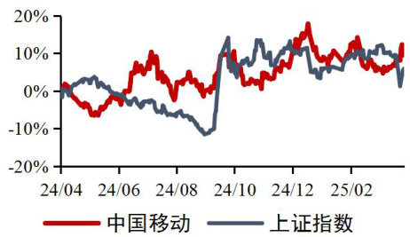

电信运营Ⅲ  

# 中国移动 （600941.SH）  

买入-A(维持)  

2025 年 4 月 14 日  

  
公司近一年市场表现  

重点布局5.5G、推理算力、AI 投资，新业务领域开辟新业态  

<html><body><table><tr><td colspan="2">市场数据：2025年4月11日</td></tr><tr><td>收盘价（元)：</td><td>109.79</td></tr><tr><td>总股本(亿股)：</td><td>215.84</td></tr><tr><td>流通股本（亿股)：</td><td>9.03</td></tr><tr><td>流通市值 (亿元)：</td><td>991.15</td></tr></table></body></html>  

<html><body><table><tr><td colspan="2">基础数据：2024年12月31日</td></tr><tr><td>每股净资产 (元)：</td><td>63.26</td></tr><tr><td>每股资本公积（元)：</td><td>-14.01</td></tr><tr><td>每股未分配利润（元)：</td><td>55.24</td></tr></table></body></html>

资料来源：最闻  

# 分析师：  

高宇洋执业登记编码：S0760523050002邮箱：gaoyuyang@sxzq.com  

张天执业登记编码：S0760523120001邮箱：zhangtian@sxzq.com  

赵天宇执业登记编码：S0760524060001邮箱：zhaotianyu@sxzq.com  

公司研究/公司快报  

# 事件描述：  

中国移动发布 2024 年年度报告。2024 年，公司实现营收 10408 亿元，同比 $+3.1\%$ ；其中，主营业务收入 8895 亿元，同比 $+3.0\%$ 。实现归母净利润1384 亿元，同比 $+5.0\%$ ；EBITDA 为 3337 亿元，同比- $.2.3\%$ 。  

# 事件点评：  

# 1） $\mathbf{C}{+}\mathbf{H}$ 端：AI 场景应用和 FTTR 升级将成为传统业务的新业态  

个人市场方面，2024 年，公司移动客户总数达 10.04 亿户，较年初净增0.13 亿户，其中 5G 网络客户数达到 5.52 亿户，较年初净增 0.88 亿户，渗透率达到 $55.0\%$ ；手机上网 DOU 达到 15.9GB，同比持平；移动 ARPU 为 48.5元，同比-0.8 元。个人移动云盘收入达 89 亿元，同比 $+12.6\%$ ；权益产品收入达268 亿元，同比 $+19.7\%$ ；5G 新通话全场景月活跃客户达 1.5 亿户，其中智能应用订购客户达到 3,475 万户。大流量创新应用未成熟、智能座舱等场景分流等因素导致公司个人业务增速放缓，但我们认为，随着 AI 飞速发展，应用场景不断下沉，公司通过“连接 $^+$ 应用 $+$ 权益 $.+$ 硬件”融合拓展，个人业务有望迎来新的发展机遇，保持基本盘平稳。  

家庭市场方面，2024 年，公司有线宽带客户总数达 3.15 亿户，较年初净增 0.17 亿户，其中家庭宽带客户达 2.78 亿户，较年初净增 0.14 亿户，千兆家庭宽带客户达 0.99 亿户（ $+25.0\%$ ）；FTTR 客户达 1,063 万户（ $4376\%$ ）；千兆宽带覆盖住户 4.8 亿户（ $\left(+0.9\right.$ 亿户）。家庭客户综合 ARPU 为 43.8 元（ $(+0.7$ 元）。公司积极构建“全千兆 $^+$ 云生活”智慧家庭生态，以“移动爱家”品牌为引领， $^{66}{\mathrm{AI}}+$ 智家”和“千兆 $+$ FTTR”引领智家服务升级，家庭市场有望保持良好增长。  

# 2） $\mathbf{B}{+}\mathbf{N}$ 端：移动云营收破千亿，车联网、低空新场景取得突破  

公司在庞大的基础业务体量下仍保持创新活力，DICT 业务收入稳健增长。2024 年，公司政企市场收入达 2,091 亿元，同比 $+8.8\%$ ；政企客户数达3,259 万家，净增 422 万家；公开招标市场中标占比达 $16.6\%$ ，全行业领先，成功打造融合自有能力的“三化”解决方案 99 项。公司作为一流云服务商由云向智，移动云收入达 1004 亿元，同比 $+20.4\%$ ， $\mathrm{IaaS+PaaS}$ 收入规模稳居业界前五；5G 垂直行业应用保持领先，全年拓展千万大单 5G DICT 项目超 700个，5G 专网收入 87 亿元，同比 $+61.0\%$ 。To V 车联网市场取得突破，车联网前装连接净增 1,443 万个，累计达 6,506 万个，与 25 家头部车企达成渠道合作；车路云一体化试点城市支撑和标杆项目共建进展良好；商客市场推广融合产品和轻量化解决方案，面向中小企业拓展商客套餐 2,684 万套，净增 2,140万套。低空经济快速起步，打造 50 个应用示范标杆。  

新兴市场方面，国际业务、数字内容领域仍保持快速增长。2024 年，新兴市场收入 536 亿元，同比 $\pm8.7\%$ 。其中，国际业务加速优质产品能力和解决方案出海，服务“一带一路”建设，实现收入 228 亿元，同比 $+10.2\%$ ；数字内容收入 303 亿元，同比 $+8.2\%$ ，咪咕视频全场景月活跃客户达 5.2 亿户，同比 $+12.1\%$ 。金融科技打造“通信 $+$ 金融”融合生态，产业链金融业务规模达1,165 亿元，同比 $+52\%$ ；和包交易月活跃客户达 1.24 亿户，同比 $+40.7\%$ 。  

我们认为，To B，公司“网 $+$ 云+DICT”规模拓展，以“AI+DICT”能力构建三化解决方案，深耕商客等重点市场客户，车联网、低空经济拓展初具成果。To N，公司基于“内容 $^+$ 科技 $\cdot+$ 融合创新”理念，通过海内外市场联动效应建立内容媒体业务的竞争优势，大力发展国际业务。我们仍对公司在 $B{+}\ensuremath{\mathrm{N}}$ 市场的发展保持信心，同时移动云市场有望继续在 5G 行业应用中深化推进。  

# 3）资本开支整体缩减，结构性侧重 5.5G、推理算力、AI 领域  

Capex 投资继续下降，但仍聚焦于新领域提前布局。2024 年，公司资本开支 1640 亿元，同比- $.9.0\%$ ，少于年初计划的 1730 亿元；预计 2025 年资本开支 1512 亿元，同比- $-7.8\%$ ，其中，连接投资 716 亿元（ $-17.9\%$ ）（5G 投资582 亿元，同比- $16\%$ ），算力投资373 亿元 $(+0.5\%)$ ），能力投资192 亿元 $(+6.7\%)$ ，基础投资 231 亿元（ $+6.5\%$ ）。5G 整体虽整体下降，但 5G-A 方面投入力度加大，2025 年计划投资 98 亿元，同比 $+227\%$ 。算网基础继续夯实，2024 年公司智算规模达 29.2EFLOPS，同比 $+189\%$ ，通算规划达 8.5EFLOPS，同比 $+6\%$ ，计划 2025 年通算、智算规模将分别达到 8.9、34EFLOPS。GPU 利用率从 $20\%$ 增长到 $68\%$ ；资源售卖率达到 $77\%$ ，增长 $40\%$ 以上。此外，公司加大推理算力投资，根据市场需求不设上限；AI 直接投资超 120 亿，同比超 10 倍，2025年还将继续提升。公司未来将通过 $\scriptstyle{\mathrm{AI+DICT}}$ 为政企业务增添新动能，通过模型即服务为移动云业务增添新动能，通过科技创新为传统业务赋能。  

# 4）分红继续提升，整体业务计划保持良好增长  

公司高度重视股东回报，2024 年计划末期股息每股 2.49 港元，连同已派发的中期股息，2024 年全年股息合计每股 5.09 港元，同比 $+5.4\%$ ，全年派息率为 $73\%$ 。计划从 2024 年起，三年内以现金方式分配的利润逐步提升至当年股东应占利润的 $75\%$ 以上，持续为股东创造更大价值。  

2025 年公司业绩目标：个人市场收入保持平稳，5G 网络客户净增 5000万；家庭市场收入良好增长，千兆宽带客户净增 1800 万，千兆宽带覆盖超 5亿户；政企市场收入良好增长，政企客户净增 430 万；新兴市场、国际业务收入快速增长，AI 直接收入高速增长，灵犀 AI 智能体月活客户达 7000 万。  

盈利预测、估值分析和投资建议：预计公司 2025-2027 年归母净利润1477.88/1562.31/1645.33 亿 元 ， 同 比 增 长 $6.8\%/5.7\%/5.3\%$ ；对应 EPS 为6.85/7.24/7.62 元，2025 年 04 月 11 日收盘价对应 PE 分别为 $16.0/15.2/14.4$ 倍，一方面公司将继续保持业绩稳健增长，另一方面分红率进一步提升，与国际主流运营商对比估值仍有提升空间，维持“买入-A”评级。  

# 风险提示：  

通信行业用户增速下降，若公司综合权益运营不达预期可能出现移动和宽带业务下滑风险。  

 公司云计算业务由于基数变大、市场竞争等因素可能出现增长不达预期风险。  

财务数据与估值：  

<html><body><table><tr><td>会计年度</td><td>2023A</td><td>2024A</td><td>2025E</td><td>2026E</td><td>2027E</td></tr><tr><td>营业收入(百万元)</td><td>1,009,309</td><td>1,040,759</td><td>1,083,838</td><td>1,125,760</td><td>1,167,069</td></tr><tr><td>YoY(%)</td><td>7.7</td><td>3.1</td><td>4.1</td><td>3.9</td><td>3.7</td></tr><tr><td>净利润(百万元)</td><td>131,766</td><td>138,373</td><td>147,788</td><td>156,231</td><td>164,533</td></tr><tr><td>YoY(%)</td><td>5.0</td><td>5.0</td><td>6.8</td><td>5.7</td><td>5.3</td></tr><tr><td>毛利率(%)</td><td>28.2</td><td>29.0</td><td>28.7</td><td>28.5</td><td>28.5</td></tr><tr><td>EPS(摊薄/元)</td><td>6.10</td><td>6.41</td><td>6.85</td><td>7.24</td><td>7.62</td></tr><tr><td>ROE(%)</td><td>10.1</td><td>10.2</td><td>10.5</td><td>10.7</td><td>11.0</td></tr><tr><td>P/E(倍)</td><td>18.0</td><td>17.1</td><td>16.0</td><td>15.2</td><td>14.4</td></tr><tr><td>P/B(倍)</td><td>1.8</td><td>1.7</td><td>1.7</td><td>1.6</td><td>1.6</td></tr><tr><td>净利率(%)</td><td>13.1</td><td>13.3</td><td>13.6</td><td>13.9</td><td>14.1</td></tr></table></body></html>

资料来源：最闻，山西证券研究所  

# 财务报表预测和估值数据汇总  

资产负债表(百万元)   

<html><body><table><tr><td>会计年度</td><td>2023A</td><td>2024A</td><td>2025E</td><td>2026E</td><td>2027E</td></tr><tr><td>流动资产</td><td>498104</td><td>568559</td><td>530201</td><td>622173</td><td>610441</td></tr><tr><td>现金</td><td>178772</td><td>242275</td><td>197437</td><td>286219</td><td>267834</td></tr><tr><td>应收票据及应收账款</td><td>56086</td><td>76844</td><td>61588</td><td>82198</td><td>66864</td></tr><tr><td>预付账款</td><td>7516</td><td>8315</td><td>8171</td><td>8953</td><td>8800</td></tr><tr><td>存货</td><td>12026</td><td>11229</td><td>13575</td><td>11999</td><td>14650</td></tr><tr><td>其他流动资产</td><td>243704</td><td>229896</td><td>249429</td><td>232803</td><td>252293</td></tr><tr><td>非流动资产</td><td>1459253</td><td>1504268</td><td>1531565</td><td>1558550</td><td>1585343</td></tr><tr><td>长期投资</td><td>181715</td><td>198563</td><td>225439</td><td>252314</td><td>279190</td></tr><tr><td>固定资产</td><td>714663</td><td>714494</td><td>763251</td><td>778855</td><td>783441</td></tr><tr><td>无形资产</td><td>49876</td><td>52961</td><td>54671</td><td>56196</td><td>57541</td></tr><tr><td>其他非流动资产</td><td>512999</td><td>538250</td><td>488204</td><td>471185</td><td>465171</td></tr><tr><td>资产总计</td><td>1957357</td><td>2072827</td><td>2061766</td><td>2180723</td><td>2195784</td></tr><tr><td>流动负债</td><td>558565</td><td>633018</td><td>574006</td><td>646559</td><td>616905</td></tr><tr><td>短期借款</td><td>0</td><td>0</td><td>0</td><td>0</td><td>0</td></tr><tr><td>应付票据及应付账款</td><td>323976</td><td>395184</td><td>357007</td><td>426216</td><td>385914</td></tr><tr><td>其他流动负债</td><td>234589</td><td>237834</td><td>216999</td><td>220343</td><td>230991</td></tr><tr><td>非流动负债</td><td>88107</td><td>78570</td><td>78570</td><td>78570</td><td>78570</td></tr><tr><td>长期借款</td><td>0</td><td>0</td><td>0</td><td>0</td><td>0</td></tr><tr><td>其他非流动负债</td><td>88107</td><td>78570</td><td>78570</td><td>78570</td><td>78570</td></tr><tr><td>负债合计</td><td>646672</td><td>711588</td><td>652576</td><td>725129</td><td>695475</td></tr><tr><td>少数股东权益</td><td>4253</td><td>4507</td><td>4670</td><td>4843</td><td>5025</td></tr><tr><td>股本</td><td>455001</td><td>461838</td><td>461838</td><td>461838</td><td>461838</td></tr><tr><td>资本公积</td><td>-301738</td><td>-301501</td><td>-301501</td><td>-301501</td><td>-301501</td></tr><tr><td>留存收益</td><td>1147798</td><td>1188577</td><td>1228524</td><td>1267625</td><td>1308803</td></tr><tr><td>归属母公司股东权益</td><td>1306432</td><td>1356732</td><td>1404520</td><td>1450751</td><td>1495284</td></tr><tr><td>负债和股东权益</td><td>1957357</td><td>2072827</td><td>2061766</td><td>2180723</td><td>2195784</td></tr></table></body></html>  

现金流量表(百万元)   

<html><body><table><tr><td>会计年度</td><td>2023A</td><td>2024A</td><td>2025E</td><td>2026E</td><td>2027E</td></tr><tr><td>经营活动现金流</td><td>303780</td><td>315741</td><td>89095</td><td>199329</td><td>102155</td></tr><tr><td>净利润</td><td>131935</td><td>138526</td><td>147951</td><td>156404</td><td>164715</td></tr><tr><td>折旧摊销</td><td>717</td><td>489</td><td>1129</td><td>1241</td><td>1333</td></tr><tr><td>财务费用</td><td>-3457</td><td>-2495</td><td>-2307</td><td>-2981</td><td>-2887</td></tr><tr><td>投资损失</td><td>-9886</td><td>-14657</td><td>-11528</td><td>-11528</td><td>-11528</td></tr><tr><td>营运资金变动</td><td>-16282</td><td>3628</td><td>-32980</td><td>69363</td><td>-36307</td></tr><tr><td>其他经营现金流</td><td>200753</td><td>190250</td><td>-13170</td><td>-13170</td><td>-13170</td></tr><tr><td>投资活动现金流</td><td>-205699</td><td>-185194</td><td>-3728</td><td>-3528</td><td>-3428</td></tr><tr><td>筹资活动现金流</td><td>-123843</td><td>-105167</td><td>-130205</td><td>-107019</td><td>-117113</td></tr><tr><td colspan="6">每股指标 (元)</td></tr><tr><td>每股收益(最新摊薄)</td><td>6.10</td><td>6.41</td><td>6.85</td><td>7.24</td><td>7.62</td></tr><tr><td>每股经营现金流(最新摊薄)</td><td>14.07</td><td>14.63</td><td>4.13</td><td>9.23</td><td></td></tr><tr><td>每股净资产(最新摊薄)</td><td>60.53</td><td>62.86</td><td>65.07</td><td>67.21</td><td>4.73 69.28</td></tr></table></body></html>

资料来源：最闻、山西证券研究所  

利润表(百万元)  

<html><body><table><tr><td>会计年度</td><td>2023A</td><td>2024A</td><td>2025E</td><td>2026E</td><td>2027E</td></tr><tr><td>营业收入</td><td>1009309</td><td>1040759</td><td>1083838</td><td>1125760</td><td>1167069</td></tr><tr><td>营业成本</td><td>724358</td><td>738772</td><td>772704</td><td>804582</td><td>834277</td></tr><tr><td>营业税金及附加</td><td>3071</td><td>3759</td><td>3915</td><td>4066</td><td>4215</td></tr><tr><td>营业费用</td><td>52477</td><td>54564</td><td>56793</td><td>59665</td><td>62438</td></tr><tr><td>管理费用</td><td>56025</td><td>56937</td><td>56360</td><td>57414</td><td>58353</td></tr><tr><td>研发费用</td><td>28711</td><td>28163</td><td>26012</td><td>27018</td><td>28010</td></tr><tr><td>财务费用</td><td>-3457</td><td>-2495</td><td>-2307</td><td>-2981</td><td>-2887</td></tr><tr><td>资产减值损失</td><td>9795</td><td>15718</td><td>-9755</td><td>-4503</td><td>-467</td></tr><tr><td>公允价值变动收益</td><td>12874</td><td>13170</td><td>13170</td><td>13170</td><td>13170</td></tr><tr><td>投资净收益</td><td>9886</td><td>14657</td><td>11528</td><td>11528</td><td>11528</td></tr><tr><td>营业利润</td><td>168117</td><td>176284</td><td>188421</td><td>199307</td><td>210009</td></tr><tr><td>营业外收入</td><td>3871</td><td>3593</td><td>3593</td><td>3593</td><td>3593</td></tr><tr><td>营业外支出</td><td>1457</td><td>1488</td><td>1488</td><td>1488</td><td>1488</td></tr><tr><td>利润总额</td><td>170531</td><td>178389</td><td>190526</td><td>201412</td><td>212114</td></tr><tr><td>所得税</td><td>38596</td><td>39863</td><td>42575</td><td>45008</td><td>47399</td></tr><tr><td>税后利润</td><td>131935</td><td>138526</td><td>147951</td><td>156404</td><td>164715</td></tr><tr><td>少数股东损益</td><td>169</td><td>153</td><td>163</td><td>173</td><td>182</td></tr><tr><td>归属母公司净利润</td><td>131766</td><td>138373</td><td>147788</td><td>156231</td><td>164533</td></tr><tr><td>EBITDA</td><td>169460</td><td>176455</td><td>189456</td><td>200234</td><td>210676</td></tr></table></body></html>  

主要财务比率  

<html><body><table><tr><td>会计年度</td><td>2023A</td><td>2024A</td><td>2025E</td><td>2026E</td><td>2027E</td></tr><tr><td>成长能力</td><td></td><td></td><td></td><td></td><td></td></tr><tr><td>营业收入(%)</td><td>7.7</td><td>3.1</td><td>4.1</td><td>3.9</td><td>3.7</td></tr><tr><td>营业利润(%)</td><td>4.2</td><td>4.9</td><td>6.9</td><td>5.8</td><td>5.4</td></tr><tr><td>归属于母公司净利润(%)</td><td>5.0</td><td>5.0</td><td>6.8</td><td>5.7</td><td>5.3</td></tr><tr><td>获利能力</td><td></td><td></td><td></td><td></td><td></td></tr><tr><td>毛利率(%)</td><td>28.2</td><td>29.0</td><td>28.7</td><td>28.5</td><td>28.5</td></tr><tr><td>净利率(%)</td><td>13.1</td><td>13.3</td><td>13.6</td><td>13.9</td><td>14.1</td></tr><tr><td>ROE(%)</td><td>10.1</td><td>10.2</td><td>10.5</td><td>10.7</td><td>11.0</td></tr><tr><td>ROIC(%)</td><td>9.2</td><td>9.3</td><td>9.9</td><td>10.1</td><td>10.4</td></tr><tr><td>偿债能力</td><td></td><td></td><td></td><td></td><td></td></tr><tr><td>资产负债率(%)</td><td>33.0</td><td>34.3</td><td>31.7</td><td>33.3</td><td>31.7</td></tr><tr><td>流动比率</td><td>0.9</td><td>0.9</td><td>0.9</td><td>1.0</td><td>1.0</td></tr><tr><td>速动比率</td><td>0.8</td><td>0.8</td><td>0.8</td><td>0.9</td><td>0.9</td></tr><tr><td>营运能力</td><td></td><td></td><td></td><td></td><td></td></tr><tr><td>总资产周转率</td><td>0.5</td><td>0.5</td><td>0.5</td><td>0.5</td><td>0.5</td></tr><tr><td>应收账款周转率</td><td>20.3</td><td>15.7</td><td>15.7</td><td>15.7</td><td>15.7</td></tr><tr><td>应付账款周转率</td><td>2.4</td><td>2.1</td><td>2.1</td><td>2.1</td><td>2.1</td></tr><tr><td>估值比率</td><td></td><td></td><td></td><td></td><td></td></tr><tr><td>P/E</td><td>18.0</td><td>17.1</td><td>16.0</td><td>15.2</td><td>14.4</td></tr><tr><td>P/B</td><td>1.8</td><td>1.7</td><td>1.7</td><td>1.6</td><td>1.6</td></tr><tr><td>EV/EBITDA</td><td>298.0</td><td>285.7</td><td>266.2</td><td>251.4</td><td>239.1</td></tr></table></body></html>  

# 分析师承诺：  

本人已在中国证券业协会登记为证券分析师，本人承诺，以勤勉的职业态度，独立、客观地出具本报告。本人对证券研究报告的内容和观点负责，保证信息来源合法合规，研究方法专业审慎，分析结论具有合理依据。本报告清晰准确地反映本人的研究观点。本人不曾因，不因，也将不会因本报告中的具体推荐意见或观点直接或间接受到任何形式的补偿。本人承诺不利用自己的身份、地位或执业过程中所掌握的信息为自己或他人谋取私利。  

# 投资评级的说明：  

以报告发布日后的 6--12 个月内公司股价（或行业指数）相对同期基准指数的涨跌幅为基准。其中：A 股以沪深 300 指数为基准；新三板以三板成指或三板做市指数为基准；港股以恒生指数为基准；美股以纳斯达克综合指数或标普 500 指数为基准。  

无评级：因无法获取必要的资料，或者公司面临无法预见的结果的重大不确定事件，或者其他原因，致使无法给出明确的投资评级。（新股覆盖、新三板覆盖报告及转债报告默认无评级）  

# 评级体系：  

公司评级  

买入： 预计涨幅领先相对基准指数 $15\%$ 以上；  
增持： 预计涨幅领先相对基准指数介于 $5\%-15\%$ 之间；  
中性： 预计涨幅领先相对基准指数介于- $-5\%-5\%$ 之间；  
减持： 预计涨幅落后相对基准指数介于- $-5\%--15\%$ 之间；  
卖出： 预计涨幅落后相对基准指数- $.15\%$ 以上。  

# 行业评级  

领先大市： 预计涨幅超越相对基准指数 $10\%$ 以上；  
同步大市： 预计涨幅相对基准指数介于- $10\%-10\%$ 之间；  
落后大市： 预计涨幅落后相对基准指数- $10\%$ 以上。  

风险评级  

A： 预计波动率小于等于相对基准指数；  
B： 预计波动率大于相对基准指数。  

# 免责声明：  

山西证券股份有限公司(以下简称“公司”)具备证券投资咨询业务资格。本报告是基于公司认为可靠的已公开信息，但公司不保证该等信息的准确性和完整性。入市有风险，投资需谨慎。在任何情况下，本报告中的信息或所表述的意见并不构成对任何人的投资建议。在任何情况下，公司不对任何人因使用本报告中的任何内容引致的损失负任何责任。本报告所载的资料、意见及推测仅反映发布当日的判断。在不同时期，公司可发出与本报告所载资料、意见及推测不一致的报告。公司或其关联机构在法律许可的情况下可能持有或交易本报告中提到的上市公司发行的证券或投资标的，还可能为或争取为这些公司提供投资银行或财务顾问服务。客户应当考虑到公司可能存在可能影响本报告客观性的利益冲突。公司在知晓范围内履行披露义务。本报告版权归公司所有。公司对本报告保留一切权利。未经公司事先书面授权，本报告的任何部分均不得以任何方式制作任何形式的拷贝、复印件或复制品，或再次分发给任何其他人，或以任何侵犯公司版权的其他方式使用。否则，公司将保留随时追究其法律责任的权利。  

依据《发布证券研究报告执业规范》规定特此声明，禁止公司员工将公司证券研究报告私自提供给未经公司授权的任何媒体或机构；禁止任何媒体或机构未经授权私自刊载或转发公司证券研究报告。刊载或转发公司证券研究报告的授权必须通过签署协议约定，且明确由被授权机构承担相关刊载或者转发责任。  

依据《发布证券研究报告执业规范》规定特此提示公司证券研究业务客户不得将公司证券研究报告转发给他人，提示公司证券研究业务客户及公众投资者慎重使用公众媒体刊载的证券研究报告。  

依据《证券期货经营机构及其工作人员廉洁从业规定》和《证券经营机构及其工作人员廉洁从业实施细则》规定特此告知公司证券研究业务客户遵守廉洁从业规定。  

# 山西证券研究所：  

上海 深圳  
上海市浦东新区滨江大道 5159 号陆家 广东省深圳市福田区金田路 3086 号大  
嘴滨江中心 N5 座 3 楼 百汇广场 43 层  
太原 北京  
太原市府西街69 号国贸中心A 座28 层 北京市丰台区金泽西路 2 号院 1 号楼丽  
电话：0351-8686981 泽平安金融中心 A 座 25 层  
http://www.i618.com.cn  