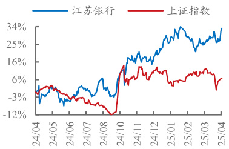

江苏银行(600919)  

报告日期：2025 年 04 月 19 日  

# 零售不良改善  

# 江苏银行2024 年年报点评  

# 投资要点  

# 江苏银行年报业绩增速提升，息差环比下降，不良基本稳定。  

# 数据概览  

江苏银行 2024 年归母净利润同比增长 $10.8\%$ ，增速较前三季度提升 0.7pc；2024年营收同比增长 $8.8\%$ ，增速较前三季度上升 2.6pc。2024 年末不良率 $0.89\%$ ，持平于三季度末水平。2024 年末拨备覆盖率 $350\%$ ，较三季度末下降 1pc。  

# 业绩增速提升  

江苏银行 2024 年归母净利润同比增长 $10.8\%$ ，增速较前三季度提升 0.7pc；2024年营收同比增长 $8.8\%$ ，增速较前三季度上升 2.6pc。全年业绩增速提升，主要是利息净收入增速和中收增速回升，24A 利息净收入、中收同比增速分别较24Q1-3提升 5pc、15pc 至 $6.3\%$ 、 $3.3\%$ 。展望 2025 年，预计江苏银行营收和利润增速有望实现中高位数增长。主要考虑： $\textcircled{1}$ 江苏地区信贷需求韧性强，江苏银行投放有望维持高增； $\textcircled{2}$ 其他非息收入增长压力好于同业，主要考虑 2024 年江苏银行其他非息收入同比增速（ $17.7\%$ ）较行业来看基数并不高，同时测算 2024 年末 OCI债券浮盈是 24Q1 其他非息收入的 1.27 倍。  

# 息差环比下降  

江苏银行 24Q4 单季息差（期初期末）环比下降 4bp 至 $1.67\%$ ，主要受资产端收益率下降影响。资负两端来看：  

$\textcircled{1}$ 江苏银行 24Q4 单季资产收益率环比下降 13bp 至 $3.82\%$ ，判断受结构和价格两方面因素共同影响。24Q4 贷款占比下降，24Q4 贷款环比增长 $0.1\%$ ，较生息资产增速慢 $3.9\mathrm{pc}$ ；2024 年 10 月份 LPR 进一步调降，叠加市场利率下行，判断贷款收益率和债券利息收益率进一步下行。  

$\textcircled{2}$ 江苏银行 24Q4 单季负债成本率环比下降 6bp 至 $2.12\%$ ，判断主要受价格端影响。24A 江苏银行存款成本率、应付债券成本率、同业负债成本率分别较 24H1下降 8bp、17bp、12bp。  

# 不良基本稳定  

$\textcircled{1}$ 静态指标来看，24Q4 末江苏银行不良率 $0.89\%$ 、关注率 $1.40\%$ ，分别环比持平、下降 5bp，24Q4 末逾期率 $1.12\%$ ，持平于 24Q2 末水平。 $\textcircled{2}$ 动态指标来看，不良生成率在历史高位基本稳定，24A 江苏银行真实不良生成率较 24H1 上升1bp 至 $1.71\%$ 。 $\textcircled{3}$ 分领域来看，24Q4 末江苏银行个人贷款不良率较 24Q2 末下降10bp 至 $0.88\%$ ，其中个人经营贷不良仍在上升，24Q4 末个人经营贷较 24Q2 末上升 46bp 至 $2.04\%$ ；对公不良有所上升，24Q4 对公不良率 $0.97\%$ ，较 24Q2 末上升 4bp，重点行业中制造业和批发零售 24Q4 末不良率分别为 $1.02\%$ 、 $2.37\%$ ，分别较 24Q2 末上升 12bp、 $29\mathrm{bp}$ 。后续重点关注实体企业，特别是中小企业和个人经营性贷款不良生成变化。  

# 盈利预测与估值  

预计江苏银行 2025-2027 年归母净利润同比增长 $8.43\%/8.07\%/8.31\%$ ，对应 BPS14.31/15.70/17.21 元/股。现价对应 2025-2027 年 PB 估值 $0.69/0.63/0.57$ 倍。目标价为 14.05 元/股，对应 25 年 PB0.98 倍，现价空间 $42\%$ ，维持“买入”评级。  

# 风险提示：宏观经济失速，不良大幅暴露。  

# 投资评级: 买入(维持)  

分析师：梁凤洁  
执业证书号：S1230520100001  
021-80108037  
liangfengjie@stocke.com.cn  
分析师：徐安妮  
执业证书号：S1230523060006  
xuanni@stocke.com.cn  

<html><body><table><tr><td colspan="2">基本数据</td></tr><tr><td>收盘价</td><td>Y9.87</td></tr><tr><td>总市值(百万元)</td><td>181,127.57</td></tr><tr><td>总股本(百万股)</td><td>18,351.32</td></tr></table></body></html>  

  
股票走势图  

# 相关报告  

1 《业绩好于预期》 2025.01.24  
2 《业绩和规模高增延续》  
2024.10.30  
3 《盈利维持双位数增长》  
2024.08.17  

财务摘要   

<html><body><table><tr><td>(百万元)</td><td>2024A</td><td>2025E</td><td>2026E</td><td>2027E</td></tr><tr><td>营业收入</td><td>80,815</td><td>84,826</td><td>88,215</td><td>91,990</td></tr><tr><td>(+/-) (%)</td><td>8.78%</td><td>4.96%</td><td>4.00%</td><td>4.28%</td></tr><tr><td>归母净利润</td><td>31,843</td><td>34,528</td><td>37,314</td><td>40,413</td></tr><tr><td>(+/-) (%)</td><td>10.76%</td><td>8.43%</td><td>8.07%</td><td>8.31%</td></tr><tr><td>每股净资产(元)</td><td>12.73</td><td>14.31</td><td>15.70</td><td>17.21</td></tr><tr><td>P/B</td><td>0.78</td><td>0.69</td><td>0.63</td><td>0.57</td></tr></table></body></html>

资料来源：wind，公司公告，浙商证券研究所。  

表1： 江苏银行 2024 年年报业绩概览  

<html><body><table><tr><td colspan="2">维度 单位：百万元</td><td colspan="2">23A 24Q1-3</td><td colspan="2">24A 环比变化同比变化</td><td colspan="2">24Q1 24Q2</td><td colspan="3">24Q3 24Q4</td><td colspan="2">QQ</td></tr><tr><td rowspan="8"></td><td>利润指标ROE（年化） ROA（年化）</td><td>14.5% 0.94%</td><td>16.3% 1.08%</td><td>13.6% 0.91%</td><td>-2.7pc -17bp</td><td>-0.9pc -3bp</td><td>14.2% 1.02%</td><td>14.3% 1.04%</td><td>13.0% 1.00%</td><td>4.8%</td><td>-8.2pc</td></tr><tr><td>拨备前利润</td><td>55,434</td><td>48.893</td><td>59,645</td><td></td><td>7.6%</td><td>16,109</td><td>15,646</td><td>17,138</td><td>0.37% 10,752</td><td>-63bp -37.3%</td></tr><tr><td>同比增速</td><td>6.0%</td><td>7.1%</td><td>7.6%</td><td>0.5pc</td><td>1.6pc</td><td>9.2%</td><td>1.2%</td><td>11.0%</td><td>10.1%</td><td>-0.9pc</td></tr><tr><td>归母净利润</td><td>28,750</td><td>28,235</td><td>31,843</td><td></td><td>10.8%</td><td>9,042</td><td>9,689</td><td>9,504</td><td>3,608</td><td>-62.0%</td></tr><tr><td></td><td>13.3%</td><td>10.1%</td><td>10.8%</td><td>0.7pc</td><td>-2.5pc</td><td>10.0%</td><td>10.1%</td><td>10.1%</td><td>16.5%</td><td></td></tr><tr><td>同比增速 EPS（未年化）</td><td>1.69</td><td>1.54</td><td>1.65</td><td></td><td>-2.1%</td><td>0.49</td><td>0.53</td><td>0.52</td><td>0.20</td><td>6.4pc -62.0%</td></tr><tr><td>BVPS（未年化）</td><td>11.47</td><td>12.67 12.73</td><td></td><td>0.5%</td><td>11.0%</td><td>12.00</td><td>12.15</td><td>12.67</td><td>12.73</td><td>0.5%</td></tr><tr><td>收入拆分营业收入 同比增速</td><td>74,293 5.3%</td><td>62,303 6.2%</td><td>80.815 8.8%</td><td>2.6pc</td><td>8.8% 3.5pc</td><td>20,999 11.7%</td><td>20,626 2.9%</td><td>20,678 4.3%</td><td>18,512 18.5%</td><td>-10.5% 14.3pc</td></tr><tr><td>利息净收入</td><td>52,645</td><td>41,693</td><td>55,957</td><td></td><td>6.3%</td><td>13,607</td><td>14,050</td><td>14,037</td><td></td><td></td></tr><tr><td>生息资产（期初期末平均，注1）</td><td></td><td>2,869,971 3,183,758 3,239,978</td><td></td><td>1.8%</td><td>12.9%</td><td>3,077,787</td><td>3,191,019</td><td>3,282,467</td><td>14,263 3,408,639</td><td>1.6%</td></tr><tr><td>净息差（日均余额口径）</td><td>1.98%</td><td></td><td>1.86%</td><td></td><td>-12bp</td><td>n.a</td><td>1.a </td><td>n.a</td><td></td><td>3.8%</td></tr><tr><td></td><td>1.83%</td><td>11.a 1.75%</td><td></td><td>1.a -2bp</td><td>-11bp</td><td>1.77%</td><td>1.76%</td><td>1.71%</td><td>n.a</td><td>1.a -4bp</td></tr><tr><td>净息差（期初期末口径） 生息资产收益率（期初期末口径）</td><td>4.39%</td><td>4.11%</td><td>1.73% 4.03%</td><td>-8bp</td><td>-36bp</td><td>4.29%</td><td>4.11%</td><td>3.94%</td><td>1.67% 3.82%</td><td>-13bp -6bp</td></tr><tr><td>付息负债成本率（期初期末口径） 非利息净收入</td><td>2.51%</td><td>2.30% 20,610</td><td>2.25% 24,858</td><td>-5bp</td><td>-25bp</td><td>2.47%</td><td></td><td>2.27% 6.576</td><td>2.17%</td><td>2.12%</td></tr><tr><td></td><td>21,649</td><td></td><td></td><td></td><td>14.8%</td><td>7.393</td><td></td><td></td><td>6,641 4.249</td><td>-36.0%</td></tr><tr><td>手续费净收入</td><td>4.276</td><td>3,792</td><td>4,417</td><td></td><td>3.3%</td><td>1.355</td><td>1,675</td><td>762</td><td>625</td><td>-17.9%</td></tr><tr><td>其他非息收入</td><td>17,372</td><td>16,818</td><td>20,442</td><td></td><td>17.7%</td><td>6.038</td><td>4,901</td><td>5,879</td><td>3,623</td><td>-38.4%</td></tr><tr><td>业务及管理费</td><td>17,826</td><td>12,566</td><td>19,983</td><td></td><td>12.1%</td><td>4,628 22.04%</td><td>4,710 22.83%</td><td>3,229 15.62%</td><td>7,417</td><td>129.7%</td></tr><tr><td>资产减值损失 贷款减值损失</td><td>23.99% 16,740 23,086</td><td>20.17% 12,025</td><td>24.73% 18.377</td><td>4.6pc</td><td>0.7pc 9.8%</td><td>4,617</td><td>2,682</td><td>4,725</td><td>40.07% 6.352</td><td>24.4pc 34.4%</td></tr><tr><td>信用成本</td><td>1.32%</td><td>14,168 0.95%</td><td>20,657 1.04%</td><td></td><td>-10.5%</td><td></td><td>6,368 1.34%</td><td>2.232 0.45%</td><td>5,568 6,489 1.07% 1.24%</td><td>16.6%</td></tr><tr><td>所得税费用</td><td></td><td>7,572</td><td></td><td>9bp</td><td>-28bp</td><td></td><td></td><td></td><td></td><td>17bp</td></tr><tr><td></td><td>8.681</td><td></td><td>7,962</td><td></td><td>-8.3%</td><td>2,178</td><td>2.866</td><td>2.527</td><td>390</td><td>-84.6%</td></tr><tr><td>有效税率</td><td>22.44%</td><td>20.54%</td><td>19.29%</td><td>-1.2pc</td><td>-3.1pc</td><td>18.95%</td><td>22.11%</td><td>20.36%</td><td>8.86%</td><td>-11.5pc</td></tr><tr><td>规模增长总资产 生息资产余额 贷款总额</td><td>3,403,362 2,996,567</td><td>3,856,856 3,341,902</td><td>3,952,042 3,475,377</td><td>2.5% 4.0%</td><td>16.1% 16.0%</td><td>3,669,830 3,159,007</td><td>3,770,834 3,223,031</td><td>3,856,856 3,341,902</td><td>3,952,042 3,475,377</td><td>2.5% 4.0%</td></tr><tr><td>对公贷款 个人贷款</td><td></td><td>1,893,127 2,093,970 1,240,535 1,446,580</td><td>2,095,203 1,420,399</td><td></td><td>0.1% -1.8%</td><td>10.7% 14.5%</td><td>1,903,670 2,053,535 1,274,773 1,418,958</td><td>2,093,970 1,446,580</td><td>2,095,203 1,420,399</td><td>0.1% -1.8%</td></tr><tr><td>同业资产</td><td>652.592</td><td>647,389</td><td>674,804</td><td>4.2%</td><td></td><td>3.4% 628,897</td><td></td><td>634,577 647,389</td><td>674,804</td><td>4.2%</td></tr><tr><td>金融投资</td><td>141,334</td><td>176,914</td><td>199,976</td><td>13.0%</td><td>41.5%</td><td>182,434</td><td>154,573</td><td>176,914</td><td></td><td></td></tr><tr><td></td><td>1,229,048</td><td>1,440,426</td><td>1,526,470</td><td>6.0%</td><td>24.2%</td><td>1,351,188</td><td>1,386,958</td><td>1,440,426</td><td>199,976 1,526,470</td><td>13.0% 6.0%</td></tr><tr><td>存放央行</td><td>154.238</td><td>154,363</td><td>142,275</td><td>-7.8%</td><td>-7.8%</td><td>149,526</td><td>172.984</td><td>154,363</td><td>142.275</td><td></td></tr><tr><td>总负债 付息负债余额</td><td>3,144,246</td><td>3,544,775</td><td>3,638,383</td><td>2.6%</td><td>15.7%</td><td>3,400,602</td><td>3,478,600</td><td>3,544,775</td><td>3,638,383</td><td>-7.8% 2.6%</td></tr><tr><td>吸收存款</td><td>3,029,055</td><td>3,409,451</td><td>3,492,156</td><td>2.4%</td><td>15.3%</td><td>3,270,556</td><td>3,335,776</td><td>3,409,451</td><td>3,492,156</td><td>2.4%</td></tr><tr><td></td><td>1,875,335</td><td>2,076,075</td><td>2,115,851</td><td>1.9%</td><td>12.8%</td><td>2.083,018</td><td>2,091,450</td><td>2,076,075</td><td>2,115,851</td><td>1.9%</td></tr><tr><td>企业活期</td><td>426,759</td><td>11.a</td><td>481,043</td><td>nl.a</td><td></td><td></td><td>486,739</td><td></td><td></td><td></td></tr><tr><td>个人活期</td><td>92,580</td><td></td><td></td><td></td><td>12.7%</td><td>n.a</td><td></td><td>n.a</td><td>481,043</td><td>n.a</td></tr><tr><td>企业定期</td><td>504,588</td><td>n.a</td><td>101,045</td><td>n.a</td><td>9.1%</td><td>11.a</td><td>96,679 662,237</td><td>.a </td><td>101,045</td><td>1.a</td></tr><tr><td>个人定期</td><td></td><td>n.a n.a</td><td>680,723 721,893</td><td>n.a n.a</td><td>34.9% 17.3%</td><td></td><td>.a 1l.a 706,201</td><td>n.a</td><td>11.a 680,723 721,893</td><td>n.a 1l.a</td></tr><tr><td>同业负债</td><td>615,537 539,119</td></table></body></html>

资料来源：wind，公司公告，浙商证券研究所。注1：以24H1举例，24Q2单季生息资产平均余额为期初期末平均，24H1生息资产平均余额为24Q1、24Q2 平均余额的平均值。“环比变化”指24A 环比24Q1-3 的指标变化情况，“同比变化”指24A 同比23A 的指标变化情况，右侧QoQ 指24Q4 环比24Q3指标变化情况。  

# 表附录：报表预测值  

资产负债表  

<html><body><table><tr><td>(百万元)</td><td>2024A</td><td>2025E</td><td>2026E</td><td>2027E</td></tr><tr><td>存放央行</td><td>142,275</td><td>319,917</td><td>358,307</td><td>401,303</td></tr><tr><td>同业资产</td><td>199,976</td><td>223,974</td><td>250,850</td><td>280,953</td></tr><tr><td>贷款总额</td><td>2,095,203</td><td>2,304,723</td><td>2,535,195</td><td>2,788,715</td></tr><tr><td>贷款减值准备</td><td>(64,851)</td><td>(66,145)</td><td>(64,713)</td><td>(62,202)</td></tr><tr><td>贷款净额</td><td>2,038,661</td><td>2,238,578</td><td>2,470,483</td><td>2,726,513</td></tr><tr><td>证券投资</td><td>1,526,470</td><td>1,415,408</td><td>1,563,991</td><td>1,729,466</td></tr><tr><td>其他资产</td><td>44,659</td><td>112,058</td><td>123,957</td><td>137,160</td></tr><tr><td>资产合计</td><td>3,952,042</td><td>4,309,935</td><td>4,767,588</td><td>5,275,395</td></tr><tr><td>同业负债</td><td>733,225</td><td>806,547</td><td>887,202</td><td>975,922</td></tr><tr><td>存款余额</td><td>2,115,851</td><td>2,369,753</td><td>2,654,124</td><td>2,972,618</td></tr><tr><td>应付债券</td><td>643,080</td><td>694,526</td><td>750,088</td><td>810,095</td></tr><tr><td>其他负债</td><td>146,228</td><td>95,184</td><td>105,527</td><td>117,016</td></tr><tr><td>负债合计</td><td>3,638,383</td><td>3,966,011</td><td>4,396,940</td><td>4,875,652</td></tr><tr><td>股东权益合计</td><td>313,658</td><td>343,924</td><td>370,648</td><td>399,744</td></tr></table></body></html>  

利润表  

<html><body><table><tr><td>(百万元)</td><td>2024A</td><td>2025E</td><td>2026E</td><td>2027E</td></tr><tr><td>净利息收入</td><td>55,957</td><td>60,155</td><td>63,313</td><td>66,844</td></tr><tr><td>净手续费收入</td><td>4,417</td><td>4,638</td><td>4,870</td><td>5,113</td></tr><tr><td>其他非息收入</td><td>20,442</td><td>20,033</td><td>20,033</td><td>20,033</td></tr><tr><td>营业收入</td><td>80,815</td><td>84,826</td><td>88,215</td><td>91,990</td></tr><tr><td>税金及附加</td><td>(947)</td><td>(1,056)</td><td>(1,119)</td><td>(1,194)</td></tr><tr><td>业务及管理费</td><td>(19,983)</td><td>(20,975)</td><td>(19,848)</td><td>(20,698)</td></tr><tr><td>营业外净收入</td><td>(38)</td><td>0</td><td>0</td><td>0</td></tr><tr><td>拨备前利润</td><td>59,645</td><td>62,753</td><td>67,205</td><td>70,053</td></tr><tr><td>资产减值损失</td><td>(18,377)</td><td>(18.480)</td><td>(19,360)</td><td>(18,234)</td></tr><tr><td>税前利润</td><td>41,268</td><td>44,274</td><td>47,845</td><td>51,819</td></tr><tr><td>所得税</td><td>(7,962)</td><td>(8,541)</td><td>(9,231)</td><td>(9,997)</td></tr><tr><td>税后利润</td><td>33,306</td><td>35,732</td><td>38.615</td><td>41,822</td></tr><tr><td>归属母公司净利润</td><td>31,843</td><td>34,528</td><td>37,314</td><td>40,413</td></tr><tr><td>归属母公司普通股股东 净利润</td><td>30,311</td><td>32,996</td><td>35,782</td><td>38,881</td></tr></table></body></html>  

主要财务比率  

<html><body><table><tr><td></td><td>2024A</td><td>2025E</td><td>2026E</td><td>2027E</td></tr><tr><td>业绩增长</td><td></td><td></td><td></td><td></td></tr><tr><td>利息净收入增速</td><td>6.3%</td><td>7.5%</td><td>5.2%</td><td>5.6%</td></tr><tr><td>手续费净增速</td><td>3.29%</td><td>5.0%</td><td>5.0%</td><td>5.0%</td></tr><tr><td>非息净收入增速</td><td>14.8%</td><td>-0.8%</td><td>0.9%</td><td>1.0%</td></tr><tr><td>拨备前利润增速</td><td>7.6%</td><td>5.2%</td><td>7.1%</td><td>4.2%</td></tr><tr><td>归属母公司净利润 增速</td><td>10.8%</td><td>8.4%</td><td>8.1%</td><td>8.3%</td></tr><tr><td>盈利能力</td><td></td><td></td><td></td><td></td></tr><tr><td>ROAE</td><td>13.7%</td><td>13.3%</td><td>13.0%</td><td>12.9%</td></tr><tr><td>ROAA</td><td>0.9%</td><td>0.8%</td><td>0.8%</td><td>0.8%</td></tr><tr><td>RORWA</td><td>1.3%</td><td>1.3%</td><td>1.3%</td><td>1.3%</td></tr><tr><td>生息率</td><td>4.0%</td><td>3.9%</td><td>3.8%</td><td>3.7%</td></tr><tr><td>付息率</td><td>2.3%</td><td>2.1%</td><td>2.1%</td><td>2.0%</td></tr><tr><td>净利差</td><td>1.8%</td><td>1.8%</td><td>1.7%</td><td>1.6%</td></tr><tr><td>净息差</td><td>1.7%</td><td>1.7%</td><td>1.6%</td><td>1.5%</td></tr><tr><td>成本收入比</td><td>24.7%</td><td>24.7%</td><td>22.5%</td><td>22.5%</td></tr><tr><td>资本状况</td><td></td><td></td><td></td><td></td></tr><tr><td>资本充足率</td><td>13.0%</td><td>13.6%</td><td>13.3%</td><td>12.9%</td></tr><tr><td>核心资本充足率</td><td>11.8%</td><td>12.4%</td><td>12.1%</td><td>11.8%</td></tr><tr><td>风险加权系数</td><td>66.2%</td><td>63.7%</td><td>63.7%</td><td>63.7%</td></tr><tr><td></td><td></td><td></td><td></td><td></td></tr><tr><td>股息支付率</td><td>30.0%</td><td>30.0%</td><td>30.0%</td><td>30.0%</td></tr></table></body></html>

数据来源：wind，公司公告，浙商证券研究所。  

主要财务比率  

<html><body><table><tr><td></td><td>2024A</td><td>2025E</td><td>2026E</td><td>2027E</td></tr><tr><td>资产质量</td><td></td><td></td><td></td><td></td></tr><tr><td>不良贷款余额</td><td>18,685</td><td>21,886</td><td>21,837</td><td>23,909</td></tr><tr><td>不良贷款净生成率</td><td>1.43%</td><td>1.00%</td><td>0.90%</td><td>0.90%</td></tr><tr><td>不良贷款率</td><td>0.89%</td><td>0.95%</td><td>0.86%</td><td>0.86%</td></tr><tr><td>拨备覆盖率</td><td>350%</td><td>302%</td><td>296%</td><td>260%</td></tr><tr><td>拨贷比</td><td>3.12%</td><td>2.87%</td><td>2.55%</td><td>2.23%</td></tr><tr><td>流动性</td><td></td><td></td><td></td><td></td></tr><tr><td>贷存比</td><td>99.02%</td><td>97.26%</td><td>95.52%</td><td>93.81%</td></tr><tr><td>贷款/总资产</td><td>53.02%</td><td>53.47%</td><td>53.18%</td><td>52.86%</td></tr><tr><td>平均生息资产/平均 总资产</td><td>87.99%</td><td>88.19%</td><td>88.34%</td><td>88.17%</td></tr><tr><td>每股指标（元）</td><td></td><td></td><td></td><td></td></tr><tr><td>EPS</td><td>1.65</td><td>1.80</td><td>1.95</td><td>2.12</td></tr><tr><td>BVPS</td><td>12.73</td><td>14.31</td><td>15.70</td><td>17.21</td></tr><tr><td>每股股利</td><td>0.52</td><td>0.56</td><td>0.61</td><td>0.66</td></tr><tr><td>估值指标</td><td></td><td></td><td></td><td></td></tr><tr><td>P/E</td><td>5.98</td><td>5.49</td><td>5.06</td><td>4.66</td></tr><tr><td>P/B</td><td>0.78</td><td>0.69</td><td>0.63</td><td>0.57</td></tr><tr><td>P/PPOP</td><td>3.04</td><td>2.89</td><td>2.70</td><td>2.59</td></tr><tr><td>股息收益率</td><td>5.27%</td><td>5.72%</td><td>6.18%</td><td>6.69%</td></tr></table></body></html>  

# [股Ta票ble投_T资hr评ee级F说orc明a  

以报告日后的 6 个月内，证券相对于沪深 300 指数的涨跌幅为标准，定义如下：  

1.买 入 ：相对于沪深 300 指数表现 $+20\%$ 以上；  
2.增 持 ：相对于沪深 300 指数表现 $+10\%\sim+20\%$ ；  
3.中 性 ：相对于沪深 300 指数表现 $\mathrm{~-~}10\%\sim\mathrm{~+~}10\%$ 之间波动；  
4.减 持 ：相对于沪深 300 指数表现 $-10\%$ 以下。  

# 行业的投资评级：  

以报告日后的 6 个月内，行业指数相对于沪深 300 指数的涨跌幅为标准，定义如下：  
1.看 好 ：行业指数相对于沪深 300 指数表现 $+10\%$ 以上；  
2.中 性 ：行业指数相对于沪深 300 指数表现 $-~10\%\sim\ +\ 10\%\nu\rangle.$ 上；  
3.看 淡 ：行业指数相对于沪深 300 指数表现 $-10\%$ 以下。  
我们在此提醒您，不同证券研究机构采用不同的评级术语及评级标准。我们采用的是相对评级体系，表示投资的相对比重。  
建议：投资者买入或者卖出证券的决定取决于个人的实际情况，比如当前的持仓结构以及其他需要考虑的因素。投资者不应仅仅依靠投资评级来推断结论。  

# 法律声明及风险提示  

本报告由浙商证券股份有限公司（已具备中国证监会批复的证券投资咨询业务资格，经营许可证编号为：Z39833000）制作。本报告中的信息均来源于我们认为可靠的已公开资料，但浙商证券股份有限公司及其关联机构（以下统称“本公司”）对这些信息的真实性、准确性及完整性不作任何保证，也不保证所包含的信息和建议不发生任何变更。本公司没有将变更的信息和建议向报告所有接收者进行更新的义务。本报告仅供本公司的客户作参考之用。本公司不会因接收人收到本报告而视其为本公司的当然客户。本报告仅反映报告作者的出具日的观点和判断，在任何情况下，本报告中的信息或所表述的意见均不构成对任何人的投资建议，投资者应当对本报告中的信息和意见进行独立评估，并应同时考量各自的投资目的、财务状况和特定需求。对依据或者使用本报告所造成的一切后果，本公司及/或其关联人员均不承担任何法律责任。本公司的交易人员以及其他专业人士可能会依据不同假设和标准、采用不同的分析方法而口头或书面发表与本报告意见及建议不一致的市场评论和/或交易观点。本公司没有将此意见及建议向报告所有接收者进行更新的义务。本公司的资产管理公司、自营部门以及其他投资业务部门可能独立做出与本报告中的意见或建议不一致的投资决策。本报告版权均归本公司所有，未经本公司事先书面授权，任何机构或个人不得以任何形式复制、发布、传播本报告的全部或部分内容。经授权刊载、转发本报告或者摘要的，应当注明本报告发布人和发布日期，并提示使用本报告的风险。未经授权或未按要求刊载、转发本报告的，应当承担相应的法律责任。本公司将保留向其追究法律责任的权利。  

# 浙商证券研究所  

上海总部地址：杨高南路 729 号陆家嘴世纪金融广场 1 号楼 25 层  
北京地址：北京市东城区朝阳门北大街 8 号富华大厦 E 座 4 层  
深圳地址：广东省深圳市福田区广电金融中心 33 层  
上海总部邮政编码：200127  
上海总部电话：(8621) 80108518  
上海总部传真：(8621) 80106010  
浙商证券研究所：https://www.stocke.com.cn  