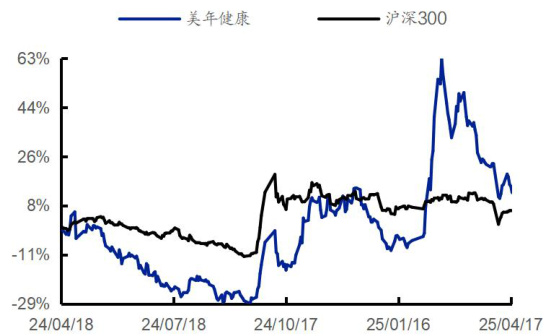

研究所：  

证券分析师： 李明 S0350523090001lim06@ghzq.com.cn  

# AI 赋能显效，体检龙头迈向数智化健管时代——美年健康（002044）2024 年年报点评  

  
最近一年走势  

<html><body><table><tr><td>相对沪深300表现</td><td></td><td>2025/04/18</td></tr><tr><td>表现</td><td>1M</td><td>3M 12M</td></tr><tr><td>美年健康</td><td>-18.9%</td><td>18.5% 12.4%</td></tr><tr><td>沪深300</td><td>-5.9%</td><td>-1.0% 5.7%</td></tr></table></body></html>  

<html><body><table><tr><td>市场数据</td><td>2025/04/18</td></tr><tr><td>当前价格（元）</td><td>5.19</td></tr><tr><td>52周价格区间（元）</td><td>3.22-7.79</td></tr><tr><td>总市值（百万）</td><td>20,314.98</td></tr><tr><td>流通市值(百万）</td><td>20,098.01</td></tr><tr><td>总股本（万股）</td><td>391,425.39</td></tr><tr><td>流通股本（万股）</td><td>387,244.87</td></tr><tr><td>日均成交额(百万）</td><td>311.03</td></tr><tr><td>近一月换手（%）</td><td>2.20</td></tr></table></body></html>  

# 相关报告  

《美年健康（002044）公司动态研究：第三季度营收利润双增长，发布国内首个 AI 数智健管师“健康小美”（买入）\*医疗服务\*李明》——2024-11-05《美年健康（002044）2024 年半年报点评：个检占比和客单价稳步提升，看好体检龙头引领数智化健管升级（买入）\*医疗服务\*李明》——2024-09-03《美年健康（002044）2023 年报及 2024 一季报点评：年度经营态势向好，数据资产开始入表（买入）\*医疗服务\*周小刚，李明》——2024-05-05《美年健康（002044）2023 年业绩预告点评：成  

# 事件:  

美年健康于 4 月 17 日公告 2024 年年报：2024 年公司实现营业收入 107亿元（ $(-1.76\%$ ，同比口径，下同），归母净利润 2.82 亿元（ $-44.18\%$ ），扣非归母净利润 2.52 亿元（ $-45.52\%$ ），收入体量下降的同时费用相对刚性导致利润降幅更大，经营活动现金流净额 16.62 亿元 $(-17.88\%$ 。  

# 投资要点:  

体检服务收入 103 亿元。2024 年体检服务收入 103 亿元 $(\it-2.18\%$ ），拆分量价，2024 年控股门店接待量 1538 万人次（ $(-12\%$ ）、体检客单价 672 元（ $412\%$ ）。截至 2024 年底，集团分院总数 576 家，其中控股体检分院 312 家、参股体检分院 264 家。  

结合AI 技术取得的收入2.2 亿元，AI 赋能有望助力公司创收和提效。2024 年主营收入中结合技术手段取得的收入为 2.2 亿元，主要包括心肺联筛、眼底 AI、脑睿佳等收入。公司实施“All in AI”战略，将进一步开发推广 AI 专精特新产品、AI 健管服务，构建国内领先 $^{\mathfrak{a}}\mathsf{A l}+$ 健康管理”应用场景，逐步实现从“单次体检服务”向“全程健康管理”的升级。精细化运营方面，2025 年公司将推广和优化 AI 销售助手、AI 质控管理、智能主检等，进一步实现降本增效。  

房租物业、门店人工、耗材成本等实现节降。结合公司年报数据，我们计算 2024 年营业成本中店均房租 246 万元，同比下降 $5.6\%$ ；店均人工成本 668 万元，同比下降 $3.0\%$ ；体检直接耗材成本占收入的比例为 $7.98\%$ ，同比减少 1.25pct。  

盈利预测和投资评级：考虑到宏观经济环境影响 B 端体检需求，我们调整了盈利预测，预计 2025-2027 年公司营业收入分别为 116 亿元、128 亿元、145 亿元，分别同比增长 $8\%$ 、 $11\%$ 、 $14\%$ ；归母净利润分别为 6.21 亿元、9.46 亿元、12.53 亿元，分别同比增长 $120\%$ 、$52\%$ 、 $32\%$ ；PE 分别为 33 倍、21 倍、16 倍。公司是健康体检行业龙头，践行“All in AI”战略，以国内领先的 C 端流量入口平台与应用场景优势，打造“ $^{\mathrm{i}}\mathsf{A l}+$ 健康管理”新业态。维持“买入”评级。  

风险提示：精细运营不及预期的风险；AI 应用推进不及预期的风险；  

长性兑现，开启高质量发展（买入）\*医疗服务\*周小刚，李明》——2024-01-29  

《美年健康（002044）点评报告：推出股票期权激励计划，凝心聚力打造新美年（买入）\*医疗服务\*周小刚，李明》——2023-12-07  

行业需求不及预期的风险；商誉减值风险；担保余额较高风险；公司治理及舆情风险。  

<html><body><table><tr><td>预测指标</td><td>2024A</td><td>2025E</td><td>2026E</td><td>2027E</td></tr><tr><td>营业收入（百万元）</td><td>10702</td><td>11577</td><td>12801</td><td>14542</td></tr><tr><td>增长率(%)</td><td>-2</td><td>8</td><td>11</td><td>14</td></tr><tr><td>归母净利润（百万元）</td><td>282</td><td>621</td><td>946</td><td>1253</td></tr><tr><td>增长率(%)</td><td>-44</td><td>120</td><td>52</td><td>32</td></tr><tr><td>摊薄每股收益（元）</td><td>0.07</td><td>0.16</td><td>0.24</td><td>0.32</td></tr><tr><td>ROE(%)</td><td>4</td><td>7</td><td>10</td><td>13</td></tr><tr><td>P/E</td><td>65.57</td><td>32.70</td><td>21.47</td><td>16.21</td></tr><tr><td>P/B</td><td>2.27</td><td>2.42</td><td>2.23</td><td>2.03</td></tr><tr><td>P/S</td><td>1.68</td><td>1.75</td><td>1.59</td><td>1.40</td></tr><tr><td>EV/EBITDA</td><td>9.17</td><td>7.97</td><td>5.86</td><td>4.47</td></tr></table></body></html>

资料来源：Wind 资讯、国海证券研究所  

[附Tab表le：_F美orc年as健t]康盈利预测表  

<html><body><table><tr><td>证券代码：</td><td>002044</td><td>股价：</td><td></td><td>5.19</td></tr><tr><td>财务指标</td><td>2024A</td><td>2025E</td><td>2026E</td><td>2027E</td></tr><tr><td>盈利能力</td><td></td><td></td><td></td><td></td></tr><tr><td>ROE</td><td>4%</td><td>7%</td><td>10%</td><td>13%</td></tr><tr><td>毛利率</td><td>43%</td><td>44%</td><td>45%</td><td>46%</td></tr><tr><td>期间费率</td><td>35%</td><td>33%</td><td>30%</td><td>29%</td></tr><tr><td>销售净利率</td><td>3%</td><td>5%</td><td>7%</td><td>9%</td></tr><tr><td>成长能力</td><td></td><td></td><td></td><td></td></tr><tr><td>收入增长率</td><td>-2%</td><td>8%</td><td>11%</td><td>14%</td></tr><tr><td>利润增长率</td><td>-44%</td><td>120%</td><td>52%</td><td>32%</td></tr><tr><td>营运能力</td><td></td><td></td><td></td><td></td></tr><tr><td>总资产周转率</td><td>0.54</td><td>0.57</td><td>0.61</td><td>0.66</td></tr><tr><td>应收账款周转率</td><td>3.79</td><td>3.88</td><td>3.93</td><td>3.99</td></tr><tr><td>存货周转率</td><td>27.94</td><td>29.16</td><td>29.09</td><td>29.52</td></tr><tr><td>偿债能力</td><td></td><td></td><td></td><td></td></tr><tr><td>资产负债率</td><td>57%</td><td>55%</td><td>52%</td><td>48%</td></tr><tr><td>流动比</td><td>0.78</td><td>0.93</td><td>1.13</td><td>1.39</td></tr><tr><td>速动比</td><td>0.73</td><td>0.87</td><td>1.07</td><td>1.31</td></tr></table></body></html>  

<html><body><table><tr><td>资产负债表(百万元）</td><td>2024A</td><td>2025E</td><td>2026E</td><td>2027E</td></tr><tr><td>现金及现金等价物</td><td>3080</td><td>4004</td><td>5058</td><td>6375</td></tr><tr><td>应收款项</td><td>2856</td><td>3110</td><td>3406</td><td>3883</td></tr><tr><td>存货净额</td><td>211</td><td>234</td><td>251</td><td>277</td></tr><tr><td>其他流动资产</td><td>680</td><td>701</td><td>765</td><td>857</td></tr><tr><td>流动资产合计</td><td>6827</td><td>8049</td><td>9479</td><td>11393</td></tr><tr><td>固定资产</td><td>1886</td><td>1837</td><td>1748</td><td>1618</td></tr><tr><td>在建工程</td><td>90</td><td>82</td><td>76</td><td>71</td></tr><tr><td>无形资产及其他</td><td>10373</td><td>9793</td><td>9200</td><td>8586</td></tr><tr><td>长期股权投资</td><td>951</td><td>951</td><td>951</td><td>951</td></tr><tr><td>资产总计</td><td>20127</td><td>20712</td><td>21454</td><td>22619</td></tr><tr><td>短期借款</td><td>2562</td><td>1962</td><td>1262</td><td>462</td></tr><tr><td>应付款项</td><td>1235</td><td>1320</td><td>1419</td><td>1573</td></tr><tr><td>合同负债</td><td>1600</td><td>1976</td><td>2102</td><td>2383</td></tr><tr><td>其他流动负债</td><td>3330</td><td>3385</td><td>3573</td><td>3806</td></tr><tr><td>流动负债合计</td><td>8726</td><td>8643</td><td>8355</td><td>8224</td></tr><tr><td>长期借款及应付债券</td><td>57</td><td>57</td><td>57</td><td>57</td></tr><tr><td>其他长期负债</td><td>2640</td><td>2640</td><td>2640</td><td>2640</td></tr><tr><td>长期负债合计</td><td>2697</td><td>2697</td><td>2697</td><td>2697</td></tr><tr><td>负债合计</td><td>11424</td><td>11340</td><td>11052</td><td>10921</td></tr><tr><td>股本</td><td>3914</td><td>3914</td><td>3914</td><td>3914</td></tr><tr><td>股东权益</td><td>8703</td><td>9372</td><td>10401</td><td>11697</td></tr><tr><td>负债和股东权益总计</td><td>20127</td><td>20712</td><td>21454</td><td>22619</td></tr></table></body></html>

资料来源：Wind 资讯、国海证券研究所  

<html><body><table><tr><td>投资评级：</td><td>买入</td><td></td><td>日期:</td><td>2025/04/18</td></tr><tr><td>每股指标与估值</td><td>2024A</td><td>2025E</td><td>2026E</td><td>2027E</td></tr><tr><td>每股指标</td><td></td><td></td><td></td><td></td></tr><tr><td>EPS</td><td>0.07</td><td>0.16</td><td>0.24</td><td>0.32</td></tr><tr><td>BVPS</td><td>2.02</td><td>2.15</td><td>2.33</td><td>2.55</td></tr><tr><td>估值</td><td></td><td></td><td></td><td></td></tr><tr><td>P/E</td><td>65.57</td><td>32.70</td><td>21.47</td><td>16.21</td></tr><tr><td>P/B</td><td>2.27</td><td>2.42</td><td>2.23</td><td>2.03</td></tr><tr><td>P/S</td><td>1.68</td><td>1.75</td><td>1.59</td><td>1.40</td></tr></table></body></html>  

<html><body><table><tr><td>利润表(百万元）</td><td>2024A</td><td>2025E</td><td>2026E</td><td>2027E</td></tr><tr><td>营业收入</td><td>10702</td><td>11577</td><td>12801</td><td>14542</td></tr><tr><td>营业成本</td><td>6123</td><td>6487</td><td>7042</td><td>7780</td></tr><tr><td>营业税金及附加</td><td>8</td><td>8</td><td>9</td><td>10</td></tr><tr><td>销售费用</td><td>2546</td><td>2660</td><td>2594</td><td>2901</td></tr><tr><td>管理费用</td><td>885</td><td>953</td><td>1043</td><td>1192</td></tr><tr><td>财务费用</td><td>315</td><td>253</td><td>211</td><td>163</td></tr><tr><td>其他费用／（-收入）</td><td>55</td><td>65</td><td>70</td><td>79</td></tr><tr><td>营业利润</td><td>613</td><td>1179</td><td>1861</td><td>2449</td></tr><tr><td>营业外净收支</td><td>-20</td><td>-29</td><td>-27</td><td>-27</td></tr><tr><td>利润总额</td><td>593</td><td>1150</td><td>1834</td><td>2422</td></tr><tr><td>所得税费用</td><td>184</td><td>356</td><td>568</td><td>750</td></tr><tr><td>净利润</td><td>409</td><td>794</td><td>1266</td><td>1672</td></tr><tr><td>少数股东损益</td><td>127</td><td>172</td><td>320</td><td>419</td></tr><tr><td>归属于母公司净利润</td><td>282</td><td>621</td><td>946</td><td>1253</td></tr></table></body></html>  

<html><body><table><tr><td>现金流量表（百万元）</td><td>2024A</td><td>2025E</td><td>2026E</td><td>2027E</td></tr><tr><td>经营活动现金流</td><td>1662</td><td>2694</td><td>3001</td><td>3469</td></tr><tr><td>净利润</td><td>282</td><td>621</td><td>946</td><td>1253</td></tr><tr><td>少数股东损益</td><td>127</td><td>172</td><td>320</td><td>419</td></tr><tr><td>折旧摊销</td><td>1358</td><td>1368</td><td>1422</td><td>1483</td></tr><tr><td>公允价值变动</td><td>-4</td><td>0</td><td>0</td><td>0</td></tr><tr><td>营运资金变动</td><td>-599</td><td>220</td><td>35</td><td>73</td></tr><tr><td>投资活动现金流</td><td>-588</td><td>-762</td><td>-760</td><td>-761</td></tr><tr><td>资本支出</td><td>-400</td><td>-589</td><td>-587</td><td>-587</td></tr><tr><td>长期投资</td><td>-248</td><td>0</td><td>0</td><td>0</td></tr><tr><td>其他</td><td>59</td><td>-173</td><td>-173</td><td>-174</td></tr><tr><td>筹资活动现金流</td><td>-821</td><td>-1008</td><td>-1188</td><td>-1390</td></tr><tr><td>债务融资</td><td>512</td><td>-600</td><td>-700</td><td>-800</td></tr><tr><td>权益融资</td><td>39</td><td>0</td><td>0</td><td>0</td></tr><tr><td>其它</td><td>-1372</td><td>-408</td><td>-488</td><td>-590</td></tr><tr><td>现金净增加额</td><td>252</td><td>925</td><td>1053</td><td>1318</td></tr></table></body></html>  

# 【医药小组介绍】  

年庆功，分析师，北京大学物理学本科，军事医学科学院微生物博士，2022 年加入国海证券研究所医药组，主要覆盖中药、零售药店、干扰素、疫苗和血制品等板块。  
李明，分析师，北京大学金融科技硕士，2021 年加入国海证券医药组，主要覆盖医疗服务板块。  
林羽茜，分析师，悉尼大学数据分析硕士，2021 年加入国海证券医药组，主要覆盖医疗器械板块。  
赵宁宁，医药分析师，中南财经政法大学金融硕士，生物工程 $\cdot^{+}$ 金融复合背景，2021 年加入国海证券医药组，主要覆盖中药、生物药。  
李畅，分析师，北京大学药理学硕士，具有 1 年医疗实业工作经验，2022 年加入国海证券医药组，主要覆盖中药、化药、创新药等板块。  
万鹏辉，分析师，中科院药物所药物化学硕士，浙江大学药学学士，4 年医药二级市场投研经验，主要覆盖 CXO、软镜、创新药等板块。  
孔维崎，分析师，北京大学药学院化学生物学硕士，4.5 年医药股权投资经验，2.5 年医药二级研究经验，主要覆盖创新药和 CXO 板块。  

# 【分析师承诺】  

李明, 本报告中的分析师均具有中国证券业协会授予的证券投资咨询执业资格并注册为证券分析师，以勤勉的职业态度，独立，客观的出具本报告。本报告清晰准确的反映了分析师本人的研究观点。分析师本人不曾因，不因，也将不会因本报告中的具体推荐意见或观点而直接或间接收取到任何形式的补偿。  

# 【国海证券投资评级标准】  

行业投资评级  

推荐：行业基本面向好，行业指数领先沪深 300 指数；  
中性：行业基本面稳定，行业指数跟随沪深 300 指数；  
回避：行业基本面向淡，行业指数落后沪深 300 指数。  

股票投资评级  

买入：相对沪深 300 指数涨幅 $20\%$ 以上；  
增持：相对沪深 300 指数涨幅介于 $10\%\sim20\%$ 之间；  
中性：相对沪深 300 指数涨幅介于- $10\%\sim10\%$ 之间；  
卖出：相对沪深 300 指数跌幅 $10\%$ 以上。  

# 【免责声明】  

本报告的风险等级定级为 R3，仅供符合国海证券股份有限公司（简称“本公司”）投资者适当性管理要求的客户（简称“客户”）使用。本公司不会因接收人收到本报告而视其为客户。客户及/或投资者应当认识到有关本报告的短信提示、电话推荐等只是研究观点的简要沟通，需以本公司的完整报告为准，本公司接受客户的后续问询。  

本公司具有中国证监会许可的证券投资咨询业务资格。本报告中的信息均来源于公开资料及合法获得的相关内部外部报告资料，本公司对这些信息的准确性及完整性不作任何保证，不保证其中的信息已做最新变更，也不保证相关的建议不会发生任何变更。本报告所载的资料、意见及推测仅反映本公司于发布本报告当日的判断，本报告所指的证券或投资标的的价格、价值及投资收入可能会波动。在不同时期，本公司可发出与本报告所载资料、意见及推测不一致的报告。报告中的内容和意见仅供参考，在任何情况下，本报告中所表达的意见并不构成对所述证券买卖的出价和征价。本公司及其本公司员工对使用本报告及其内容所引发的任何直接或间接损失概不负责。本公司或关联机构可能会持有报告中所提到的公司所发行的证券头寸并进行交易，还可能为这些公司提供或争取提供投资银行、财务顾问或者金融产品等服务。本公司在知晓范围内依法合规地履行披露义务。  

# 【风险提示】  

市场有风险，投资需谨慎。投资者不应将本报告视为作出投资决策的唯一参考因素，亦不应认为本报告可以取代自己的判断。在决定投资前，如有需要，投资者务必向本公司或其他专业人士咨询并谨慎决策。在任何情况下，本报告中的信息或所表述的意见均不构成对任何人的投资建议。投资者务必注意，其据此做出的任何投资决策与本公司、本公司员工或者关联机构无关。  

若本公司以外的其他机构（以下简称“该机构”）发送本报告，则由该机构独自为此发送行为负责。通过此途径获得本报告的投资者应自行联系该机构以要求获悉更详细信息。本报告不构成本公司向该机构之客户提供的投资建议。  

任何形式的分享证券投资收益或者分担证券投资损失的书面或口头承诺均为无效。本公司、本公司员工或者关联机构亦不为该机构之客户因使用本报告或报告所载内容引起的任何损失承担任何责任。  

# 【郑重声明】  

本报告版权归国海证券所有。未经本公司的明确书面特别授权或协议约定，除法律规定的情况外，任何人不得对本报告的任何内容进行发布、复制、编辑、改编、转载、播放、展示或以其他任何方式非法使用本报告的部分或者全部内容，否则均构成对本公司版权的侵害，本公司有权依法追究其法律责任。  