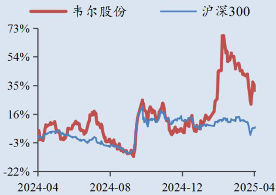

电子  

报告日期：2025 年 04 月 16 日  

# 智能手机、汽车市场推动 CIS 主业高增——韦尔股份（603501.SH）2024 年报点评报告  

# 华龙证券研究所  

# 事件：  

投资评级：增持（首次覆盖）  

2025 年 4 月 16 日，公司发布 2024 年报。2024 年，公司实现营业收入257.31 亿元，同比增长 $22.41\%$ ；实现归母净利润33.23 亿元，同比增长 $498.11\%$ 。  

  
最近一年走势  

市场数据  

<html><body><table><tr><td></td><td>2025年04月16日</td></tr><tr><td>当前价格 (元） 52周价格区间（元）</td><td>124.22 81.41-161.96</td></tr><tr><td>总市值 (百万元)</td><td>150,609.52</td></tr><tr><td>流通市值 （百万元） 总股本 (万股)</td><td>150,609.52 121,694.83</td></tr><tr><td>流通股 (万股) 近一月换手(%)</td><td>121,694.83</td></tr></table></body></html>  

分析师：景丹阳  
执业证书编号：S0230523080001  
邮箱：jingdy@hlzq.com  

# 点评：  

智能手机和汽车需求增长强劲，推动 CIS 收入、利润高增。据公司公告，2024 年全球智能手机出货12.2 亿部，同比增长 $7\%$ ，其中中国市场智能手机出货 3.14 亿部，同比增长 $8.7\%$ 。公司推出的 $1.2\mathrm{um}5000$ 万像素高端图像传感器OV50H 被广泛应用于国内主流高端智能手机后置主摄方案中，市场份额持续提升。2024 年我国汽车产销量分别完成3128.2 万辆和3143.6 万辆，同比分别增长 $3.7\%$ 和 $4.5\%$ ，产销量再创新高。公司汽车 CIS 解决方案已覆盖ADAS、驾驶室内部监控、电子后视镜等应用，未来有望导入更多设计方案。2024 年，公司 CIS 业务实现营业收入 191.90 亿元，占主营业务收入的 $74.76\%$ ，较上年增加 $23.52\%$ 。其中，智能手机CIS 实现收入98.02 亿元，同比增长 $26.01\%$ ，汽车 CIS 收入达到 59.05 亿元。  

高研发水平保障产品升级，助推竞争力提升。2024 年，公司半导体设计销售主业研发投入金额 32.45 亿元，占半导体设计销售收入 $15\%$ ，同比增长 $10.89\%$ 。除2023 年以外，2020 年至今研发投入保持正增长，且占比较高。在高强度研发投入下，公司已搭建起成熟的研发团队及专利矩阵，为产品升级和新产品研发提供保障，助推竞争力稳步提升。  

# 相关阅读  

盈利预测及投资评级：2024 年公司CIS（图像传感器）业务在智能手机、汽车两大需求支撑下获得高速增长。公司注重研发，研发费用占比维持高水平，产品研发与升级能力提高，推动市占率稳步提升，叠加下游两大领域增长确定性强，公司有望维持稳健增长。我们预测 2025-2027 年公司分别实现归母净利润44.06/53.01/60 亿元，对应 PE 分别为 34.3/28.5/25.2 倍。综合考虑主营业务相近度，选取思特威-W、格科微、兆易创新作为可比公司，公司作为CIS 业务龙头，仍有一定低估。首次覆盖，给予公司“增持”评级。  

风险提示：智能手机出货不及预期；汽车销量不及预期；公司新产品导入存在不确定性；研发进展不及预期；海外主要经济体征  

加关税；数据引用风险。  

# 盈利预测简表  

<html><body><table><tr><td>预测指标</td><td>2023A 2024A</td><td>2025E</td><td>2026E 2027E</td></tr><tr><td>营业收入 (百万元)</td><td>21,021 25,731</td><td>30,026</td><td>33,744 37,121</td></tr><tr><td>增长率 (%)</td><td>4.69 22.41</td><td>16.69</td><td>12.38 10.01</td></tr><tr><td>归母净利润 (百万元)</td><td>556 3,323</td><td>4,406</td><td>5,301 6,000</td></tr><tr><td>增长率 (%)</td><td>-43.89 498.11</td><td>32.57</td><td>20.33 13.18</td></tr><tr><td>ROE (%)</td><td>2.53 13.57</td><td>15.38</td><td>15.66 15.18</td></tr><tr><td>每股收益/EPS (摊薄/元)</td><td>0.46 2.73</td><td>3.62</td><td>4.36 4.93</td></tr><tr><td>市盈率 (P/E)</td><td>271.8 45.5</td><td>34.3</td><td>28.5 25.2</td></tr><tr><td>市净率 (P/B)</td><td>7.1 6.3</td><td>5.4</td><td>4.6 3.9</td></tr></table></body></html>

数据来源：Wind，华龙证券研究所  

可比公司估值表  

<html><body><table><tr><td rowspan="2">代码</td><td rowspan="2">简称</td><td rowspan="2">最新价（元）</td><td colspan="3">EPS (元)</td><td colspan="5">PE（倍）</td></tr><tr><td>2023A</td><td>2024A/E</td><td>2025E</td><td>2026E</td><td>2023A</td><td>2024A/E</td><td>2025E</td><td>2026E</td></tr><tr><td>688213.SH</td><td>思特威-W</td><td>91.84</td><td>0.04</td><td>0.97</td><td>2.03</td><td>3.30</td><td>1,563.4</td><td>79.4</td><td>46.4</td><td>28.5</td></tr><tr><td>688728.SH</td><td>格科微</td><td>14.37</td><td>0.02</td><td>0.07</td><td>0.18</td><td>0.33</td><td>1,103.4</td><td>187.1</td><td>77.8</td><td>42.8</td></tr><tr><td>603986.SH</td><td>兆易创新</td><td>109.19</td><td>0.24</td><td>1.68</td><td>2.50</td><td>3.23</td><td>382.4</td><td>65.4</td><td>44.0</td><td>34.0</td></tr><tr><td>平均值</td><td></td><td></td><td>0.10</td><td>0.91</td><td>1.57</td><td>2.29</td><td>1016.4</td><td>110.6</td><td>56.1</td><td>35.1</td></tr><tr><td>603501.SH</td><td>韦尔股份</td><td>124.22</td><td>0.46</td><td>2.73</td><td>3.62</td><td>4.36</td><td>271.8</td><td>45.5</td><td>34.3</td><td>28.5</td></tr></table></body></html>

数据来源：Wind，华龙证券研究所（最新价为 2025 年 4 月 16 日股价，其中韦尔股份盈利预测来自华龙证券研究所，其他公司盈利预测来自万得一致预期;兆易创新 2024 年数据为预测值）  

表：公司财务预测表  

<html><body><table><tr><td>会计年度</td><td>2023A</td><td>2024A</td><td>2025E</td><td>2026E</td><td>2027E</td></tr><tr><td>流动资产</td><td>20,264</td><td>21,804</td><td>25,213</td><td>28,988</td><td>34,581</td></tr><tr><td>现金</td><td>9,086</td><td>10,185</td><td>10,720</td><td>14,427</td><td>17,065</td></tr><tr><td>应收票据及应收账款</td><td>4,057</td><td>3,988</td><td>5,395</td><td>5,167</td><td>6,470</td></tr><tr><td>其他应收款</td><td>45</td><td>58</td><td>62</td><td>73</td><td>75</td></tr><tr><td>预付账款</td><td>221</td><td>251</td><td>300</td><td>319</td><td>362</td></tr><tr><td>存货</td><td>6,322</td><td>6,956</td><td>8,372</td><td>8,638</td><td>10,244</td></tr><tr><td>其他流动资产</td><td>534</td><td>366</td><td>366</td><td>366</td><td>366</td></tr><tr><td>非流动资产</td><td>17,479</td><td>17,160</td><td>16,918</td><td>16,437</td><td>15,810</td></tr><tr><td>长期股权投资</td><td>518</td><td>464</td><td>430</td><td>392</td><td>356</td></tr><tr><td>固定资产</td><td>2,586</td><td>3,126</td><td>3,295</td><td>3,349</td><td>3,316</td></tr><tr><td>无形资产</td><td>3,350</td><td>3,280</td><td>2,852</td><td>2,365</td><td>1,817</td></tr><tr><td>其他非流动资产</td><td>11,025</td><td>10,291</td><td>10,341</td><td>10,330</td><td>10,322</td></tr><tr><td>资产总计</td><td>37,743</td><td>38,965</td><td>42,131</td><td>45,425</td><td>50,392</td></tr><tr><td>流动负债</td><td>9,069</td><td>7,595</td><td>7,994</td><td>7,835</td><td>8,625</td></tr><tr><td>短期借款</td><td>2.671</td><td>1,086</td><td>2,201</td><td>2,104</td><td>1,986</td></tr><tr><td>应付票据及应付账款</td><td>1,663</td><td>1,935</td><td>2,258</td><td>2,349</td><td>2,780</td></tr><tr><td>其他流动负债</td><td>4,734</td><td>4,574</td><td>3,536</td><td>3,383</td><td>3,859</td></tr><tr><td>非流动负债</td><td>7,180</td><td>7,167</td><td>5,853</td><td>4,400</td><td>2,883</td></tr><tr><td>长期借款</td><td>5,421</td><td>5,996</td><td>4,682</td><td>3,229</td><td>1,712</td></tr><tr><td>其他非流动负债</td><td>1,759</td><td>1,171</td><td>1,171</td><td>1,171</td><td>1,171</td></tr><tr><td>负债合计</td><td>16,248</td><td>14,762</td><td>13,847</td><td>12,235</td><td>11,508</td></tr><tr><td>少数股东权益</td><td>44</td><td>1</td><td>-55</td><td>-158</td><td>-256</td></tr><tr><td>股本</td><td>1,216</td><td>1,216</td><td>1,216</td><td>1,216</td><td>1,216</td></tr><tr><td>资本公积</td><td>11,329</td><td>11,545</td><td>11,545</td><td>11,545</td><td>11,545</td></tr><tr><td>留存收益</td><td>9,156</td><td>12.072</td><td>15,781</td><td>20,154</td><td>25,034</td></tr><tr><td>归属母公司股东权益</td><td>21,451</td><td>24,201</td><td>28,339</td><td>33,348</td><td>39,140</td></tr><tr><td>负债和股东权益</td><td>37,743</td><td>38,965</td><td>42,131</td><td>45,425</td><td>50,392</td></tr></table></body></html>  

资产负债表（百万元）  

<html><body><table><tr><td>会计年度</td><td>2023A</td><td>2024A</td><td>2025E</td><td>2026E</td><td>2027E</td></tr><tr><td>营业收入</td><td>21,021</td><td>25,731</td><td>30,026</td><td>33,744</td><td>37,121</td></tr><tr><td>营业成本</td><td>16,446</td><td>18,154</td><td>21,153</td><td>23,219</td><td>25,773</td></tr><tr><td>税金及附加</td><td>33</td><td>40</td><td>40</td><td>48</td><td>54</td></tr><tr><td>销售费用</td><td>467</td><td>557</td><td>683</td><td>779</td><td>832</td></tr><tr><td>管理费用</td><td>623</td><td>748</td><td>940</td><td>1,081</td><td>1,133</td></tr><tr><td>研发费用</td><td>2,234</td><td>2.622</td><td>3,153</td><td>3,691</td><td>3,922</td></tr><tr><td>财务费用</td><td>457</td><td>-13</td><td>-489</td><td>-707</td><td>-939</td></tr><tr><td>资产和信用减值损失</td><td>-460</td><td>-659</td><td>-29</td><td>-33</td><td>-37</td></tr><tr><td>其他收益</td><td>60</td><td>59</td><td>61</td><td>66</td><td>61</td></tr><tr><td>公允价值变动收益</td><td>231</td><td>58</td><td>-3</td><td>16</td><td>76</td></tr><tr><td>投资净收益</td><td>73</td><td>182</td><td>479</td><td>446</td><td>295</td></tr><tr><td>资产处置收益</td><td>2</td><td>9</td><td>5</td><td>6</td><td>5</td></tr><tr><td>营业利润</td><td>667</td><td>3,271</td><td>5,058</td><td>6,134</td><td>6,747</td></tr><tr><td>营业外收入</td><td>26</td><td>13</td><td>12</td><td>14</td><td>17</td></tr><tr><td>营业外支出</td><td>2</td><td>5</td><td>3</td><td>3</td><td>3</td></tr><tr><td>利润总额</td><td>691</td><td>3,278</td><td>5,067</td><td>6,146</td><td>6,760</td></tr><tr><td>所得税</td><td>148</td><td>-6</td><td>717</td><td>947</td><td>858</td></tr><tr><td>净利润</td><td>544</td><td>3,284</td><td>4,350</td><td>5,198</td><td>5,902</td></tr><tr><td>少数股东损益</td><td>-12</td><td>-39</td><td>-56</td><td>-103</td><td>-98</td></tr><tr><td>归属母公司净利润</td><td>556</td><td>3,323</td><td>4,406</td><td>5,301</td><td>6,000</td></tr><tr><td>EBITDA</td><td>2,396</td><td>5,157</td><td>6,269</td><td>7,411</td><td>7,954</td></tr><tr><td>EPS (元)</td><td>0.46</td><td>2.73</td><td>3.62</td><td>4.36</td><td>4.93</td></tr></table></body></html>  

利润表（百万元）  
主要财务比率  

<html><body><table><tr><td>会计年度</td><td>2023A</td><td>2024A</td><td>2025E</td><td>2026E</td><td>2027E</td></tr><tr><td>成长能力</td><td></td><td></td><td></td><td></td><td></td></tr><tr><td>营业收入同比增速(%)</td><td>4.69</td><td>22.41</td><td>16.69</td><td>12.38</td><td>10.01</td></tr><tr><td>营业利润同比增速(%)</td><td>-48.65</td><td>390.55</td><td>54.63</td><td>21.28</td><td>9.98</td></tr><tr><td>归属于母公司净利润同比增速(%)</td><td>-43.89</td><td>498.11</td><td>32.57</td><td>20.33</td><td>13.18</td></tr><tr><td>获利能力</td><td></td><td></td><td></td><td></td><td></td></tr><tr><td>毛利率(%)</td><td>21.76</td><td>29.44</td><td>29.55</td><td>31.19</td><td>30.57</td></tr><tr><td>净利率(%)</td><td>2.59</td><td>12.76</td><td>14.49</td><td>15.40</td><td>15.90</td></tr><tr><td>ROE(%)</td><td>2.53</td><td>13.57</td><td>15.38</td><td>15.66</td><td>15.18</td></tr><tr><td>ROIC(%)</td><td>3.19</td><td>11.58</td><td>11.83</td><td>12.76</td><td>12.85</td></tr><tr><td>偿债能力</td><td></td><td></td><td></td><td></td><td></td></tr><tr><td>资产负债率(%)</td><td>43.05</td><td>37.89</td><td>32.87</td><td>26.94</td><td>22.84</td></tr><tr><td>净负债比率(%)</td><td>9.71</td><td>-1.41</td><td>-8.93</td><td>-23.45</td><td>-31.01</td></tr><tr><td>流动比率</td><td>2.23</td><td>2.87</td><td>3.15</td><td>3.70</td><td>4.01</td></tr><tr><td>速动比率</td><td>1.49</td><td>1.89</td><td>2.04</td><td>2.52</td><td>2.75</td></tr><tr><td>营运能力</td><td></td><td></td><td></td><td></td><td></td></tr><tr><td>总资产周转率</td><td>0.58</td><td>0.67</td><td>0.74</td><td>0.77</td><td>0.77</td></tr><tr><td>应收账款周转率</td><td>6.43</td><td>6.44</td><td>6.40</td><td>6.41</td><td>6.42</td></tr><tr><td>应付账款周转率</td><td>11.79</td><td>10.09</td><td>10.09</td><td>10.11</td><td>10.13</td></tr><tr><td>每股指标 (元)</td><td></td><td></td><td></td><td></td><td></td></tr><tr><td>每股收益(最新摊薄)</td><td>0.46</td><td>2.73</td><td>3.62</td><td>4.36</td><td>4.93</td></tr><tr><td>每股经营现金流(最新摊薄)</td><td>6.20</td><td>3.92</td><td>2.04</td><td>4.33</td><td>3.28</td></tr><tr><td>每股净资产(最新摊薄)</td><td>17.45</td><td>19.71</td><td>23.10</td><td>27.21</td><td>31.97</td></tr><tr><td>估值比率</td><td></td><td></td><td></td><td></td><td></td></tr><tr><td>P/E</td><td>271.8</td><td>45.5</td><td>34.3</td><td>28.5</td><td>25.2</td></tr><tr><td>P/B</td><td>7.1</td><td>6.3</td><td>5.4</td><td>4.6</td><td>3.9</td></tr><tr><td>EV/EBITDA</td><td>63.89</td><td>29.23</td><td>23.68</td><td>19.31</td><td>17.44</td></tr></table></body></html>  

现金流量表（百万元）  

<html><body><table><tr><td>会计年度</td><td>2023A</td><td>2024A</td><td>2025E</td><td>2026E</td><td>2027E</td></tr><tr><td>经营活动现金流</td><td>7,537</td><td>4,772</td><td>2,478</td><td>5,272</td><td>3,998</td></tr><tr><td>净利润</td><td>544</td><td>3,284</td><td>4,350</td><td>5,198</td><td>5,902</td></tr><tr><td>折旧摊销</td><td>1,074</td><td>1,221</td><td>1,236</td><td>1,378</td><td>1,458</td></tr><tr><td>财务费用</td><td>457</td><td>-13</td><td>-489</td><td>-707</td><td>-939</td></tr><tr><td>投资损失</td><td>-73</td><td>-182</td><td>-479</td><td>-446</td><td>-295</td></tr><tr><td>营运资金变动</td><td>5,232</td><td>-720</td><td>-2,168</td><td>-162</td><td>-2,084</td></tr><tr><td>其他经营现金流</td><td>303</td><td>1,182</td><td>28</td><td>11</td><td>-44</td></tr><tr><td>投资活动现金流</td><td>-2.464</td><td>-811</td><td>-513</td><td>-429</td><td>-455</td></tr><tr><td>资本支出</td><td>1,048</td><td>1,249</td><td>1,028</td><td>935</td><td>867</td></tr><tr><td>长期投资</td><td>-112</td><td>457</td><td>34</td><td>38</td><td>36</td></tr><tr><td>其他投资现金流</td><td>-1,303</td><td>-19</td><td>481</td><td>467</td><td>376</td></tr><tr><td>筹资活动现金流</td><td>-64</td><td>-3,007</td><td>-1,431</td><td>-1,136</td><td>-904</td></tr><tr><td>短期借款</td><td>-961</td><td>-1,586</td><td>1,115</td><td>-97</td><td>-118</td></tr><tr><td>长期借款</td><td>325</td><td>575</td><td>-1,314</td><td>-1,453</td><td>-1,517</td></tr><tr><td>普通股增加</td><td>30</td><td>0</td><td>0</td><td>0</td><td>0</td></tr><tr><td>资本公积增加</td><td>2,698</td><td>217</td><td>0</td><td>0</td><td>0</td></tr><tr><td>其他筹资现金流</td><td>-2,156</td><td>-2,212</td><td>-1,232</td><td>414</td><td>731</td></tr><tr><td>现金净增加额</td><td>5,060</td><td>1,098</td><td>534</td><td>3,707</td><td>2,639</td></tr></table></body></html>

数据来源：Wind，华龙证券研究所  

# 免责及评级说明部分  

# 分析师声明：  

本人具有中国证券业协会授予的证券投资咨询执业资格并注册为证券分析师，以勤勉尽责的职业态度，独立、客观、公正地出具本报告。不受本公司相关业务部门、证券发行人士、上市公司、基金管理公司、资产管理公司等利益相关者的干涉和影响。本报告清晰准确地反映了本人的研究观点。本人在预测证券品种的走势或对投资证券的可行性提出建议时，已按要求进行相应的信息披露，在自己所知情的范围内本公司、本人以及财产上的利害关系人与所评价或推荐的证券不存在利害关系。本人不会因本报告中的具体推荐意见或观点而直接或间接收到任何形式的补偿。据此入市，风险自担。  

投资评级说明：  

<html><body><table><tr><td>投资建议的评级标准</td><td>类别</td><td>评级</td><td>说明</td></tr><tr><td rowspan="7">报告中投资建议所涉及的评级 分为股票评级和行业评级（另 有说明的除外)。评级标准为报 告发布日后的6-12个月内公司 股价（或行业指数）相对同期 相关证券市场代表性指数的涨 跌幅。其中：A股市场以沪深</td><td rowspan="5">股票评级</td><td>买入</td><td>股票价格变动相对沪深 300 指数涨幅在10%以上</td></tr><tr><td>增持</td><td>股票价格变动相对沪深 300 指数涨幅在 5%至 10%之间</td></tr><tr><td>中性</td><td>股票价格变动相对沪深 300 指数涨跌幅在-5%至 5%之间</td></tr><tr><td>减持</td><td>股票价格变动相对沪深300指数跌幅在-10%至-5%之间</td></tr><tr><td>卖出</td><td>股票价格变动相对沪深300 指数跌幅在-10%以上</td></tr><tr><td rowspan="2">行业评级</td><td>推荐</td><td>基本面向好，行业指数领先沪深300指数</td></tr><tr><td>中性 回避 基本面向淡，行业指数落后沪深 300 指数</td><td>基本面稳定，行业指数跟随沪深 300 指数</td></tr></table></body></html>  

# 免责声明：  

本报告仅供华龙证券股份有限公司（以下简称“本公司”）的客户使用。本公司不会因为任何机构或个人接收到报告而视其为当然客户。  

本报告信息均来源于公开资料，本公司对这些信息的准确性和完整性不作任何保证。本报告所载的意见、评估及预测仅反映报告发布当日的观点和判断。在不同时期，本公司可能会发出与本报告所载意见、评估及预测不一致的研究报告，但本公司没有义务和责任及时更新本报告所涉及的内容并通知客户。同时，本报告所指的证券或投资标的的价格、价值及投资收入可能会波动。以往表现并不能指引未来，未来回报并不能得到保证，并存在损失本金的可能。  

本报告仅为参考之用，并不构成对具体证券或金融工具在具体价位、具体时点、具体市场表现的投资建议，也不构成对所述金融产品、产品发行或管理人作出任何形式的保证。在任何情况下，本公司仅承诺以勤勉的职业态度，独立、客观地出具本报告以供投资者参考，但不就本报告中的任何内容对任何投资做出任何形式的承诺或担保。据此投资所造成的任何一切后果或损失，本公司及相关研究人员均不承担任何形式的法律责任。  

在法律许可的情况下，本公司及所属关联机构可能会持有报告中提及的公司所发行证券的头寸并进行证券交易，也可能为这些公司提供或正在争取提供投资银行、财务顾问或金融产品等相关服务。本公司的资产管理部门、自营部门以及其他投资业务部门可能独立做出与本报告中的意见或建议不一致的投资决策。本公司的员工可能担任本报告所提及的公司的董事。客户应充分考虑可能存在的利益冲突，勿将本报告作为投资决策的唯一参考依据。  

# 版权声明：  

本报告版权归华龙证券股份有限公司所有，本公司对本报告保留一切权利。未经本公司事先书面授权，本报告的任何部分均不得以任何方式制作任何形式的拷贝、复印件或复制品，或再次分发给任何其他人，或以任何侵犯本公司版权的其他方式使用。  

华龙证券研究所  

<html><body><table><tr><td>北京</td><td>兰州</td><td>上海</td><td>深圳</td></tr><tr><td>地址：北京市东城区安定门外</td><td>地址：兰州市城关区东岗西路</td><td>地址：上海市浦东新区浦东大</td><td>地址：深圳市福田区民田路</td></tr><tr><td>大街189号天鸿宝景大厦西</td><td>638号文化大厦21楼</td><td>道720号11楼</td><td>178号华融大厦辅楼2层</td></tr><tr><td>配楼F4层</td><td>邮编：730030</td><td>邮编：200000</td><td>邮编：518046</td></tr><tr><td>邮编：100033</td><td>电话：0931-4635761</td><td></td><td></td></tr></table></body></html>  